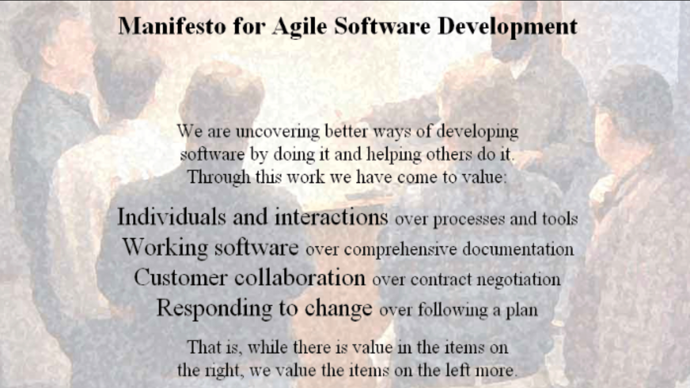
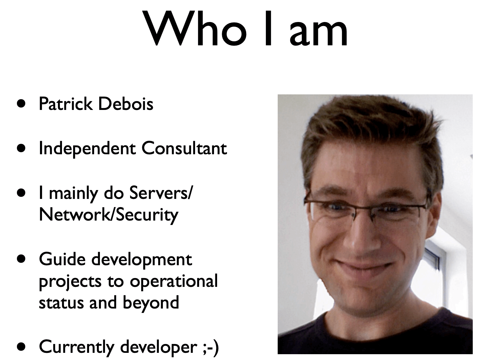

# DevOps

Nesse capítulo vamos aprender sobre o que é DevOps e entender sua história e motivação. Aprenderemos sobre os problemas recorrentes na área de tecnologia, em especial na área de desenvolvimento de software, que foram a grande inspiração para a criação da filosofia DevOps.

Também vamos discutir sobre alguns dos principais mitos a respeito desse tema e porque não devemos nos preocupar com eles.

## O que é DevOps

DevOps é um conceito um pouco complicado de explicar e definir, pois existem diversas opiniões distintas sobre ele na literatura e internet, e também por se tratar de algo bastante subjetivo, pois cada profissional e empresa possui um ambiente e contexto totalmente diferente, possuindo assim experiências distintas sobre o tema.

Na nossa opinião, gostamos de definir DevOps da seguinte maneira:

> **Filosofia** que une os **valores**, **princípios**, **práticas** e **ferramentas** dos times de desenvolvimento e operações de uma empresa, com o objetivo de aumentar sua capacidade e **agilidade** de **inovação**, por meio da criação e manutenção de produtos de tecnologia, fazendo assim com que ela se torne mais competitiva no mercado.

Repare que é uma definição um pouco abstrata, da mesma forma que encontramos a definição de metodologias ágeis e do próprio manifesto ágil, pois a ideia não é te induzir a uma única maneira de fazer DevOps, focando em determinadas praticas e ferramentas, mas sim entender os princípios e valores por trás delas.

Ao longo desse capítulo vamos estudar sobre a história do DevOps, algo que vai facilitar bastante no entendimento da nossa visão e definição dele.

## A história do desenvolvimento de software

Para entender melhor o que é DevOps é necessário voltar ao passado, entendendo como a nossa área nasceu, evoluiu e chegou aos problemas aos quais o DevOps veio para tentar resolver.

Voltaremos então ao ano de 1943, no qual ocorreu um grande marco para a área de desenvolvimento de software, pois nele iniciou-se um dos projetos de software mais famoso do mundo, que foi o projeto **ENIAC**.

### ENIAC - Electronic Numerical Integrator and Computer

Em 1943, durante a 2ª guerra mundial, o governo dos Estados Unidos da América iniciou um projeto secreto, com o objetivo de criar uma máquina capaz de realizar cálculos balísticos complexos em poucos segundos.

Nasce assim o projeto que ficou conhecido como **Electronic Numerical Integrator and Computer**, abreviado de **ENIAC**.

Alguns engenheiros da Universidade de Pennsylvania foram responsáveis por construir o hardware do ENIAC, que pesava quase 30 toneladas e ocupava uma área de quase 170 metros quadrados.

Após o hardware ser concluído, foi necessário o desenvolvimento de um software para operá-lo, sendo que seis mulheres matemáticas participaram desse projeto e assim criaram o primeiro sistema de computador eletrônico programável do mundo, que foi desenvolvido sem o uso de linguagens de programação ou quaisquer ferramentas, utilizando apenas diagramas lógicos e dispositivos eletrônicos.

Naquela época a indústria focava apenas em hardwares, sendo que quando problemas surgiam os engenheiros de hardware costumavam dizer: “O problema não é o hardware, mas quem está o operando”.

O projeto ENIAC foi concluído em 1945 e seu primeiro teste real foi realizado no dia 10 de dezembro desse mesmo ano.

Esse foi o marco de início de uma nova área, focada no desenvolvimento de softwares para controle de hardwares.

> **ENIAC Programmers Project**
> 
> Embora o software do ENIAC tenha sido desenvolvido por seis mulheres, que são consideradas como pioneiras da área de desenvolvimento de software, elas nunca tiveram o merecido reconhecimento e suas histórias ficaram perdidas no passado.
>
> Kathy Kleiman, uma jovem desenvolvedora de softwares, iniciou nos anos 90 uma busca pela verdadeira história por trás do desenvolvimento do software do ENIAC e criou um projeto chamado **ENIAC Programmers Project**, com o objetivo de resgatar e divulgar a história perdida das seis desenvolvedoras que participaram da construção do software do ENIAC.
>
> Para saber mais sobre esse projeto acesse o site: https://eniacprogrammers.org

### Projeto Apollo

Após o projeto ENIAC ser concluído, milhares de outros projetos de software foram iniciados ao redor do mundo, sendo que na década de 60 um desses projetos era bastante ambicioso e com grande impacto mundial.

Em 1961 o presidente americano John Kennedy anunciou que em 10 anos os Estados Unidos da América levariam uma pessoa à lua, a trazendo de volta para a Terra em segurança. Criou-se então um projeto, batizado de Apollo, sendo sua missão atribuída à NASA.

Para realizar tal missão a NASA precisava construir um foguete e também de alguém capaz de desenvolver um software complexo para controle aéreo, que seria utilizado nesse foguete a ser enviado à lua.

Margaret Hamilton, uma matemática do MIT, foi a pessoa escolhida como responsável por chefiar a equipe de desenvolvimento de tal software.

Devido às limitações de hardware do módulo lunar, o software que Margaret e sua equipe desenvolveram era flexível a ponto de permitir que ele pudesse ser sobrescrito manualmente, para que o piloto o controlasse utilizando controles manuais.

O projeto foi concluído em 1969 e o foguete foi lançado da terra em 16 de julho desse mesmo ano, retornando para a terra no dia 24 de julho, após oito longos dias de missão no espaço.

Durante o desenvolvimento do software, Margaret Hamilton definiu alguns itens como sendo críticos para garantir sua qualidade, tais como:

* Debug individual de todos os componentes;
* Testes individuais de todos os componentes; e
* Testes de integração entre os componentes.

Nasce assim o termo **Software Engineering**, na qual Margaret Hamilton foi uma das pioneiras em especializar e profissionalizar a então nova área de desenvolvimento de softwares, que estava ficando cada vez mais popular e utilizada no mundo inteiro.

> **O primeiro projeto DevOps do mundo?**
> 
> Graças à liberdade, autonomia, confiança e respeito entre todas as pessoas envolvidas no projeto Apollo, a missão foi bem-sucedida.
>
> Ao ler sobre a história do Apollo é possível identificar como os valores e princípios do modelo DevOps ali estavam presentes e contribuíram bastante para o sucesso do projeto como um todo.
>
> Sendo assim, podemos considerar o Apollo como sendo o primeiro projeto DevOps do mundo, embora naquela época esse termo sequer existia :)

### Software Crisis

Embora os projetos ENIAC e Apollo tenham sido bem-sucedidos, ao redor do mundo a grande maioria dos projetos de software fracassava e muitos problemas começaram a surgir, visto que essa era uma área nova e que não seguia os padrões das outras engenharias.

Em 1967 o `NATO Science Committee` criou um grupo de estudos sobre Ciência da Computação, formado por cientistas de diversos países e indústrias, com o objetivo de discutir sobre o estado atual da área de engenharia de software.

Foram formados três grupos focados em discutir sobre projeto de software, desenvolvimento de software e operação de software, com objetivos de definir, descrever e começar a pensar em como resolver os problemas da engenharia de software.

Em 1968 ocorreu a primeira `NATO Software Engineering Conference`, na qual foram identificados os principais problemas da engenharia de software, dentre eles:

* Definição e métricas de sucesso do projeto;
* Softwares complexos que exigem investimentos altos e viabilidade incerta;
* Entregar projetos dentro do orçamento previsto;
* Entregar projetos no prazo previsto; e
* Entregar projetos de acordo com as especificações.

Nessa conferencia se cunhou então o termo **Software Crisis**, para descrever o cenário problemático atual da área de engenharia de software.

Posteriormente, a partir de 1979, a tecnologia começou a evoluir bastante, em especial na área de redes, na qual empresas e universidades estavam utilizando novas tecnologias para compartilhar informações.

Entretanto, compartilhar informações não era visto com bons olhos pelas empresas, pois elas não queriam que seu modo de operar fosse exposto, pois ele era considerado como informação estratégica.

Esse **isolamento** entre as empresas acabou levando a um aumento na complexidade de seus sistemas, algo que motivou a necessidade de especialização de perfis e aumento no número de papéis relacionados a área de tecnologia.

E assim se inicia, infelizmente, o surgimento de **silos**, dentro da área de tecnologia, pois de um lado estavam os **engenheiros de software**, especializados na criação e manutenção de produtos, e do outro estavam os **sysadmins**, especializados no gerenciamento dos sistemas.

Cada um desses dois perfis têm habilidades e necessidades distintas, sendo que em situações de problemas, é comum que não haja uma colaboração entre eles.

Aqui foi justamente onde a engenharia de software “desandou”, algo bem diferente do que aconteceu no projeto Apollo.

O problema foi que as tecnologias de software evoluíram muito rapidamente, forçando as empresas a aumentarem sua flexibilidade e velocidade de evolução, para continuarem competitivas no mercado.

Mas essa velocidade de evolução e necessidade de constantes mudanças causou problemas e atritos entre as equipes de desenvolvedores e sysadmins, pois ela afetava a estabilidade nos sistemas e aumentava o risco de problemas surgirem.

E com isso se inicia uma nova era de grande **resistência às mudanças**.

### Agile Manifesto

Após um tempo de caos e diversos problemas recorrentes na área de engenharia de software, nasce um movimento denominado **Agile**, com o manifesto ágil publicado em 2001.

O manifesto ágil surgiu de uma reunião entre 17 engenheiros de software que buscavam por melhores formas de desenvolver softwares e como lidar com os problemas enfrentados no mercado.

Nesse encontro eles compartilharam seus valores e princípios, e também como acreditavam que o desenvolvimento de softwares deveria ser, sendo comum entre ele um foco grande em **ciclos de release curtos**, **adaptação às mudanças** e forte **ênfase nas pessoas**.

Algumas metodologias de desenvolvimento de software alinhadas ao manifesto ágil foram surgindo e se popularizando. Dentre elas: Scrum, XP e Kanban.

Esse foi um grande marco na história da área de desenvolvimento de software, pois o manifesto e as metodologias ágeis resgataram os valores e princípios da época do projeto Apollo, aumentando bastante com isso o sucesso dos projetos de software ao redor do mundo.

## A história do DevOps

Agora que já aprendemos sobre a origem, evolução e problemas enfrentados pela área de desenvolvimento de software, vai ficar mais fácil de entender o que motivou o movimento DevOps.

### Dev vs. Ops

Mesmo com o manifesto e as metodologias ágeis sendo utilizadas como principal abordagem para o desenvolvimento de softwares, alguns problemas ainda persistiam no mercado.

O grande problema é que a área de operações, também conhecida como infraestrutura, era tratada de maneira **isolada** da área de desenvolvimento, o que acabou criando um **silo** entre essas duas áreas.

De um lado está o time de desenvolvimento, trabalhando de maneira ágil, buscando autonomia e necessitando de ciclos de release cada vez mais curtos, mas do outro lado está o time de operações, que possui outro ritmo de trabalho e processos que exigem mais controle, governança e estabilidade.

São duas áreas com ideias, necessidades e processos distintos, que às vezes podem entrar em conflito, gerando um atrito entre esses dois times.

O resultado desse conflito foi a perda de agilidade da empresa em inovação, o que geralmente a fazia perder o **Time to Market** ao tentar desenvolver uma nova ideia de negócio.

A única maneira de resolver tal situação era então juntar os times de desenvolvimento e operações, fazendo com que eles trabalhassem como um time só, com metas compartilhadas e entendendo suas necessidades, problemas, valores e princípios, para que assim pudessem pensar juntos em como resolver os problemas e melhorar a capacidade e agilidade de inovação de sua empresa.

Foi justamente para resolver esses problemas que alguns sysadmins começaram a se interessar pelo tema `Agile` e foram buscar por maneiras de o utilizar também na área de infraestrutura.

### Agile Infrastructure

Em 2008, no evento `Agile Conference`, Patrick DuBois and Andrew Schafer se reuniram para discutir sobre um tópico pouco explorado na comunidade: **Agile Infrastructure**.

Eles discutiram e trocaram experiências sobre os problemas e frustrações que haviam passado em suas empresas, ao tentar levar o mindset do movimento `Agile` para a área de operações e ao tentar unir os times de desenvolvimento e operações. Posteriormente eles criaram um grupo de discussões para compartilhar suas ideias com outras pessoas ao redor do mundo.

Patrick Debois palestrou no evento com o tema "Agile Infrastructure and Operations: how infra-gile are you?", sendo que sua palestra foi para contar sua experiência em utilizar os conceitos de Agile em três projetos dos quais ele participou. Os slides de sua palestra podem ser acessados em: http://www.jedi.be/presentations/agile-infrastructure-agile-2008.pdf

No ano seguinte, em 2009, na O’Reilly Velocity Conference, John Allspaw e Paul Hammond, ambos do Flickr, deram uma palestra com o tema "10+ Deploys per Day: Dev and Ops Cooperation at Flickr", contando sobre suas experiências de trabalho no Flickr, onde eles conseguiram unir os times de desenvolvimento e operações, conseguindo com isso ter um ambiente onde eram realizados mais de 10 deploys ao dia, algo que naquela época era bem inovador e difícil de se ver no mercado.

E assim começa a nascer e crescer o interesse das pessoas sobre o tema **Agile Infrastructure**, para então tentar resolver os conflitos entre os times de Dev e de Ops, gerando melhores resultados para suas empresas.

Patrick Debois não pôde ir ao evento para prestigiar a palestra de John Allspaw e Paul Hammond, mas assistiu remotamente a transmissão e ficou muito empolgado e feliz em ver que diversas outras pessoas e empresas estavam interessadas pelo tema que ele se apaixonou um ano antes.

### DevOps Days

Ainda em 2009, Patrick Debois decidiu criar um evento para reunir pessoas interessadas pelo assunto e que também quisessem compartilhar suas experiências.

O evento foi batizado de **DevOps Days**, na qual sua primeira edição ocorreu na Bélgica, terra natal de Patrick Debois, e foi fortemente divulgado na internet via Twitter, sendo que para isso foi necessário a criação de uma `hashtag`.

A ideia era utilizar o próprio nome do evento como hashtag, mas preferiu-se remover a palavra `days`, e com isso a hashtag utilizada foi: **DevOps**.

E foi justamente assim que surgiu o termo DevOps, o qual Patrick Debois é considerado um dos pioneiros e que rapidamente se espalhou pelo mundo, sendo adotando por milhares de empresas.

Perceba então que agora que entendemos história, motivação e origem do DevOps, fica mais fácil de entender o que ele é, e o porquê dele ter sido criado.

DevOps pode ser considerado também com uma **extensão** do Agile, para contemplar também a área de infraestrutura e deixa-la mais alinhada com a área de desenvolvimento, fazendo assim que que essas duas áreas trabalhem de maneira similar e com muita colaboração, para que assim consigam entregar mais resultados para a empresa como um todo.

## DevOps Anti-Patterns

Assim como é importante conhecer os conceitos, motivações e boas práticas do DevOps, também é muito importante conhecer os mal-entendimentos e anti-patterns sobre esse tema, para evitar cair em algumas armadilhas comuns de se ver no mercado, evitando com isso uma dificuldade ao adotar DevOps em uma empresa.

### DevOps é apenas para Dev e Ops

Embora o termo DevOps seja uma abreviação de `Developers` e `Operations`, a ideia não é limitar a prática apenas a esses dois times.

É importante que os outros times, como por exemplo QA, segurança e business, também sejam envolvidos e colaborem entre si, pois isso vai influenciar muito nos resultados.

### DevOps é um time separado

Criar um time DevOps separado dos outros times pode ser um tiro no pé, pois se a empresa já tem dificuldades de transparência, comunicação e colaboração, um novo time DevOps separado apenas vai criar mais um silo e não necessariamente resolverá tais problemas de cultura dela.

### DevOps é um cargo

DevOps é um movimento cultural, com objetivos de melhorar o ambiente de trabalho e os resultados produzidos em todo o processo de desenvolvimento e manutenção de softwares.

Muitas vezes criar um cargo chamado `DevOps Engineer` cria a sensação de ser uma vaga para uma pessoa de desenvolvimento que também tenha conhecimentos em infra ou vice e versa. 

Tem muita empresa que faz isso para redução de custos, contratando um profissional que vale por dois, mas no geral elas fazem isso apenas para atrair novos talentos, que estejam interessados em trabalhar em ambientes que sigam a cultura DevOps. 

Há também o caso de muitos profissionais que fazem isso pois existem pesquisas que indicam maiores salários para cargos com esse nome.

### DevOps não serve para empresas grandes

Embora em empresas grandes seja mais difícil aplicar mudanças culturais e promover mais agilidade, também é totalmente possível aplicar DevOps nesse tipo de ambiente, seguindo algumas dicas de como lidar com os possíveis problemas, barreiras e dificuldades que surgirão no caminho.

### DevOps é enxugar o time

DevOps não significa ter menos pessoas, já que se tem a ideia de que um time DevOps é formado por profissionais `Full-Stack`, no qual cada pessoa tem todas as competências de Dev e de Ops. Isso pode levar a sobrecarga de trabalho e estresse, algo que certamente vai gerar mais erros e problemas que poderiam ser evitados.

### DevOps somente pode ser feito de um jeito

Não existe a famosa **Bala de Prata** no DevOps. Cada empresa possui diferentes necessidades e problemas e cada implementação de DevOps provavelmente será diferente. Inclusive em relação a quais ferramentas e técnicas que os times vão adotar.

### DevOps é apenas sobre ferramentas e automatização

DevOps não se resume a apenas utilizar ferramentas e tecnologias para automatizar um pipeline de build e deploy de aplicações.

Ferramentas e automatização são muito importantes em um time DevOps, pois elas auxiliam muito na agilidade e produtividade, além de minimizar os erros humanos. Entretanto, de nada adianta adotar as melhores ferramentas do mercado, se o grande problema na empresa é cultural.

## A cultura em um ambiente DevOps

Em um ambiente no qual as pessoas são culpadas e punidas por **erros** que acontecem, uma cultura de **medo** será criada e certamente causará a criação de **silos** entre as pessoas e seus times, algo que prejudicará muito a comunicação e transparência entre elas.

Isso torna o ambiente de trabalho um local **hostil**, no qual as pessoas têm medo de arriscar, inovar e colaborar, por conta do risco de errarem e serem punidas.

Nesse tipo de ambiente os erros humanos são considerados como **a causa de um problema**, criando-se assim uma cultura que busca a eliminação de erros humanos, os considerando como **incompetência**.

Uma outra abordagem seria considerar os erros humanos como **o sintoma de um problema sistêmico**, que levou as pessoas a os cometerem.

Nessa segunda abordagem os problemas não são atribuídos às pessoas, mas ao processo ou sistema de trabalho na qual elas estão inseridas, criando-se assim **oportunidades de aprendizado**, que favorecem a transparência e a colaboração.

Essa segunda abordagem está totalmente alinhada aos princípios e valores do movimento DevOps, devendo sempre ser preferida pelas empresas que querem adotá-lo.

O coração do DevOps consiste em criar uma cultura na qual as pessoas não trabalhem de maneira isolada, mas sim unidas, com transparência, colaboração e com metas claras e compartilhadas, bem como resolvendo juntas a causa raiz dos problemas que surgirem ao longo do caminho.

Conforme mencionado anteriormente, não existe uma única maneira de fazer DevOps. Cada empresa tem diferentes necessidades, problemas, clientes, processos, ferramentas e pessoas, fazendo com que a adoção de DevOps também seja diferente.

Porém, existem alguns tópicos relacionados à cultura que são comuns e recorrentes entre as empresas, nos quais podemos os basear em um pilar que pode ser utilizado para se começar uma adoção de DevOps de maneira mais efetiva, que é a **colaboração**.

Ao se basear nesse pilar será muito mais fácil de identificar os problemas de cultura de sua empresa, algo que certamente vai contribuir para as mudanças necessárias e para a adoção de DevOps de uma maneira mais efetiva.

### Colaboração

As pessoas passam boa parte dos seus dias no trabalho, portanto é muito importante e essencial que haja colaboração entre elas.

Existem alguns aspectos que devem ser avaliados ao se planejar como abordar e melhorar o tema colaboração dentro de uma empresa. São eles:

* Comunicação;
* Transparência;
* Autonomia;
* Empatia;
* Valores comuns; e
* Mentoria.
		
### Comunicação

Comunicação é a coisa mais importante para a colaboração de um time. Sem uma comunicação efetiva haverá desconfiança, retrabalho, desentendimentos e desunião entre as pessoas do time.

Uma comunicação efetiva é capaz de ajudar um time a ter uma visão e entendimento compartilhado de seus objetivos, evitando que elas trabalhem de maneira isolada e competitiva.

Incentivar a comunicação e o compartilhamento de informações dentro de um time, e também entre outros times e setores da empresa, ajuda a criar uma cultura de transparência e colaboração, favorecendo com isso o trabalho em time, e principalmente evitando a sobrecarga de trabalho e riscos ao deixar conhecimentos acumulado em poucas pessoas.

Transparência é um ponto chave para a comunicação, pois sem ela as pessoas se sentirão excluídas, não mais sendo colaborativas, além disso favorecer a ocultação de problemas.

Algumas práticas e técnicas para incentivar a comunicação incluem:

* Pair Programming;
* Code Reviews;
* Programming Dojos;
* Tech Talks;
* Shared Coffee Breaks; e
* Hack days.

Algo que prejudica bastante a comunicação são as interrupções, principalmente durante reuniões. É necessário criar uma cultura onde as pessoas falem para serem entendidas e não apenas para influenciar. Interrupções atrapalham bastante no entendimento e quase sempre levam a discussões, distrações e conflitos.

### Transparência

Sem transparência será difícil haver colaboração entre as pessoas, principalmente entre times distintos. As pessoas precisam saber o que está acontecendo a qualquer momento, independente da área, e isso certamente facilitará o entendimento e tomada de decisões.

É muito importante criar uma cultura de transparência que favorece o compartilhamento e facilidade no acesso às informações da empresa, pois caso contrário teremos uma cultura onde as pessoas têm medo, desconfiança e preferem ocultar problemas e dificuldades, para não causar problemas e evitar riscos de punição.

### Autonomia

Autonomia é outro conceito fundamental para se criar um ambiente mais colaborador e eficiente. As pessoas gostam de se sentir responsáveis pelas mudanças, melhorias e inovações, sendo que isso vai exigir a tomada de decisões.

É muito ruim ter que pedir permissão o tempo inteiro para poder realizar parte do seu trabalho. Isso gera um certo desconforto, pois passa a impressão de falta de confiança, algo que pode desmotivar as pessoas.

Além disso, não ter autonomia para tomar certas decisões pode atrapalhar no andamento de tarefas, algo que certamente prejudicará a agilidade na execução delas.

### Empatia

Empatia é a capacidade de se colocar no lugar de outra pessoa, entendendo o porquê ela age de determinada maneira, levando em consideração seus problemas, dificuldades, dentre outras coisas.

Saber ouvir e compreender a ponto de vista do outro, sem julgar e questionar, são maneiras de se praticar a empatia.

Ao valorizar a empatia em um time DevOps, começamos a fazer com que a equipe de Ops entenda e aprecie a importância de ser capaz de colocar código novo em produção de maneira ágil e contínua, bem como a equipe de Dev a entender os problemas e impactos causados por códigos mal escrito, lento e inseguro.

Sendo assim, a empatia vai permitir que ambos os times de Dev e Ops colaborem e se ajudem a entregar e operar novas funcionalidades da melhor maneira possível, para satisfazer as necessidades de seus clientes e usuários.

### Valores Comuns

Um time é a união entre diversas pessoas distintas com um ou mais objetivos em comum. Isso é bem diferente do modelo de equipes, onde cada equipe possui os seus objetivos individuais, algo que não favorece a colaboração.

Sendo assim, é muito importante deixar claro para todas as pessoas do time quais são seus objetivos em comum e também os seus valores em comum. Isso vai deixar claro a todos do time o porquê de seus comportamentos e práticas serem de determinada maneira.

Deixar claro os valores de um time também pode ajudar nos casos de conflitos de ideias. Por exemplo, imagine uma situação de conflito entre duas pessoas de um time, na qual uma pessoa quer entregar um código o quanto antes, mesmo sabendo que ele não tem uma boa qualidade, para conseguir cumprir com um determinado cronograma, enquanto a outra pessoa prefere correr o risco de atrasar, para manter um padrão mínimo de qualidade.

Qual das duas pessoas terá a razão?

As duas pessoas podem ter a razão, dependendo de seu time, sendo que isso vai depender dos valores dele.

Se um time valoriza muito a qualidade, então a segunda pessoa estaria mais certa em correr o risco de não cumprir o prazo acordado, para favorecer a qualidade das entregas, algo que vai de encontro com os valores defendidos pelo seu time.

Ter valores e objetivos compartilhados é uma excelente maneira de favorecer a colaboração entre as pessoas de um time, além de ajudar na resolução de conflitos de ideias entre elas.

### Mentoria

Outra maneira de incentivar a colaboração entre as pessoas é por meio de programas de mentoria, com o objetivo de nivelar o conhecimento entre o time e melhorar a comunicação entre as pessoas.

Pair programming, hackdays, treinamentos internos e externos e acompanhamento sênior/júnior são maneiras de promover um processo de mentoria.

Isso certamente fará com que as pessoas colaborem mais entre si, além de melhorar os resultados obtidos pelo time e valorizar o potencial das pessoas.

Outra vantagem é que as pessoas costumam a valorizar muito esse tipo de incentivo, de ponto de vista de carreira profissional, e tendem a permanecer mais tempo em empresas que investem nisso.

## CALMS

Ao estudar sobre cultura relacionada ao movimento DevOps, é comum encontrar o termo CALMS, que é um acrônimo para: Culture, Automation, Lean, Measurement e Sharing.

O termo foi criado por Damon Edwards e John Willis em 2010, após o primeiro evento Devopsdays que ocorreu nos Estados Unidos, sendo que inicialmente o acrônimo era apenas CAMS, mas posteriormente o L, de Lean, foi acrescentado por sugestão de Jez Humble.

A ideia desse acrônimo é mostrar os cinco princípios mais importantes ao adotar o modelo DevOps em uma empresa, sendo que para os autores o coração do DevOps é sobre pessoas e gestão.

### Culture

Cultura está relacionado ao tópico anterior, no qual foi discutido que o principal pilar sobre o tema é colaboração.

Sem uma boa cultura, focada em colaboração, não adianta ter as melhores ferramentas e as melhores pessoas trabalhando em uma empresa, pois DevOps não nasceu para resolver problemas de ferramentas, mas sim problemas humanos.

Outra dica em relação à cultura é formar times de projetos/produtos, com todas as pessoas necessárias fazendo parte dele, ao invés da clássica separação funcional, responsável por criar silos e desfavorecer a colaboração.

### Automation

Automação consiste em identificar todas as tarefas repetitivas, que são chatas, cansativas e sujeitas a falhas humanas, e utilizar ferramentas para automatizá-las.

Isso diminui as chances de erros e falhas humanas, diminui estresse ao executar tais tarefas, reduz o tempo para executá-las, acelera o feedback e aumenta a confiabilidade.

Os principais pontos para se buscar automatização são: build, testes, deploy e provisionamento.

### Lean

Utilize os conceitos de Lean a favor do time, para melhorar ainda mais a colaboração e melhoria de seus processos.

Ideias do Lean que vão contribuir muito ao adotar e melhorar um ambiente DevOps: One Piece Flow, eliminação de desperdícios, System Thinking, Pull System, Kanban, Kaizen, experimentações, inspeção e adaptação.

### Measurement

É difícil saber se melhorias estão acontecendo ou se problemas estão sendo gerados, se não tivermos dados para analisar.

DevOps não encerra quando colocamos um produto ou feature em produção. É extremamente importante coletar métricas que vão ajudar o time a tomar as melhores decisões.

Métricas não se resumem a apenas dados técnicos, como SLA e response time, mas também a dados de negócio, como número de novos clientes.

### Sharing

Em um ambiente DevOps tanto as pessoas de Dev quanto as de Ops devem trabalhar juntas, compartilhando informações e metas, e pareando sempre que possível, para que ambos os lados entendem o trabalho e dificuldades de cada um.

Isso facilita a criar um ambiente mais colaborativo e reduzir a superespecialização, onde cada um tem apenas uma responsabilidade e não se preocupa com o trabalho e problemas dos outros.

Uma boa abordagem aqui é a ideia de que quem constrói um software também deveria ser responsável por buildar, deployar e monitorar o projeto. Uma famosa frase que remete a isso é a: **You build it, you run it**, citada em 2006 por Werner Vogels, que na época era CTO da Amazon.

## Mudanças culturais para adotar DevOps

Ao adotar DevOps em uma empresa algumas mudanças vão começar a surgir e ser percebidas pelas pessoas. Dentre as principais mudanças estão as relacionadas ao comportamento das pessoas, em relação aos itens culturais discutidos anteriormente, e também na organização dos times.

Algumas características que devem ser observadas nesse tipo de ambiente são:

* Otimizações focadas em entrega de valor;
* Visão sistêmica do pipeline de entrega de valor;
* Definição de pronto focada no usuário;
* Entregas contínuas e pequenas;
* Loops de feedback; e
* Automatização.

### Otimizações focadas em entrega de valor

O foco de um time DevOps não é eficiência e produtividade. Ao invés de buscar por mais produtividade, mais tarefas sendo feitas ao mesmo tempo e mais entregas sendo realizadas, o foco muda para o entendimento do problema a ser resolvido, do ponto de vista de valor para os clientes e usuários, e como o time se organizará para solucioná-lo de maneira mais ágil e eficaz.

### Visão sistêmica do pipeline de entrega de valor

Todo o time deve ter a visão do processo de trabalho de ponta a ponta, sabendo quais são as etapas e atividades que deverão ser seguidas para se entregar valor ao cliente. O foco deixa de ser **fazer a minha parte e passar o bastão para o próximo** e passa a ser **entender o fluxo de valor e como otimiza-lo de maneira colaborativa**.

### Definição de pronto focada no usuário

De nada adianta um item estar pronto, do ponto de vista do desenvolvedor, se os usuários não podem ter acesso e dar feedback.

Todas as pessoas do time devem ter a visão clara de que um item é considerado pronto apenas quando ele for entregue aos usuários. Isso favorece a colaboração entre os times de Dev, Ops, QA, etc. em entregar valor aos usuários de maneira mais ágil.

### Entregas contínuas e pequenas

Para diminuir os riscos e aumentar o ciclo de feedback, é importante fazer entregas contínuas e que elas sejam pequenas.

Isso também contribui para manter um ritmo sustentável de trabalho do time e também dos usuários. Além disso, valor é algo que costuma diminuir bastante com o tempo, sendo assim, de nada adianta fazer um entrega depois de 8 meses de trabalho.

### Loops de feedback

Feedback é algo muito importante e valioso para um time DevOps e não deve se resumir a apenas o aceite ou rejeição dos usuários quanto à uma entrega.

É importante que haja feedback entre os times de Dev e Ops durante todo o ciclo de entrega de valor, para que problemas e oportunidades sejam discutidas e tratadas de maneira colaborativa.

### Automatização

Após cultura, automatização é a coisa mais importante em um ambiente DevOps. Sem automatização, um time terá muita dificuldade de entregar valor de maneira ágil, segura, efetiva e com baixo risco. 

Automatização acelera o processo de entrega de valor, aumenta a confiança no trabalho executado, diminui erros humanos em tarefas repetitivas e também contribui para a colaboração entre os times de Dev e Ops.

## The Three Ways

No livro **The DevOps Handbook** os autores enfatizam que o modelo DevOps é composto por três princípios, chamados de **Three Ways**, que são fundamentais para a adoção efetiva do modelo.

O primeiro princípio, chamado de **Principle of Flow**, foca em acelerar a entrega de trabalho que flui entre os times de Dev e Ops.

O segundo princípio, chamado de **Principle of Feedback**, foca em melhorar o feedback entre os times de Ops e Dev, para criar um ambiente de trabalho mais seguro e colaborativo.

O terceiro princípio, chamado de **Principle of Continuous Learning and Experimentation**, foca em criar uma cultura de confiança, resiliência e baseada em experimentações e adaptações contínuas.

Recomendamos a utilização desses princípios ao adotar DevOps e promover as mudanças culturais em uma empresa.

## O papel das ferramentas em um ambiente DevOps
