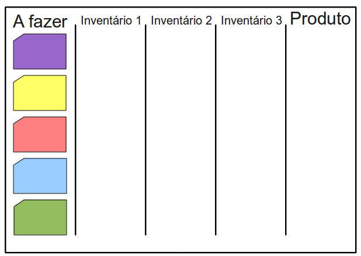
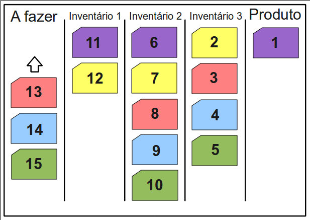
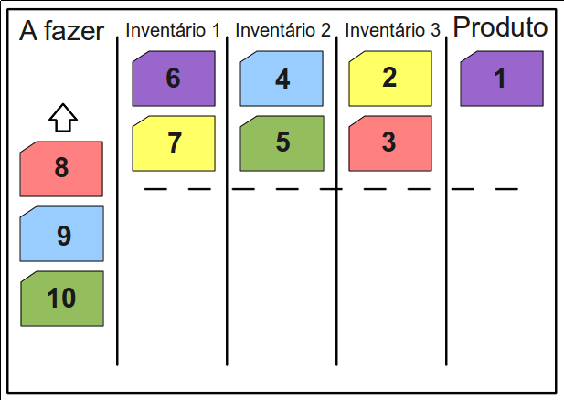

# Lean

Neste capítulo vamos aprender o que é Lean e qual a sua relação com a área de desenvolvimento de software.

## O que é Lean

O **sistema Lean de Produção** foi desenvolvido pela Toyota e tem um princípio claro e simples: **reduzir o desperdício**.

Em 2009, a Toyota vendeu mais carros nos Estados Unidos do que a nacional e tradicional Ford, tornando-se a segunda maior vendedora de carros naquele país. 

Mas como uma marca japonesa ultrapassou a gigante americana que popularizou o automóvel e revolucionou o sistema de produção de veículos com o conceito de linha de montagem?

**Simplificando**.

## Exercício: Lean Lego Game

Para entendermos melhor as idéias do Lean e as vantagens que elas trazem num sistema de produção, seja ele de automóveis ou de software, faremos um exercício prático que ilustra a redução de desperdícios por mudanças simples no processo e na cultura.

Esse *workshop* foi criado em 2008 por Danilo Sato e Francisco Trindade, da Thoughtworks de Londres, como uma forma de ensinar e promover discussões sobre Lean de forma divertida.

Ele já foi apresentado em diversas conferências pelo mundo e a página de referência sobre o jogo é: http://www.dtsato.com/blog/work/lean-lego-game

O instrutor explicará o jogo em sala.

## Sobre Lean: o método Toyota

Lean está intrinsecamente ligado à minimização dos desperdícios, sejam eles no processo, no desenvolvimento ou no produto final.

Considere como desperdício tudo aquilo que não traz valor para o cliente e, como ganho, tudo o que agrega valor. O lucro é, então, uma conta trivial: `ganho - desperdício`. No contexto de produção de software, podemos ser mais objetivos no que são considerados desperdício e ganho.

Desperdício é tudo o que não é feito para o cliente, seja a já discutida documentação excessiva, tempo de desenvolvimento parado por falta de informações (ou falta de clareza nelas), ou código e funcionalidades não-requisitadas.

Ganho é tudo o que agrega valor e reduz retrabalho: funcionalidades novas, entregas frequentes para o cliente, código de qualidade, testes, etc.

### Desperdícios em desenvolvimento de software

E o que é desperdício no desenvolvimento de software?

Funcionalidades que são desenvolvidas pela metade e as que não estão completamente funcionais são exemplos de desperdício de desenvolvimento, ligados a quantidade de trabalho em andamento, ou seja, trabalho incompleto.

Minimizar esse tipo de desperdício é fundamental para aumentar a eficácia e, consequentemente, o retorno em valor do software desenvolvido.

Outros exemplos estão ligados com o planejamento e o trabalho do dia a dia, excessos que cometemos, como produzir uma funcionalidade ainda desnecessária, aguardar ordens etc.

### Os tipos de desperdício

Lean divide os desperdícios em três categorias de igual importância:

* **Mura:** desperdícios por tentar prever possíveis necessidades futuras. Evitar Mura significa reduzir ao máximo o inventário, isto é, as partes paradas no meio do processo, ou seja, trabalho começado e não terminado.

* **Muri:** desperdícios que podem ser evitados por planejamento. Nessa categoria enquadra-se o excesso de burocracia ou de complexidade num processo de produção.

* **Muda:** desperdícios do dia-a-dia, criados por uma cultura anterior de trabalho. Os sete Mudas geralmente destacados são:

* Superprodução;
* Transporte desnecessário;
* Inventário;
* Locomoção;
* Defeitos;
* Superprocessamento; e
* Espera.

Durante o *Lean Lego Game*, vimos como ações simples podem reduzir drasticamente os desperdícios supracitados.

## Push vs. Pull Systems

No sistema Ford de produção, cada estação da linha de produção trabalha enquanto houver matéria-prima para tal. A quantidade do que será produzido é regulada com base nas previsões feitas sobre o mercado num determinado período e não há ligação entre os pedidos reais e a linha de produção.

Naturalmente, uma estação de trabalho mais simples é mais eficiente em realizar sua tarefa. Contudo, assim, dois desperdícios são criados:

* As muitas peças produzidas, esperando para serem usadas em outras estações, sem sequer saber se há demanda pelo produto. Chamamos essas peças de inventário;

* O tempo livre dos trabalhadores superespecializados que trabalham nas funções terminadas mais cedo.

Esses são exemplos de **Mura**. Uma solução possível para tais desperdícios é trabalhar com sistemas *pull* em vez dos tradicionais *push*, como o descrito.

Sistemas *pull* trabalham com o mínimo possível de inventário que ainda permita atender às demandas de clientes rapidamente. Sua concepção e prática são simples: há apenas o número suficiente de peças em inventário para um produto (ou um lote) ser completo.

Perceba que, em vez do planejamento pouco maleável baseado em previsões de mercado utilizado por sistemas *push*, em sistemas *pull* a produção acontece de acordo com a demanda, reduzindo custos de armazenamento de peças intermediárias e de produtos não vendidos, além de flexibilizar a produção.

Quando de fato há demanda, a estação final consome as peças necessárias. A anterior, então, trabalha para repor o que foi consumido, e assim acontece sucessivamente, até a primeira estação.

## Kanban

Se entendermos a linha de produção como uma sequência de passos para produzir algo, a representação óbvia para o processo é o **Kanban**, já consagrado em diversas teorias da área de Administração.

Nele, os produtos por fazer ficam à esquerda e migram para a direita conforme os passos para sua construção vão sendo terminados.

Em sistemas *push*, cada estação de trabalho faz sua parte sem considerar as fases anteriores e posteriores. O Kanban abaixo permite ver com mais clareza o acúmulo de inventário:

Já no Kanban que representa o sistema *pull* de produção, há um limite de inventário claramente delimitado. Dessa forma, peças só são produzidas quando de fato há demanda e gasta-se menos em peças que não serão utilizadas ou em estoque de inventário.

O Kanban é uma excelente forma de visualizar o andamento da produção, mas é importante lembrar que ele é apenas uma ferramenta. E, como qualquer ferramenta, deve ser empregada para reforçar e auxiliar na aplicação da metodologia.

## Systems Thinking

Voltando ao cenário proposto, após reduzir o Mura, pudemos ver mais claramente como nossa linha de produção funciona. E então foi possível notar que havia trabalhos redundantes.

No caso do workshop, havia uma estação a mais do que o realmente necessário e não reparamos antes porque, focados na nossa tarefa, não nos preocupamos em sequer saber o que as outras estações faziam. Ou, pior, notamos a duplicação de trabalho, mas não sinalizamos essa deficiência.

E quantas vezes não vimos consagrados processos de produção de software atrapalhando uma equipe em vez de ajudá-la? Todas as fases do seu processo são realmente necessárias para o sucesso final?

Ainda que todas as fases sejam necessárias no começo de um projeto, frequentemente, em algum ponto, alguma delas deixa de ser necessária e outras, antes não pensadas, podem passar a ser úteis.

É importante sempre pensar no processo, não simplesmente aceitá-lo. Um processo de produção de software, uma metodologia ou um framework. Todos eles foram planejados para auxiliar na produção - se estão fazendo o oposto, precisam ser mudados.

Pensar sempre no sistema, *Systems Thinking*, é pensar e repensar durante todo o andamento do projeto no que poderia ser melhorado no próprio processo de desenvolvimento e nas interações entre as pessoas envolvidas.

## Work Cells

Não é possível, no entanto, encontrar possíveis melhorias no processo se cada envolvido está focado exclusivamente em uma tarefa, na qual é especialista.

Por isso, Lean entende que as pessoas envolvidas em um projeto não podem ser *superespecialistas*, isto é, não podem se limitar a conhecimentos apenas de sua etapa. Deveriam conhecer todas elas e saber executar pelo menos algumas delas.

Cada membro da equipe é, dessa forma, uma *Work Cell*: uma pessoa capaz de trabalhar no projeto como um todo, em algumas ou todas as suas partes. E o conhecimento mais amplo sobre o projeto é incentivado, já que, quanto melhor alguém conhece o todo, melhor sabe criticá-lo - e, dessa forma, melhorá-lo.

Também, se um trabalhador consegue chegar sozinho ao produto final, todo o custo com locomoção, tanto de pessoas quanto de máquinas ou peças, é extinto. Menos desperdício.

Em uma planta industrial, a possibilidade de um só trabalhador fazer o produto por completo é muito mais difícil, portanto a *work cell* é formada por um grupo de pessoas, em vez de
uma pessoa apenas. Já em desenvolvimento de software essa barreira é bem menor.

Um arquiteto, um tester ou um desenvolvedor, seja ele júnior ou sênior, podem produzir código e deveriam entender essa atividade como algo de valor para o projeto, colaborando com o time.

## Kaizen

Ainda na década de 1970, Frederich Brooks publicou um artigo chamado *No Silver Bullet*. Apesar de tanto tempo passado, o artigo não perde sua veracidade e é, juntamente com
*The Mythical Man-Month*, leitura obrigatória para todos aqueles na área de Engenharia e Gerenciamento de Software.

Em Lean, acredita-se que não exista, também para o processo, uma bala de prata capaz de resolver todos os problemas. Dessa forma, é preciso que cada equipe adapte a metodologia e ferramentas à sua necessidade, a todo momento.

Finalmente, a última prática dessa breve introdução a Lean é o *Kaizen*, palavra japonesa para **melhoria**. E melhoria significa maximizar aquela função: `ganho - desperdício`. Melhorias no processo, na forma de produção e no produto final são parte do dia-a-dia de quem trabalha com Lean.

O Kaizen é amplamente apoiado pelos conceito previamente vistos. Perceba: como cada *work cell* da equipe tem uma visão mais geral da produção e são incentivados a pensar no sistema (*system thinking*), conseguem enxergar melhorias mais facilmente.

## Lean e DevOps

Lean pode ser considerado como um conjunto de princípios que emergiram nas fábricas da Toyota, como o objetivo de eliminar desperdícios e promover um ambiente de melhoria contínua.

Percebe-se então sua relação direta com DevOps, pois no modelo DevOps há um foco muito grande em mudanças culturais para promover melhores resultados no processo de desenvolvimento e operação de softwares.

Podemos utilizar todos os conceitos de Lean que vimos nesse capítulo no modelo DevOps:

* **Pull Systems**: Para se obter um melhor fluxo de trabalho, evitando sobrecargas, demoras para entregar, estresses e erros.
* **Work Cell**: Para evitar superespecializações, concentração de conhecimento e promover um ambiente de colaboração entre as pessoas.
* **Systems Thinking**: Para que tanto o time de Dev quanto o de Ops conheçam todo o processo de trabalho como um todo e possam pensar em como torná-lo mais simples.
* **Kaizen**: Para que todos possam pensar em melhorias no processo, ferramentas, ambiente ou quaisquer outras coisas que estejam atrapalhando a entrega de valor.
