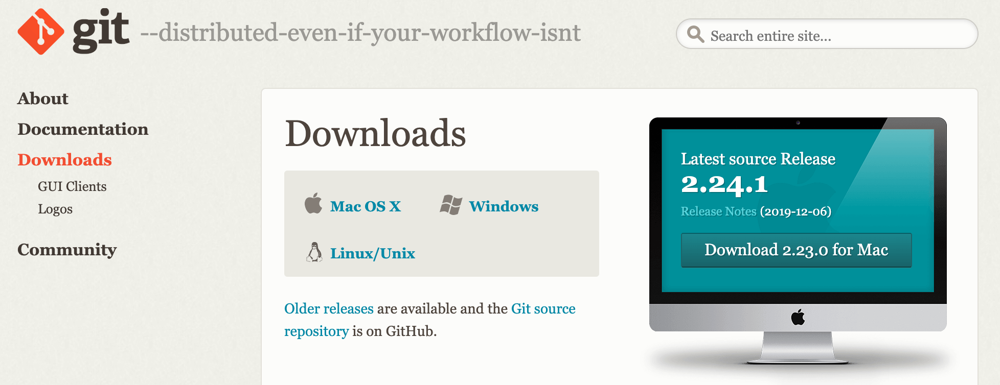

# Controle de Versão

Neste capítulo vamos aprender a utilizar o Git como ferramenta de controle de versão, além de entender o porquê de ser muito importante utilizar esse tipo de ferramenta, tanto pelo time de Dev quanto pelo time de Ops.

## Backup e colaboração

Você provavelmente deve possuir diversos arquivos em seu computador pessoal. Sejam fotos, vídeos, planilhas, documentos do trabalho, da faculdade e/ou pessoais.

E se algo *trágico* acontecesse com o seu computador, como ele queimar, der problema no HD ou até mesmo ser furtado? Além do prejuízo financeiro, você perderia todos os seus arquivos, algo que seria muito trágico e traumático.

Por conta desse risco, quase todas as pessoas, inclusive pessoas que não trabalham diretamente na área de tecnologia, já possuem o hábito de realizar **cópias** de seus arquivos, em especial os arquivos que são considerados como sendo muito importantes.

Seja utilizando algum serviço Web, como Dropbox ou Google Drive, ou utilizando algum dispositivo físico, como pendrive ou HD externo, as pessoas já desenvolveram há um bom tempo o hábito de realizar **backups** com frequência, pois nunca se sabe quando algo de ruim poderá acontecer com nossos arquivos.

Ao trabalhar no desenvolvimento de uma aplicação temos a mesma situação, pois diversos arquivos serão criados, modificados e excluídos ao longo do tempo, e não queremos correr o risco de perder todo o trabalho já realizado até então.

Devemos então ter o mesmo hábito de realizar backups do código fonte da aplicação. Mas a pergunta é: onde guardar e como realizar tais backups?

Além disso, é raro trabalharmos de maneira isolada durante o projeto. Geralmente trabalhamos simultaneamente com outras pessoas, que juntas formam um time, e com isso surge mais um problema: como fazer para *sincronizar* o trabalho de todo mundo sem que uma pessoa sobrescreva o trabalho da outra, visto que cada pessoa vai trabalhar em seu próprio computador?

Por fim, há ainda mais um problema: seria interessante não apenas ter um backup do código fonte, mas também ter registrado todo o **histórico** de evolução dele, pois dificilmente as pessoas vão conseguir se lembrar de todas as modificações que nele foram feitas ao longo do tempo.

## Sistemas de Controle de Versão

Para resolver esses problemas e facilitar a vida de quem trabalha com desenvolvimento de software, diversas ferramentas foram criadas ao longo do tempo.

Esse tipo de ferramenta é conhecido como **VCS(Version Control Systems)** ou também como **SCM(Source Code Management)**, sendo hoje considerado como **obrigatório** para qualquer tipo de projeto de software.

Sistemas de controle de versão são ferramentas que ajudam um time de desenvolvimento a **gerenciar as alterações** feitas no código fonte do projeto **ao longo do tempo**.

Isso pode ser muito útil para alguém do time que queira entender melhor a **evolução** de certo trecho de código do projeto, além de também facilitar e agilizar nos casos de ser necessário **reverter** um trecho de código para uma das versões anteriores.

Outro benefício de se utilizar esse tipo de ferramenta é a **rastreabilidade**, pois em cada alteração registrada nela também são armazenados metadados sobre quando a alteração foi feita, quais modificações foram realizadas e quem foi a pessoa que as realizou.

Além disso, esse tipo de ferramenta favorece bastante a **colaboração**, pois permite que diversas pessoas trabalhem ao mesmo tempo na mesma base de código, colaborando entre si para o desenvolvimento do projeto.

Eventualmente pode haver conflitos no código fonte, no caso de duas ou mais pessoas alterarem o mesmo arquivo em um mesmo momento, mas as ferramentas de controle de versão costumam auxiliar na resolução deles, por meio de seus recursos.

Sendo assim, percebe-se então a grande importância de se utilizar uma ferramenta de controle de versão pelo time de desenvolvimento, sendo essa considerada uma ferramenta muito importante e valiosa, pois o time a utilizará diariamente ao longo do desenvolvimento do projeto.

### Ferramentas de controle de versão

Dentre as principais ferramentas de controle de versão estão:

* CVS
* Subversion(SVN)
* SourceSafe
* Git
* Mercurial

Cada uma delas tem suas vantagens e desvantagens, sendo que todas elas cumprem com seu objetivo principal, que é manter o histórico de modificações nos arquivos de um projeto.

Até meados de 2008 o SVN era uma das mais populares e utilizadas dentre elas, mas foi perdendo cada vez mais mercado para o Git, cuja popularidade aumentava cada vez mais ao redor do mundo, tendo atualmente o domínio do mercado.

## Git

O Git foi criado em 2005 por *Linus Torvalds*, o mesmo criador do kernel do *Linux*, e hoje é a ferramenta de controle de versão mais popular, utilizada e recomendada ao redor do mundo.

Dentre as principais vantagens do Git estão:

* Gratuito e open source
* Distribuído
* Alta performance
* Extensível
* Suporte a diferentes tipos de workflow

Essas vantagens foram atraindo muitos desenvolvedores ao redor do mundo, que começaram a o utilizar como principal ferramenta para controle de versão, aumentando com isso sua popularidade.

Depois de um tempo muitas ferramentas e serviços baseados no Git foram criadas, para facilitar ainda mais a vida das pessoas que trabalham com desenvolvimento de software, criando-se com isso uma enorme comunidade e apoio ao projeto.

Um exemplo disso é o **GitHub**, que é um site que funciona como serviço para hospedagem de código fonte de projetos que utilizam o Git como controle de versão.

O GitHub provavelmente foi a ferramenta que mais disseminou o uso do Git ao redor do mundo, além de também incentivar e apoiar fortemente os projetos de software open source, oferencendo planos gratuitos para esse tipo de projeto.

Isso fez com que muitos projetos open source fossem migrados de outras plataformas, como *Google Code* e *SourceForge*, para o GitHub, aumentando assim tanto a sua popularidade, como também a do Git.

## Utilizando o Git

Para utilizar o Git é preciso baixá-lo e fazer sua instalação. Existem versões para Windows, Linux e Mac, que podem ser baixadas diretamente de seu site: https://git-scm.com/downloads



Existem duas principais maneiras de se utilizar o Git: via linha de comandos e via interface gráfica.

Existem aplicações gráficas para se trabalhar com o Git, como por exemplo: *gitk*, *git-gui* e *GitHub for macOS and Windows*, além das próprias IDEs já possuirem *plugins* que as integram diretamente com o Git, evitando a necessidade de se utilizar ferramentas externas.

Mas ao longo do curso vamos trabalhar com o Git via linha de comandos, utilizando o *Terminal*, para não ficar dependente de uma ferramenta ou plugin em específico, e também para entender melhor como funcionam os comandos do Git.

### Criando um novo repositório

No Git existe um termo importante chamado **repositório**, que nada mais é do que o diretório raiz da aplicação, no qual o time de desenvolvimento vai criar o código fonte dela. A ideia é que cada aplicação tenha o seu próprio repositório separado, para que o código de uma não atrapalhe no das outras.

Para criar um novo repositório no Git basta acessar o diretório raiz da aplicação e rodar o seguinte comando:

```
git init
```

Ao rodar o comando anterior o Git criará um diretório oculto chamado `.git`, o qual contém todas as informações sobre o repositório para o Git. Esse diretório será utilizado pelo Git para armazenar o histórico de alterações dos arquivos, dentre outras informações, não devendo ser modificado pelo time de desenvolvimento. É justamente por isso que ele é um diretório oculto :)

Agora o time de desenvolvimento já pode criar os arquivos que farão parte do código fonte da aplicação.

### Configurando o usuário para o Git

Antes de registrar as alterações no repositório precisamos nos *identificar* para o Git, pois o Git precisa guardar quem foi a pessoa que registrou cada alteração.

Isso deve ser feito utilizando os seguintes dois comandos:

```
git config --global user.name 'seu nome'
git config --global user.email 'seu email'
```

Agora todas as alterações registradas nesse repositório, feitas a partir desse computador, estarão vinculadas à pessoa com o *nome* e *email* indicados no comando anterior.

O parâmetro `--global` indica ao Git que esse mesmo nome e email deve ser utilizado em todos os novos repositórios Git que forem criados ou baixados a partir desse computador, para que assim você não precise ficar repetindo o comando anterior a cada novo repositório que for trabalhar.

### Registrando alterações com commits

Outro termo importante e recorrente no Git é o **commit**, que nada mais é do que a representação de um registro de alteração efetuada por alguém em um determinado momento no repositório.

Sempre que uma pessoa do time de desenvolvimento desejar registrar no histórico do repositório alguma alteração, ela precisará fazer um commit.

Ao realizar um commit no repositório, o Git deixará registrado quem o efetuou, quando ele foi feito e, principalmente, quais arquivos foram modificados.

Para efetuar um commit, o seguinte comando deve ser utilizado:

```
git commit -m 'mensagem do commit'
```

O parâmetro `-m` é utilizado para escrever uma mensagem que explique o que aquele commit representa para a aplicação. Veja alguns exemplos de mensagens:

* Correção do bug no botão de logout
* Funcionalidade de login
* Ajuste no tamanho das fontes
* Alteração da cor de fundo da tabela de novos clientes
* Correção ortográfica na mensagem de erro
* Adicionando campo telefone no cadastro de clientes
* Adicionando novo item na barra de menu superior
* Simplificando código que calcula o valor do saldo devedor

Perceba que as mensagens costumam ser curtas e objetivas em relação ao que aquele commit representa, facilitando assim quando for necessário analisar os commits do repositório.

### Indicando quais alterações farão parte do commit

Antes de realizar um commit precisamos indicar ao Git quais das alterações farão parte dele, pois o Git não considera que *todas as modificações* que foram realizadas desde o último commit serão adicionadas ao próximo commit a ser realizado.

E essa indicação é feita com a utilização do comando `git add`. Por exemplo, imagine um repositório no qual temos dois arquivos, `index.html` e `logo.png`, que foram modificados e queremos adicionar ao próximo commit. O comando que devemos executar antes do commit deve ser então:

```
git add index.html
git add imagens/logo.png
```

Repare que devemos informar o *caminho completo* do arquivo, e não somente o seu nome, além de ter que adicionar cada arquivo separadamente. Isso acaba sendo algo meio *chato*, mas é possível adicionar todos os arquivos que foram modificados de uma só vez, utilizando o comando `add` da seguinte maneira:

```
git add .
```

O ponto(`.`) utilizado no comando anterior indica ao Git que queremos adicionar quaisquer alterações que tiverem sido realizadas no repositório, inclusive em arquivos que estejam em subdiretórios, ou seja, o comando é `recursivo`.

### Verificando o status do repositório

E se eu não me lembrar quais arquivos foram modificados ou quais arquivos já foram adicionados?

Para esse caso existe um outro comando útil do Git, que é o comando `git status`, tendo como objetivo indicar o *status* atual do repositório, ou seja, quais arquivos foram criados, modificados e excluídos, além de indicar também quais arquivos já foram *adicionados* pelo comando `add`.

Ao rodar o comando `git status` em um repositório Git, uma mensagem como a demonstrada a seguir será apresentada:

```
On branch master
Changes not staged for commit:
  (use "git add <file>..." to update what will be committed)
  (use "git checkout -- <file>..." to discard changes in working directory)

	modified:   pom.xml

Untracked files:
  (use "git add <file>..." to include in what will be committed)

	WebContent/WEB-INF/views/index.jsp

no changes added to commit (use "git add" and/or "git commit -a")
```

Repare que a mensagem indica que um novo arquivo foi criado no repositório, que no caso é o arquivo `index.jsp`, além de também indicar que o arquivo `pom.xml` sofreu alterações.

Se executarmos o comando `git add .` e em seguida o comando `git status`, a seguinte saída será exibida:

```
On branch master
Changes to be committed:
  (use "git reset HEAD <file>..." to unstage)

	new file:   WebContent/WEB-INF/views/index.jsp
	modified:   pom.xml

```

Repare que agora a mensagem mudou, sendo que os dois arquivos estão aparecendo na seção `Changes to be committed`, a qual indica quais arquivos serão incluídos no próximo commit.

### Listando os commits do repositório

Outro comando importante do Git é o `git log`, utilizado para listar todos os commits registrados no repositório. Veja a seguir um exemplo do que é exibido ao executar esse comando:

```
commit 97fddae580b08e977f60fbdc8ca6fdcba3ec7c92 (HEAD -> master, origin/master)
Author: Rodrigo Caneppele <r.caneppele@gmail.com>
Date:   Mon Sep 24 15:56:13 2018 -0300

    corrigindo instrucoes e senha do mysql

commit 197af796a89ebf4793414b36f9fbe6bd547a1bde
Author: Rodrigo Caneppele <r.caneppele@gmail.com>
Date:   Fri Dec 8 11:33:14 2017 -0200

    context-path do projeto

commit fcda2b3a95593865d007fd0d362029e10b5e6008
Author: Rodrigo Caneppele <r.caneppele@gmail.com>
Date:   Fri Dec 8 11:32:41 2017 -0200

    atualizando instrucoes

commit febb65e93cdb751cbc00cd089c71f1ca5639273d
Author: Rodrigo Caneppele <r.caneppele@gmail.com>
Date:   Thu Nov 30 12:58:07 2017 -0200

    correcao no nome da tabela
```

Repare que, para cada commit, o Git exibe o *autor* do commit, a *data* que o commit foi realizado e também a *mensagem* do commit. Além disso, repare que cada commit possui um identificador único, por exemplo: `97fddae580b08e977f60fbdc8ca6fdcba3ec7c92`.

Esse identificador, também chamado de `id`, é gerado automaticamente pelo Git e serve para diferenciar um commit do outro.

## Exercício: Utilizando o Git na aplicação

Nesse exercício vamos utilizar o Git em nossa aplicação.

1. O primeiro passo será a criação do repositório. Abra o `Terminal`, acesse nele o diretório da aplicação e crie o repositório com o comando `git init`. Por exemplo:

  ```
  cd Desktop/alura-forum
  git init
  ```

2. O próximo passo é fazer o commit dos arquivos do projeto, mas antes precisamos utilizar o comando `git add` para indicar quais arquivos serão adicionados ao commit. Rode o seguinte comando no Terminal:

  ```
  git add .
  ```

3. Agora já podemos realizar o commit. Rode o seguinte comando:

  ```
  git commit -m "criacao do repositorio do projeto"
  ```

4. Por fim, verifique se tudo está ok no repositório, utilizando para isso o comando `git status`. A seguinte saída deve ser apresentada:

  ```
  On branch master
  nothing to commit, working tree clean
  ```

## Mais detalhes do Git

Geralmente em uma aplicação podem existir arquivos que não queremos que façam parte do histórico de commits do Git, ou seja, arquivos aos quais o Git deve ignorar.

Isso é comum para arquivos temporários, binários, ou outros similares. Por exemplo, na nossa aplicação vimos que existe o diretório `target`, utilizado pelo Maven ao gerar o build do projeto.

Entretanto esse diretório e seus arquivos podem ser considerados como temporários, pois não são utilizados pelo código fonte da aplicação, podendo até serem excluídos, sem que isso causa efeitos colaterais nela.

Sendo assim, ao realizar qualquer commit no repositório devemos tomar cuidado para não incluir acidentalmente tais arquivos ao utilizar o comando `git add`.

Para evitar esse trabalho de ter que ficar lembrando de não incluir determinados arquivos no repositório, o Git possui um mecanismo que faz isso de maneira automatizada.

Basta criar no diretório raiz do repositório um arquivo chamado `.gitignore`, e nele adicionar quais arquivos e diretórios devem sempre ser ignorados pelo Git. Veja a seguir um exemplo desse arquivo:

```
temp
build
/target/
*.jar
```

Inclusive o projeto `alura-forum` que foi disponibilizado para vocês durante o curso já possui tal arquivo. Se você acessar o diretório da aplicação no terminal e rodar o comando `ls -la` verá que será listado o arquivo `.gitignore`. Caso você queira visualizar o conteúdo desse arquivo diretamente no terminal, basta utilizar o comando `cat .gitignore`.

O Git possui muitos outros recursos e comandos que veremos ao longo do treinamento.

## Hospedando o repositório no GitLab

Uma das grandes vantagens do Git é ele funcionar de maneira *distribuída*, evitando assim a necessidade de se ter um *servidor central* para o repositório e fazer a sincronização com ele a cada novo commit.

Isso nos permite trabalhar de maneira isolada e offline, que inclusive foi o que fizemos até então, pois criamos o repositório da aplicação e nele fizemos um commit sem estar conectado a nenhum servidor central externo.

Embora isso seja uma característica interessante, ela nos traz um risco muito grande caso aconteça algo com o computador onde o repositório tenha sido criado, pois não estamos fazendo o backup dos arquivos e histórico de commits em nenhum outro local.

No início desse capítulo discutimos o quão importante é manter um backup de nossos arquivos pessoais, sendo que isso também é válido para os repositórios de nossas aplicações.

E além disso, para poder trabalhar em colaboração com outras pessoas na aplicação precisaremos compartilhar o repositório dela, para que assim todos consigam ter acesso ao código fonte dela e possam sincronizar suas modificações.

A solução mais comum para esse tipo de problema é utilizar algum serviço online de hospedagem de repositórios Git, como GitHub, GitLab e Bitbucket, permitindo assim que as pessoas possam colaborar entre si, independente de onde elas estejam.


Durante o curso utilizaremos o GitLab como serviço para hospedar o repositório da nossa aplicação, pois hoje em dia ele é um dos mais populares e utilizados ao redor do mundo, além de possuir diversas ferramentas relacionadas ao tema DevOps :)

## Exercício(opcional): Criando uma conta no GitLab

Nesse exercício vamos criar uma nova conta no GitLab. Caso você já tenha cadastro no GitLab, pode pular esse exercício.

1. Acesse o site do GitLab em https://gitlab.com

2. No menu superior clique na opção **Register**

3. Preencha o formulário com seus dados e clique no botão **Register** para criar a conta. Obs: em baixo desse botão também existe a opção para fazer login via Google, Twitter, etc.

4. Você receberá um email com o link para verificação da conta. Acesse seu email e clique nesse link. Obs: Verifique a caixa de spam caso não tenha recebido o email.

## Exercício: Criando um repositório no GitLab

Nesse exercício vamos criar um repositório em nossa conta do GitLab.

1. Acesse sua conta no site do GitLab

2. Clique no botão **New project** ou entre diretamente no endereço https://gitlab.com/projects/new

3. Preencha o campo *Project name* com **alura-forum**, deixe a visibilidade como **private** e clique no botão **Create project**.

  

## Sincronizando o repositório local com o GitLab

Agora que já criamos nosso repositório no GitLab, precisamos de alguma maneira o **vincular** com o repositório que criamos em nosso computador.

No Git, esse repositório que está em nosso computador é chamado de **repositório local**. Já o repositório ao qual vamos vincular e sincronizar o nosso repositório local é chamado de **repositório remoto**.

Para fazer essa *ponte* entre os repositórios local e remoto, devemos utilizar o comando `git remote add`, para assim adicionar um novo repositório remoto:

```
git remote add gitlab https://gitlab.com/usuario/repositorio.git
```

O comando `git remote add` precisa de dois parâmetros, sendo que o primeiro é o *apelido* do repositório remoto que estamos adicionando e o segundo é o endereço dele.

O apelido é necessário, pois podemos ter mais de um repositório remoto vinculado a um mesmo repositório local. Com isso poderíamos ter um repositório remoto no GitLab e outro no GitHub, por exemplo, sincronizando nossos commits em ambos os serviços.

Para saber quais são os repositórios remotos já adicionados em um repositório local, devemos utilizar o comando `git remote`:

```
git remote
```

O comando anterior exibe apenas os apelidos dos repositórios remotos, sendo necessário passar o parâmetro `-v` para ver também seus respectivos endereços.

Após adicionar o repositório remoto já é possível sincronizar os commits, os enviando para o GitLab, com a utilização do comando `git push`:

```
git push gitlab master
```

O primeiro parâmetro do comando `push` é o apelido do repositório remoto ao qual enviaremos os commits, e o segundo é o nome da `branch` a qual pertencem esses commits. Mais adiante no curso veremos o que são e como funcionam as branchs no Git.

Para fazer o caminho inverso, ou seja, atualizar o repositório **local** com os novos commits que foram enviados por outras pessoas para o repositório remoto, devemos utilizar o comando `git pull`, de maneira similar ao comando `git push`:

```
git pull origin master
```

## Exercício: Enviando os commits para o repositório remoto

Nesse exercício vamos sincronizar os commits do repositório local com o repositório remoto no GitLab.

1. Adicione o repositório remoto do GitLab em seu repositório local:

  ```
  git remote add gitlab https://gitlab.com/SEU_USUARIO/alura-forum.git
  ```

2. Envie os `commits` do repositório local para o repositório remoto:

  ```
  git push gitlab master
  ```

3. Verifique no GitLab se os commits e arquivos do projeto foram enviados com sucesso.

## Clonando um repositório já existente

Caso uma nova pessoa entre para o time de desenvolvimento, ela precisará ter acesso ao código fonte do projeto e como ele já existe e está hospedado no GitLab, não será necessário criar um novo repositório local em seu computador.

Nesse caso ela precisaria apenas **baixar** o repositório do GitLab para o seu computador, sendo que isso deve ser feito com o comando `git clone`. Por exemplo:

```
git clone https://gitlab.com/usuario/projeto.git
```

Ao rodar o comando anterior, o Git vai realizar uma cópia do repositório remoto para o nosso computador, criando um diretório com o mesmo nome do projeto.

Ao acessar esse novo diretório, veremos que temos todos os arquivos do projeto e todo o histórico de commits. Além disso, o Git automaticamente já adiciona esse endereço que clonamos como nosso repositório remoto:

```
git remote -v

origin	https://gitlab.com/usuario/projeto.git (fetch)
origin	https://gitlab.com/usuario/projeto.git (push)
```

Repare que por padrão o Git coloca o apelido do repositório remoto como *origin*, pois ele representa a *origem* de onde foi baixado o repositório.

## Exercício: Renomeando o repositório remoto

Nesse exercício vamos renomear o apelido do nosso repositório remoto, para que assim ele siga o padrão de nomenclatura padrão do Git.

1. Execute no terminal o comando `git remote -v`. A saída deve ser algo como:

  ```
  gitlab	https://gitlab.com/SEU_USUARIO/alura-forum.git (fetch)
  gitlab	https://gitlab.com/SEU_USUARIO/alura-forum.git (push)
  ```

2. Altere o apelido do repositório remoto de `gitlab` para `origin`:

  ```
  git remote rename gitlab origin
  ```

3. Verifique se o repositório remoto foi renomeado executando novamente o comando `git remote -v`.

## E quanto ao time de Ops?

Até o momento falamos bastante sobre o Git e seu funcionamento, entretanto apenas do ponto de vista do time de desenvolvimento. Mas e quanto ao time de Ops, seria possível e interessante a utilização do Git?

A resposta é sim! O time de Ops pode utilizar o Git, por exemplo, para controlar a evolução de arquivos de configuração de servidores, banco de dados, sistema operacional, etc.

Isso é algo bem útil, pois todas as alterações que forem realizadas ficariam registradas em commits, com uma mensagem as explicando, evitando assim que o conhecimento fique concentrado apenas com a pessoa que as realizou.

Um outro exemplo seria ao utilizar o conceito de `IaC`(Infrastructure as Code), ao qual toda a infra estrutura da aplicação é programável, com a utilização de arquivos de configuração.

Certamente essas configurações vão evoluir e ser alteradas o tempo inteiro, e não podemos deixar de registrar cada uma dessas alterações, para os casos de backup, entendimento e rollback.

Uma ferramenta de controle de versão, como o Git, é bastante útil para lidar com esses problemas que os times de Ops costumam enfrentar de maneira recorrente.
