# Testes Automatizados

Neste capítulo vamos aprender sobre testes automatizados e o porquê dessa prática ser muito importante não somente para times DevOps, mas para qualquer projeto de software.

## O processo de desenvolvimento de um software

Desenvolver um software é um processo que envolve diversas atividades, tais como:

* Entender os problemas e necessidades de uma ou mais áreas de negócio da empresa;
* Pensar nas funcionalidades que serão necessárias para resolver tais problemas;
* Conversar com as pessoas das áreas de negócio para detalhar melhor tais problemas e as funcionalidades do software;
* Documentar esses problemas e as funcionalidades do software;
* Escrever o código de implementação de tais funcionalidades;
* Testar as funcionalidades para garantir a conformidade;
* Disponibilizar o software para os usuários; e
* Realizar correções e melhorias no software;

Perceba então como desenvolver um software não se resume a apenas escrever código e colocá-lo em produção. É um processo muito mais abrangente e **complexo**, pois envolve diversas áreas e pessoas que devem colaborar entre si para assim alcançar o resultado esperado.

Obviamente, em um processo complexo como esse, problemas e dificuldades vão surgir ao longo do caminho e devemos estar cientes de que isso é algo natural e inevitável.

## Funcionalidades e bugs

Um dos problemas que pode acontecer durante o desenvolvimento de um software são os **bugs**, que nada mais são do que erros inesperados que acontecem ao utilizar o software, sejam eles causados por problemas técnicos ou por não conformidade de regras de negócio.

É praticamente impossível desenvolver um software sem que bugs surjam ao longo do caminho. Devemos entender que isso faz parte do processo e não focar em evitar que bugs aconteçam, mas sim em como **minimizar** o número de bugs e, principalmente, em como **detectar rapidamente** quando um bug surgir, para que então o time consiga o resolver o mais rápido possível.

O ideal é que o próprio time de desenvolvimento detecte os bugs antes do código entrar em produção, evitando assim que os usuários da aplicação sejam prejudicados. Outra coisa importante é evitar que bugs que já foram corrigidos ocorram novamente na aplicação.

A principal maneira para lidar com bugs é a prática de se realizar **testes** durante o desenvolvimento das funcionalidades da aplicação. Esses testes podem ser realizados pela própria pessoa que desenvolveu a funcionalidade ou por alguém que tenha o perfil de *analista de testes*, e possua as habilidades necessárias para saber testar e encontrar bugs em funcionalidades de uma aplicação.

## Testes manuais e seus problemas

O problema da abordagem anterior é que ela é feita de maneira **manual**, ou seja, necessita que uma pessoa execute o passo a passo do teste na aplicação e verifique se tudo ocorreu conforme o esperado. Obviamente, isso para cada teste a ser realizado.

No início do projeto essa tarefa não vai consumir muito tempo e esforço do time de desenvolvimento, pois ainda existem poucas funcionalidades desenvolvidas, mas a medida que a aplicação crescer, com a implementação de novas funcionalidades, o esforço e tempo aumentarão proporcionalmente.

Uma aplicação grande e complexa, com inúmeras funcionalidades e regras de negócio complicadas, vai acabar exigindo centenas ou até milhares de *cenários de testes* para garantir que tudo funciona conforme o esperado.

É muito provável que apenas uma pessoa sozinha não seja capaz de realizar todos esses testes de maneira ágil, surgindo com isso a necessidade de se criar um time de testes, formado por pessoas que são especialistas em realizar testes em aplicações.

Além disso, há ainda um outro problema: sempre que alguém do time de desenvolvimento realiza uma alteração no código fonte da aplicação, existe o risco dessa alteração causar algum impacto no código já existente, gerando com isso novos bugs.

Ou seja, a cada nova mudança no código fonte da aplicação, **todos** os testes deveriam ser realizados novamente, pois não sabemos qual o impacto que essa mudança pode ter gerado. Isso é conhecido como teste de **regressão**, pois a ideia é regredir e testar novamente o que já havia sido testado anteriormente.

Obviamente, realizar testes de regressão manualmente da aplicação inteira a cada nova mudança é algo muito custoso, pois o esforço necessário será proporcional ao tamanho e complexidade do software, podendo em muitos casos ser inviável.

Perceba então como realizar testes de maneira manual em uma aplicação acaba se tornando uma tarefa muito difícil e insustentável no longo prazo.

Para piorar a situação, podemos ainda entrar no mérito de discutir sobre o *fator humano* envolvido nessa atividade, pois são pessoas que vão realizar tais testes, e as pessoas também erram. Pode haver o caso de alguém realizar algum teste de maneira errônea, identificando um bug que na verdade não existe ou o contrário, deixando passar de maneira despercebida um bug que deveria ter sido reportado.

## Testes automatizados

Perceba que realizar testes de funcionalidades de uma aplicação é uma tarefa repetitiva, pois sempre o mesmo passo a passo deverá ser executado. Justamente por isso é que devemos tentar **automatizar** essa tarefa, pois um computador é um especialista em executar tarefas repetitivas, de maneira muito mais ágil e confiável do que um ser humano. Seres humanos são melhores em tarefas que exigem criatividade e que, eventualmente, necessitam de *improvisos* :)

Não demorou muito para que as pessoas criassem ferramentas que automatizassem a execução de seus testes, nascendo assim o termo **testes automatizados**.

Um teste automatizado nada mais é do que um programa, ou seja, é um trecho de código que vai verificar se o seu código se comporta de acordo com as regras de negócio da aplicação, sempre gerando os resultados esperados para cada cenário possível.

Vamos a um exemplo: imagine que precisamos escrever um código para realizar o cálculo do desconto de um determinado produto, sendo que o desconto deve ser baseado no preço do produto. A regra determina que produtos cujo preço seja de até R$1000.00 não tem desconto, já produtos com preço superior a esse valor deve ter 10% de desconto.

Poderíamos ter a seguinte classe, em Java, para implementar essa funcionalidade:

```java
public class CalculadoraDeDesconto {

  private static final BigDecimal MIL_REAIS = new BigDecimal("1000.00");
  private static final BigDecimal DEZ_POR_CENTO = new BigDecimal("0.1");

  public BigDecimal valorDoDesconto(Produto produto) {
    BigDecimal precoDoProduto = produto.getPreco();

    if (precoDoProduto.compareTo(MIL_REAIS) <= 0) {
      return BigDecimal.ZERO;
    } else {
      return precoDoProduto.multiply(DEZ_POR_CENTO);
    }
  }

}
```

O código anterior aparenta estar correto e deveria funcionar de acordo com as regras de negócio da aplicação, mas podemos escrever um teste automatizado para ter certeza.

Em Java poderíamos escrever o seguinte código para realizar os testes:

```java
public class TestaDescontos {

  public static void main(String[] args) {
    Produto caneta = new Produto(new BigDecimal("2.5"));
    Produto celular = new Produto(new BigDecimal("1000"));
    Produto notebook = new Produto(new BigDecimal("5000"));

    CalculadoraDeDesconto calculadora = new CalculadoraDeDesconto();

    System.out.println(calculadora.valorDoDesconto(caneta));
    System.out.println(calculadora.valorDoDesconto(celular));
    System.out.println(calculadora.valorDoDesconto(notebook));
  }

}
```

Ao executar o código de teste anterior, teremos a seguinte saída no console:

```
0
0
500.0
```

Provando assim que realmente o código da classe `CalculadoraDeDesconto` está correto e funciona de acordo com as regras de negócio da aplicação.

Se alguma pessoa do time de desenvolvimento alterar o código da classe `CalculadoraDeDesconto` gerando, acidentalmente, um bug, ao executar novamente a classe de testes a saída será diferente, indicando assim a possível existência de um bug na aplicação.

Essa é a essência dos testes automatizados. Executar de maneira **ágil** os testes da aplicação e receber, também de maneira ágil, o **feedback** de que tudo continua funcionando normalmente ou de que algum problema surgiu.

Porém, podemos melhorar ainda mais a automatização desses testes, com a utilização de ferramentas criadas para esse objetivo, pois ainda estamos realizando alguns passos de maneira manual.

Por exemplo, o teste anterior está em uma classe Java com o método `main`, mas essa classe executa apenas os testes da classe `CalculadoraDeDesconto`. Em uma aplicação real teremos dezenas, centenas ou até milhares de outras classes contendo regras de negócio, e precisaríamos com isso ter uma classe de teste para cada classe dessa.

O problema é que teríamos que executar as classes de testes uma de cada vez, aumentando assim o tempo desse processo. Além disso, para saber se um teste deu certo, ou seja, se a classe testada está funcionando corretamente, devemos analisar o que foi impresso no console, e isso também para cada uma das classes de teste.

Aqui entra a necessidade de se utilizar alguma ferramenta que simplifique esse processo, para que possamos escrever, executar e analisar os testes de maneira ágil e eficiente.

Existem várias ferramentas que atendem a esse propósito, sendo elas conhecidas como ferramentas de **Unit Testing**. Dentre as principais estão:

* JUnit(Java)
* NUnit(.Net)
* PHPUnit(PHP)
* PyUnit(Python)

Como nossa aplicação utiliza a linguagem Java, utilizaremos então o JUnit como principal ferramenta para testes automatizados. No caso das outras linguagens de programação, as ferramentas são muito parecidas e ao aprender uma delas fica fácil aprender as outras também.

### JUnit

JUnit é um framework para testes automatizados em Java e foi criado em 1997 por Kent Beck e Erich Gamma durante um voo da Suíça para os Estados Unidos. O objetivo era criar um framework para escrever e executar testes automatizados em Java, de uma maneira que fosse simples e rápida.

Para entender melhor como funciona o seu funcionamento vamos refazer o teste automatizado do exemplo anterior, relacionado com a classe `CalculadoraDeDesconto`, porém dessa vez utilizando o JUnit.

Assim como no exemplo anterior, precisamos criar uma classe que vai conter os nossos testes, entretanto ao utilizar o JUnit não devemos criar uma classe com método `main`, mas sim uma classe Java comum:

```java
public class CalculadoraDeDescontoTest {

}
```

O nome da classe de teste, pela convenção, deve ser o mesmo nome da classe a ser testada, seguida pelo sufixo **Test**. Outra convenção é que as classes de teste fiquem separadas das classes sendo testada, geralmente utilizando-se para isso outro `source folder`.

Agora para cada cenário de teste devemos criar um método e adicionar nele a anotação do JUnit `@Test`:

```java
public class CalculadoraDeDescontoTest {

  @Test
  public void produtoBaratoNaoDeveriaTerDesconto() {
    Produto caneta = new Produto(new BigDecimal("2.5"));

    CalculadoraDeDesconto calculadora = new CalculadoraDeDesconto();

    BigDecimal desconto = calculadora.valorDoDesconto(caneta);
  }

}
```

O teste anterior ainda está incompleto, pois precisamos verificar se tudo saiu conforme o esperado, sendo que para isso devemos utilizar as classes de **assertivas** do JUnit:

```java
public class CalculadoraDeDescontoTest {

  @Test
  public void produtoBaratoNaoDeveriaTerDesconto() {
    Produto caneta = new Produto(new BigDecimal("2.5"));

    CalculadoraDeDesconto calculadora = new CalculadoraDeDesconto();

    BigDecimal desconto = calculadora.valorDoDesconto(caneta);

    Assertions.assertEquals(BigDecimal.ZERO, desconto);
  }

}
```

Agora o teste já está completo e podemos executá-lo. Embora as classes de teste não tenham o método `main`, as IDEs costumam ter integração com o JUnit e facilitam a execução dos testes.

No caso do Eclipse, basta clicar com o botão direito do mouse na classe e escolher a opção `Run As -> JUnit Test`.

Ao executar o teste anterior, o Eclipse nos exibirá a seguinte tela:

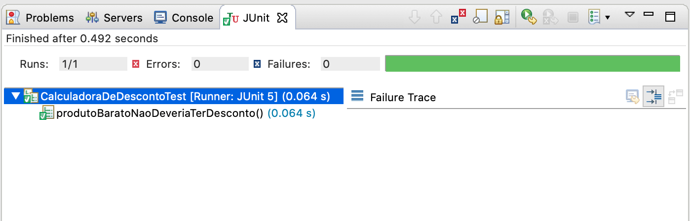

A barra horizontal na cor **verde** indica que os testes foram executados e as asserções estão corretas, nos indicando assim que nosso código funciona conforme o esperado.

Se alguma pessoa alterar o código da classe `CalculadoraDeDesconto` gerando um bug, ao executar novamente os testes teremos o seguinte resultado:

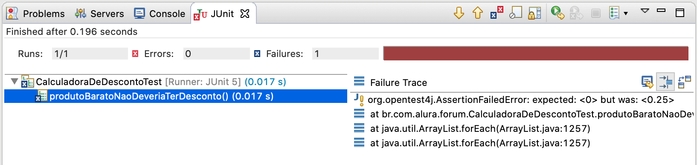

Repare como fica mais fácil de descobrir o bug e sua possível causa ao analisar esse relatório do JUnit.

Após corrigir o bug, podemos escrever os testes dos outros cenários que estão relacionados com a classe `CalculadoraDeDesconto`:

```java
public class CalculadoraDeDescontoTest {
  
  private CalculadoraDeDesconto calculadora;
  
  @BeforeEach
  public void beforeEach() {
    calculadora = new CalculadoraDeDesconto();
  }

  @Test
  public void produtoBaratoNaoDeveriaTerDesconto() {
    Produto caneta = new Produto(new BigDecimal("2.5"));
    
    BigDecimal desconto = calculadora.valorDoDesconto(caneta);
    
    Assertions.assertEquals(BigDecimal.ZERO, desconto);
  }
  
  @Test
  public void produtoQueCustaExatamente1000ReaisNaoDeveriaTerDesconto() {
    Produto caneta = new Produto(new BigDecimal("1000.00"));
    
    BigDecimal desconto = calculadora.valorDoDesconto(caneta);
    
    Assertions.assertEquals(BigDecimal.ZERO, desconto);
  }
  
  @Test
  public void produtoComPrecoMaiorQue1000ReaisDeveriaTerDescontoDe10PorCento() {
    Produto caneta = new Produto(new BigDecimal("2000.00"));
    
    BigDecimal desconto = calculadora.valorDoDesconto(caneta);
    BigDecimal descontoEsperado = new BigDecimal("200.00");
    
    Assertions.assertEquals(descontoEsperado, desconto);
  }

}
```

Agora sim estamos testando todos os cenários e nosso teste está muito mais confiável.

Repare que para evitar ficar repetindo o código que cria o objeto `CalculadoraDeDesconto` em todos os testes, o isolamos em um método anotado com `@BeforeEach`, ao qual o JUnit chama automaticamente antes de realizar cada um dos testes.

Porém, ao executar todos os testes veremos que um deles falha:

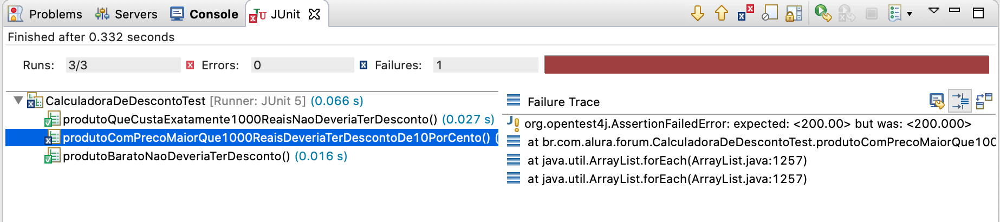

Na verdade o teste não falhou por conta de um bug na lógica do código da classe `CalculadoraDeDesconto`, mas sim por conta de um problema de arredondamento do valor retornado. Como estamos utilizando a classe `BigDecimal` do Java para representar os valores monetários, é recomendado indicar quantas casas decimais utilizaremos:

```java
public class CalculadoraDeDesconto {

  private static final BigDecimal MIL_REAIS = new BigDecimal("1000.00");
  private static final BigDecimal DEZ_POR_CENTO = new BigDecimal("0.1");

  public BigDecimal valorDoDesconto(Produto produto) {
    BigDecimal precoDoProduto = produto.getPreco();

    if (precoDoProduto.compareTo(MIL_REAIS) <= 0) {
      return BigDecimal.ZERO;
    } else {
      return precoDoProduto.multiply(DEZ_POR_CENTO).setScale(2, RoundingMode.HALF_UP);
    }
  }

}
```

Pronto! Feito esse ajuste os testes vão passar normalmente:

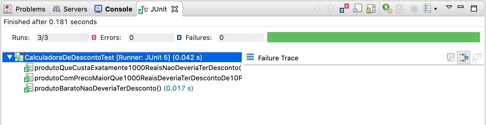

Perceba então como é muito mais simples utilizar uma ferramenta, como o JUnit, para escrever, executar e analisar o resultado dos testes automatizados em uma aplicação.

## Exercício: Configurando o projeto para os testes automatizados

Nesse exercício vamos adicionar um novo `source folder` em nossa aplicação, o qual será utilizado para as classes de testes automatizados.

1. Clique com o botão direito do mouse no projeto e selecione a opção: `Build Path -> Configure Build Path...`

  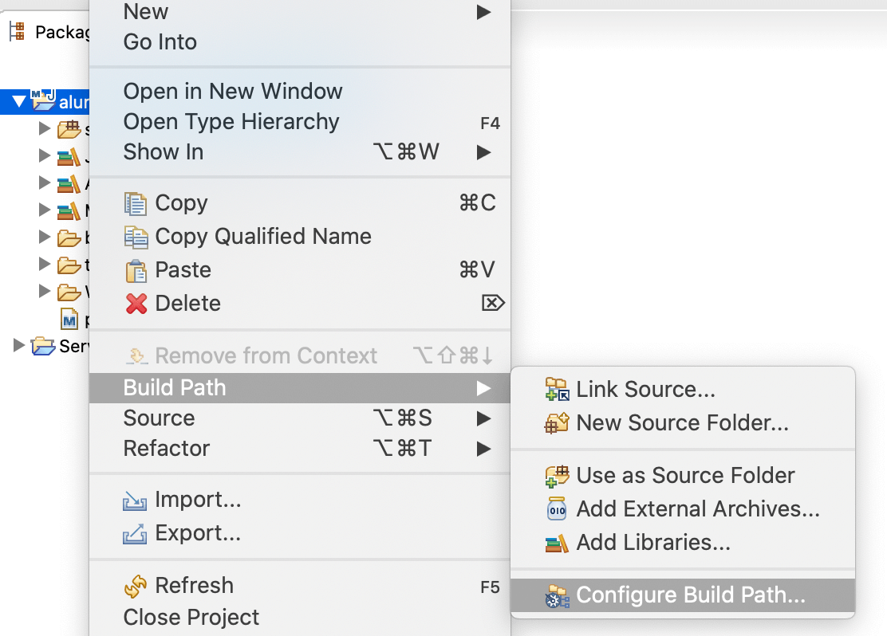

2. Clique na aba superior `Source` e então clique no botão **Add Folder...**

  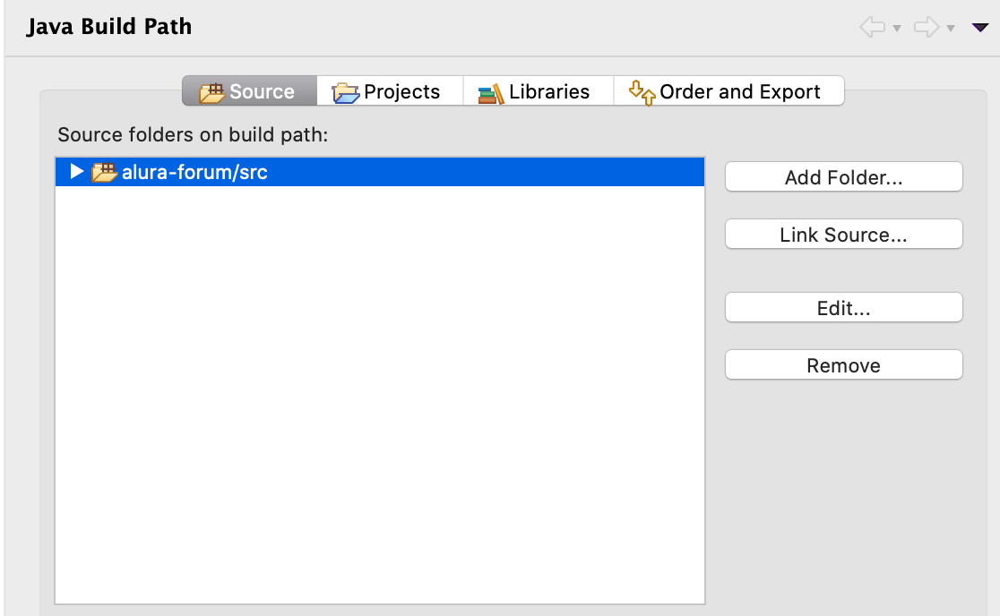

3. Na janela que foi aberta, clique no botão **Create New Folder...**, adicione uma pasta chamada **test** e então clique no botão **Finish**.

  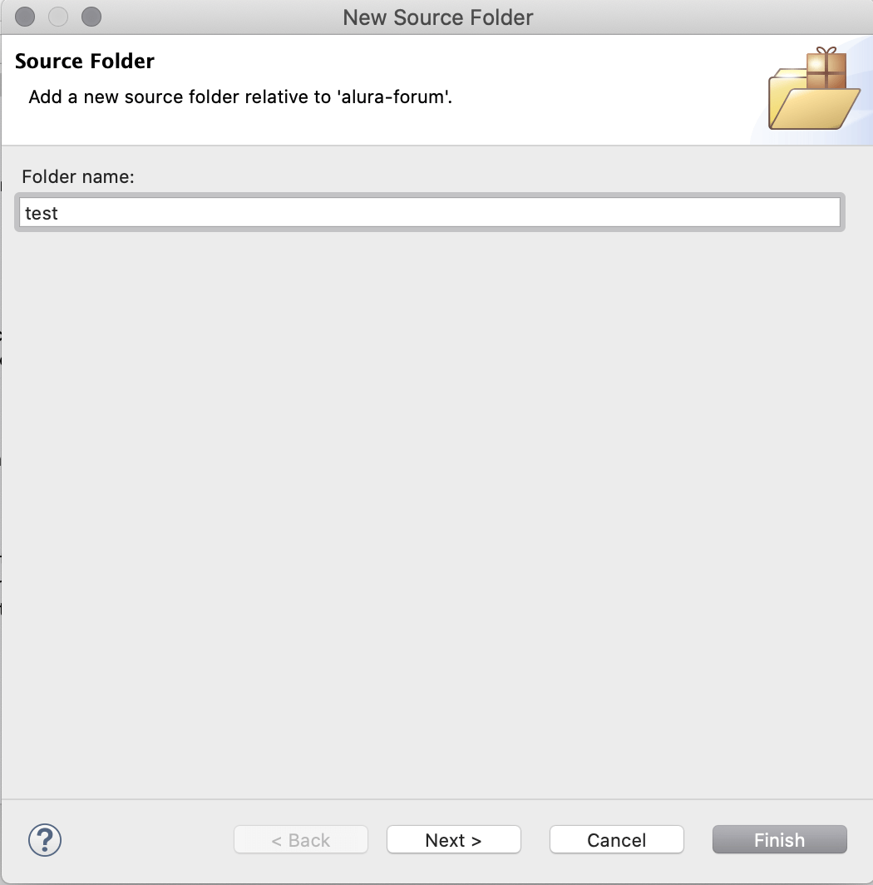

4. Verifique na tela principal do `build path` se a nova pasta está sendo listada:

  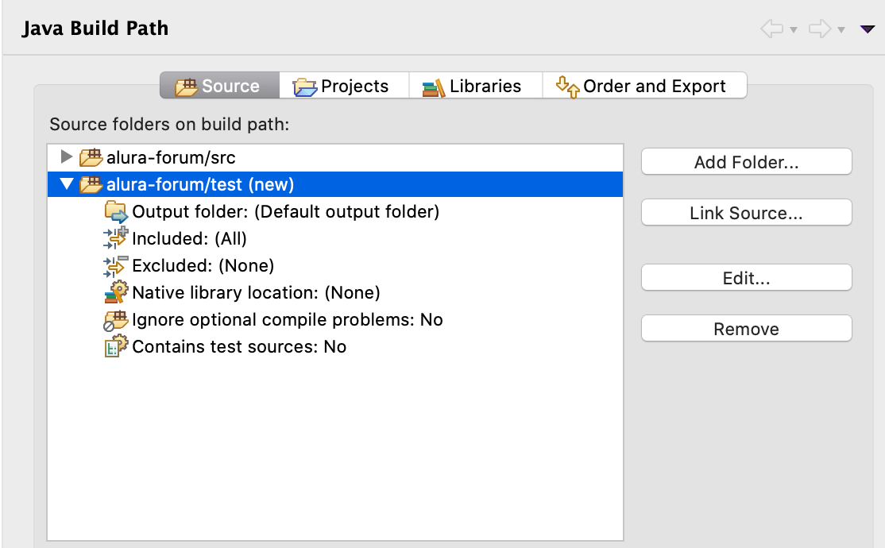

5. Dê um duplo clique na opção **Output folder** e altere-o conforme a imagem a seguir:

  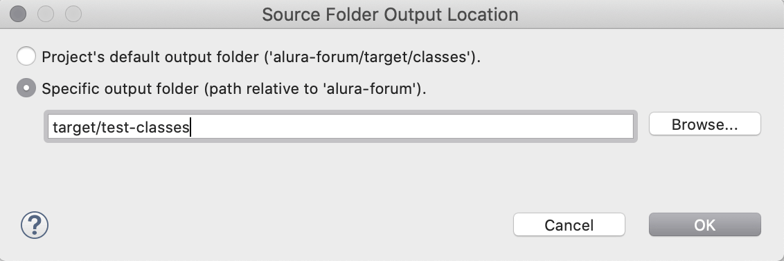

6. Dê um duplo clique na opção **Contains test sources** para alterar seu valor para **Yes** e confira se o novo source folder está configurado conforme a imagem a seguir:

  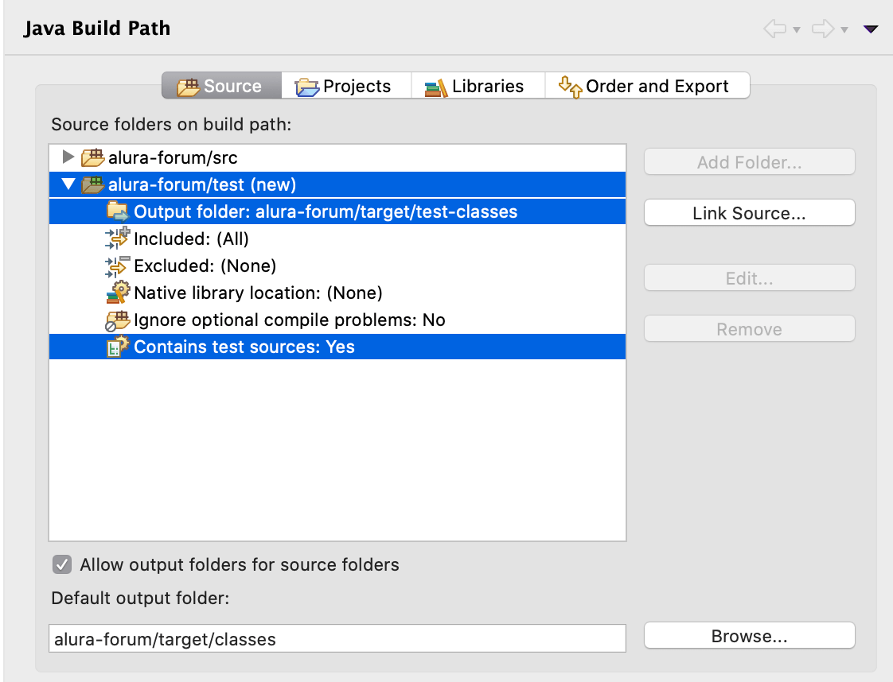

7. Clique no botão **Apply and close** para finalizar a criação do novo source folder.

8. Abra o arquivo `pom.xml`, procure pela tag `<build>` e dentro dela adicione a seguinte tag, logo abaixo da tag `<sourceDirectory>src</sourceDirectory>`:

  ```
  <testSourceDirectory>test</testSourceDirectory>
  ```

9. Agora, para finalizar, clique com o botão direito do mouse no projeto e selecione a opção **Maven -> Update Project...**.

## Exercício: Escrevendo testes automatizados na aplicação

Nesse exercício vamos escrever alguns testes automatizados em nossa aplicação utilizando o JUnit.

1. Primeiramente, precisamos adicionar o JUnit ao projeto. Abra o arquivo **pom.xml**, procure a seção de **dependências** e adicione o JUnit como dependência:

  ```xml
  <dependency>
    <groupId>org.junit.jupiter</groupId>
    <artifactId>junit-jupiter-engine</artifactId>
    <version>5.6.0</version>
    <scope>test</scope>
  </dependency>
  ```

2. Precisamos também adicionar o plugin do Maven responsável por executar os testes automatizados. Ainda no `pom.xml`, procure a seção de **plugins** e adicione o novo plugin:

  ```xml
  <plugin>
    <groupId>org.apache.maven.plugins</groupId>
    <artifactId>maven-surefire-plugin</artifactId>
    <version>3.0.0-M4</version>
  </plugin>
  ```

3. Agora já podemos escrever os testes automatizados utilizando o JUnit. A classe `Topico` é uma boa candidata para começarmos a escrever os testes, pois ela possui alguns métodos que contém regras de negócio da aplicação.

4. Clique com o botão direito em cima da classe **Topico**, que está localizada no pacote **br.com.alura.forum.model**, e escolha a opção **New -> Other... -> Junit Test Case**:

  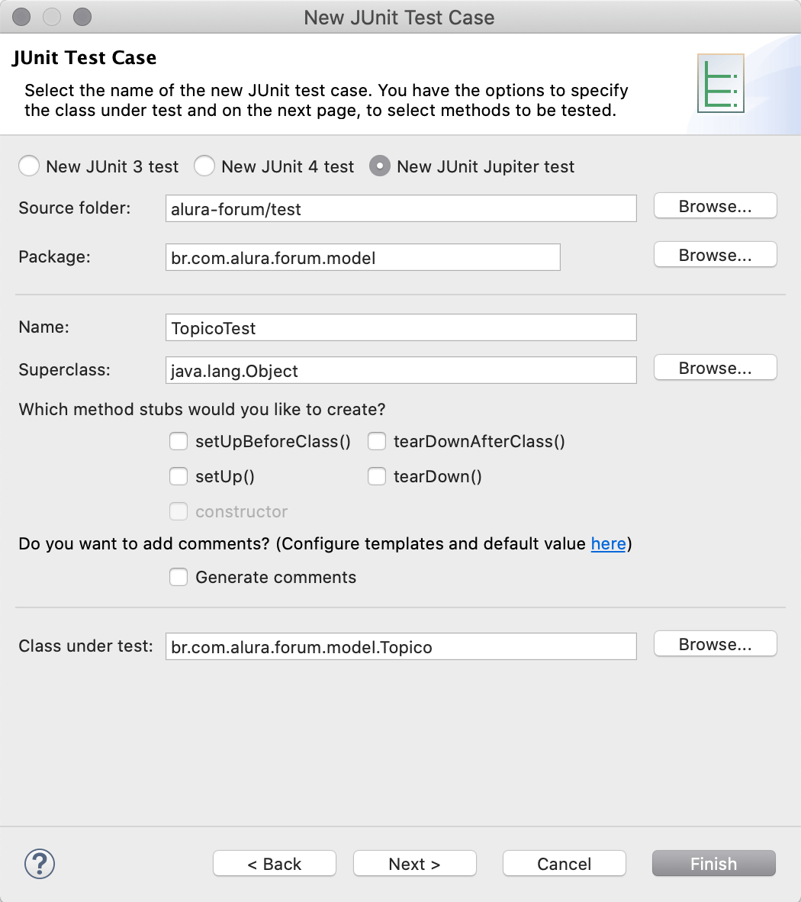

5. Repare que que o Eclipse já preencheu automaticamente as informações de maneira correta. Clique em **Finish** e verifique se a classe **TopicoTest** foi criada corretamente no pacote **br.com.alura.forum.model**, dentro do source folder **test**.

6. Apague o método `test()`, criado automaticamente como um exemplo, e crie o primeiro teste conforme o código a seguir:

  ```java
  class TopicoTest {

    private Usuario joao;
    private Categoria frontend;
    private Categoria html;
    private Curso htmlBasico;
    
    @BeforeEach
    public void before() {
      this.joao = new Usuario("João", "joao@email.com.br", "123456");
      this.frontend = new Categoria("FRONT-END");
      this.html = new Categoria("HTML", frontend);
      this.htmlBasico = new Curso("HTML Básico", html);
    }

    @Test
    public void aoFecharUmTopicoSeuStatusDeveriaSerAlteradoParaFechado() {
      Topico duvida = new Topico("Dúvida HTML", "Qual tag utilizar?", joao, htmlBasico);
      
      duvida.fechar();
      
      Assertions.assertEquals(StatusTopico.FECHADO, duvida.getStatus());
    }

  }
  ```

7. Execute o teste, clicando com botão direito na classe e escolhendo a opção **Run As -> JUnit Test**, e verifique se ele passa com sucesso.

8. Analise o código da classe **Topico** e verifique que outros testes poderiam ser criados. Discuta com os outros alunos(as) e instrutor(a) da turma sobre isso.

9. Lembre-se de fazer o commit das alterações no projeto:

  ```
  git add .
  git commit -m "criacao dos primeiros testes automatizados"
  ```

## Tipos de testes automatizados

Existem diversos tipos de testes automatizados que podemos escrever para verificar a corretude da aplicação, além de encontrar possíveis bugs. O tipo de teste que vimos na seção anterior é chamado de **teste de unidade**, também conhecido como teste unitário, sendo utilizado para testar classes e métodos de maneira isolada do resto do sistema.

Entretanto, existem outros tipos de testes que são mais complexos do que um simples teste de unidade e também são importantes, pois nem sempre conseguiremos testar uma classe de maneira isolada.

### Testes de unidade

Testes de unidade servem para testar apenas uma classe ou método, de maneira isolada das outras classes, verificando se seu comportamento está de acordo com o desejado. Nesse tipo de teste, verificamos a funcionalidade da classe e/ou método em questão passando o mínimo possível por outras classes ou dependências do nosso sistema.

> **Unidade?**
>
> Unidade é a menor parte testável de uma aplicação. Em uma linguagem de programação orientada a objetos, como o Java, a menor unidade é um método.
>
> O termo correto para esse tipo de teste é teste de unidade, porém o termo teste unitário propagou-se e é o mais encontrado nas traduções.

Em testes de unidade não estamos interessados no comportamento real das dependências da classe, mas em como a classe em questão se comporta diante das possíveis respostas das dependências, ou então, se a classe modificou as dependências da maneira esperada.

Para isso, quando criamos um teste de unidade, simulamos a execução de métodos da classe a ser testada. Fazemos isso passando parâmetros, caso necessário, ao método testado e definimos o resultado que esperamos. Se o resultado for igual ao que definimos como esperado, o teste passa. Caso contrário, falha.

Justamente por conta dessas características é que os testes de unidade são mais simples de escrever, além de também serem executados de maneira muito mais rápida.

### Testes de integração

Nem sempre será possível testar uma classe de maneira isolada, utilizando testes de unidade, pois é comum que algumas classes precisem se *integrar* com outras classes, módulos ou até mesmo outros sistemas externos.

Para esse tipo de classe um teste de unidade não vai funcionar, pois a essência dela é se integrar com "serviços" externos, não sendo possível assim executar seu código de maneira isolada.

Surge assim a necessidade de se escrever testes um pouco mais complexos que os testes de unidade, de maneira em que a integração que a classe faz possa também ser testada.

Esse tipo de teste é chamado de **teste de integração** e seu objetivo é testar justamente a integração entre classes, módulos e/ou serviços externos da aplicação.

Um exemplo de classe que precisaríamos testar via testes de integração são as classes **DAO**(Data Access Object), cujo objetivo é isolar o acesso ao banco de dados da aplicação.

A essência dessa classe é fazer o acesso ao banco de dados da aplicação, ou seja, ao executar os métodos dessa classe ocorrerá uma integração entre a aplicação e o banco de dados em si.

Vejamos um exemplo desse tipo de classe:

```java
@Repository
public class FaturaDao {

  @PersistenceContext
  private EntityManager em;

  public List<Fatura> buscarFaturasVencidas() {
    String jpql = "SELECT f FROM Fatura f WHERE f.dataVencimento < :hoje AND f.dataPagamento IS NULL";
    return em.createQuery(jpql, Fatura.class)
        .setParameter("hoje", LocalDate.now())
        .getResultList();
  }

}
```

Repare no código anterior que a classe possui um método chamado `buscarFaturasVencidas()`, cujo objetivo é carregar do banco de dados as faturas não pagas e já vencidas. Sempre que esse método for executado uma integração ao banco de dados será efetuada.

Para testar essa classe será necessário escrever um teste de integração. Entretanto, um teste de integração pode ser bastante complexo, dependendo do tipo de integração sendo realizada pela classe a ser testada.

Por exemplo, ao escrever o teste da classe `Dao` mostrada no exemplo anterior, os seguintes questionamentos e dificuldades poderão surgir:

* Como fazer com os parâmetros injetados na classe, por exemplo o `EntityManager`?
* O teste vai acessar o mesmo banco de dados utilizado pelo time de desenvolvimento?
* Os dados já existentes no banco de dados vão interferir nos testes?
* Seria melhor utilizar um outro banco de dados para os testes?

Todas essas questões devem ser levadas em consideração, para que assim seja possível saber como escrever os testes de integração.

Além de aumentar a dificuldade para escrever e dar manutenção no código desse tipo de teste, o tempo de execução dele será bem maior, se comparado aos testes de unidade.

### Mocks

Existe também o caso de algumas classes que se integram com outras, entretanto a integração em si não é o foco principal delas. Nesses casos é comum que a classe faça a integração apenas para buscar algum tipo de informação, utilizando então essa informação para executar alguma lógica.

Por exemplo, suponha que temos a seguinte classe:

```java
@Service
public class ProcessadorDePagamentos {

  private PagamentoService pagamentoService;

  @Autowired
  public ProcessadorDePagamentos(PagamentoService pagamentoService) {
    this.pagamentoService = pagamentoService;
  }

  public void processarPagamentos(List<Fatura> faturas) {
    for(Fatura atual : faturas) {
      Pagamento recebido = pagamentoService.buscarPagamentoDaFatura(atual);
      if (recebido != null) {
        atual.setDataPagamento(recebido.getData());
        atual.setValorPago(recebido.getValor());
        atual.setStatus(StatusFatura.PAGO);
      }
    }
  }

}
```

A classe anterior tem como objetivo buscar o pagamento de determinadas faturas e, caso elas tenha sido pagas, atualizar suas informações.

Para realizar esse trabalho ela precisa utilizar uma outra classe, que no caso é a classe `PagamentoService`, que é responsável por buscar o pagamento de determinada fatura. Sendo assim, perceba então que existe uma integração entre as classes `ProcessadorDePagamentos` e `PagamentoService`.

Porém, ao testar essa classe não estamos interessados na integração dela com a classe `PagamentoService`, mas sim na sua lógica interna, que representa uma regra de negócio da aplicação.

O objetivo agora é escreve um teste de unidade para essa classe, mas para isso precisamos **isolar**, de alguma maneira, as dependências dela.

Para nos ajudar com isso foi criado um conceito chamado de **Mock**, que nada mais é do que uma classe que vai **simular** o comportamento de outra classe. É como se fosse um **dublê** de filmes, que atua no lugar do ator ou atriz em determinadas cenas.

Poderíamos criar uma classe chamada `PagamentoServiceMock`, que seria utilizada como `mock` da classe `PagamentoService`, e então ao testar a classe `ProcessadorDePagamentos` utilizaríamos a classe `mock` e não a classe verdadeira.

Já existem bibliotecas de `mock` que fazem esse trabalho automaticamente, como por exemplo o **Mockito**, no caso do Java.

Veja um exemplo de teste de unidade da classe `ProcessadorDePagamento` utilizando o Mockito:

```java
@RunWith(MockitoJUnitRunner.class)
public class ProcessadorDePagamentoTest {

  @Mock
  private PagamentoService pagamentoServiceMock;

  private ProcessadorDePagamentos processador;

  @BeforeEach
  public void before() {
    processador = new ProcessadorDePagamentos(pagamentoServiceMock);
  }

  @Test
  public void faturaNaoPagaDeveriaManterSeusDadosInalterados() {
    Fatura contaDeLuz = new Fatura("Conta de Luz", new BigDecimal(105.90));
    List<Fatura> faturas = Arrays.asList(contaDeLuz);

    //configurando comportamento do mock:
    Mockito.when(pagamentoServiceMock.buscarPagamentoDaFatura(contaDeLuz)).thenReturn(null);

    processador.processarPagamentos(faturas);

    Assertions.assertNull(contaDeLuz.getDataPagamento());
    Assertions.assertNull(contaDeLuz.getValorPago());
    Assertions.assertEquals(StatusFatura.EM_ABERTO, contaDeLuz.getStatus());
  }

}
```

Repare no código anterior que antes de chamar o método `processarPagamentos()` configuramos o `mock` com o comportamento que desejamos para esse cenário de teste.

Com isso o teste se comportará como um simples teste de unidade, pois a integração não ocorrerá de verdade, uma vez que estamos utilizando um `mock` e não a classe verdadeira.

### Testes de aceitação

Nem sempre testar as classes de maneira isolada, com testes de unidade, e de maneira integrada, com testes de integração, significa que a aplicação está funcionando corretamente e sem bugs.

Isso porque, até então, não fizemos um teste do ponto de vista do usuário da aplicação, que seria bem mais realista. Todos os testes que vimos até o momento são focados no código da aplicação, sendo que os usuários não tem acesso diretamente e ele.

Um usuário utiliza a aplicação por meio de sua interface gráfica, por exemplo utilizando um browser, no caso de uma aplicação Web, e por meio dessa interface ele interage com suas funcionalidades.

Faz sentido então criar testes que sejam mais realistas, ou seja, que simulem o uso do software de maneira mais próxima possível a como os usuários a utilizam.

Esse tipo de teste é chamado de **teste de aceitação**, também conhecido como **teste de sistema** ou até mesmo como **teste end-to-end**, uma vez que ele testa a aplicação de ponta a ponta.

Para escrever testes de aceitação automatizados será necessário utilizar alguma ferramenta que consiga interagir com a interface gráfica da aplicação, como por exemplo o **Selenium WebDriver**. Esse tipo de ferramenta é capaz de interagir com o browser, acessando URLs, preenchendo formulários, clicando em botões e links, localizando informações na página, etc.

O problema desse tipo de teste é que ele costuma ser bem mais trabalhoso de escrever e dar manutenção, além de exigir do time de desenvolvimento que aprenda uma nova ferramenta para a escrita dos testes, como o Selenium WebDriver.

Além disso, como esse teste vai simular um usuário navegando pela aplicação e interagindo com suas funcionalidades, ele tende a ser bem demorado para executar. Enquanto um teste de unidade é executado em milissegundos, um teste de aceitação pode levar de segundos a minutos para ser executado completamente.

Vejamos um exemplo de teste de aceitação escrito na linguagem Java com a utilização da biblioteca Selenium WebDriver:

```java
public class ListagemDeClientesTest {

  private WebDriver browser;

  @BeforeEach
  public void before() {
    this.browser = new ChromeDriver();
    browser.navigate().to("http://localhost:8080/sistema");
  }

  @Test
  public void deveriaExibirAListaDeClientes() {
    //clica no menu para abrir a pagina de clientes
    browser.findElement(By.id("menu-clientes")).click();

    //recupera o titulo principal da pagina
    WebElement titulo = browser.findElement(By.tagName("h1"));

    //recupera a listagem de clientes
    WebElement tabela = browser.findElement(By.id("tabela-clientes"));

    //verifica se o titulo da pagina esta correto
    Assertions.assertEquals("Lista de clientes cadastrados", titulo.getText());

    //verifica se a listagem de clientes foi encontrada na pagina
    Assertions.assertNotNull(tabela);
  }

}
```

Repare no código anterior que existe um acoplamento forte entre o teste e os componentes visuais da página. Qualquer alteração feita no front-end da aplicação pode fazer com que vários testes falhem, tornando assim esse tipo de teste bem *frágil*.

## Exercício: Testes automatizados com Mockito

Nesse exercício vamos escrever mais um teste de unidade, entretanto dessa vez será necessário a utilização de mocks e portanto utilizaremos a biblioteca Mockito.

1. Primeiramente, precisamos adicionar o Mockito como dependência do projeto. Abra o arquivo **pom.xml** e adicione mais uma dependência:

  ```xml
  <dependency>
    <groupId>org.mockito</groupId>
    <artifactId>mockito-junit-jupiter</artifactId>
    <version>3.2.4</version>
    <scope>test</scope>
  </dependency>
  ```

2. A classe que vamos testar será a **DashboardService**, que está localizada no pacote **br.com.alura.forum.service**. Clique com o botão direto nela e escolha a opção **New -> Other... -> JUnit Test Case**.

3. Apague o método de exemplo que foi criado automaticamente e escreva o seguinte código:

  ```java
  @ExtendWith(MockitoExtension.class)
  class DashboardServiceTest {

    @InjectMocks
    private DashboardService dashboardService;

    @Mock
    private CategoriaDao categoriaDao;

    @Mock
    private TopicoDao topicoDao;

    private List<Categoria> categorias;

    @BeforeEach
    public void before() {
      Categoria backend = new Categoria("Back-End", null);
      Categoria frontend = new Categoria("Front-End", null);
      Categoria mobile = new Categoria("Mobile", null);

      this.categorias = Arrays.asList(backend,frontend, mobile);
    }

  }
  ```

4. Agora que já configuramos o mockito para injetar os mocks, podemos escrever os nossos testes. Vamos testar se o `DashboardService` devolve as categorias com os contadores zerados, no caso de não haver nenhum tópico cadastrado:

  ```java
  @Test
    public void contadoresDeveriamEstarZeradosNoCasoDeNaoHaverTopicosAbertos() {
      Mockito.when(categoriaDao.buscarTodasAsCategoriasPrincipais()).thenReturn(categorias);
      categorias.forEach(c -> {
        Mockito.when(topicoDao.countPorCategoria(c)).thenReturn(0l);
        Mockito.when(topicoDao.countPorCategoriaEAbertosNaUltimaSemana(c)).thenReturn(0l);
        Mockito.when(topicoDao.countPorCategoriaENaoRespondidos(c)).thenReturn(0l);
      });

      List<DashboardItem> dashboard = dashboardService.buscarDadosDoDashboardDeTopicos();

      Assertions.assertEquals(3, dashboard.size());
      dashboard.forEach(d -> {
        Assertions.assertEquals(0, d.getQtdTopicos());
        Assertions.assertEquals(0, d.getQtdTopicosDaUltimaSemana());
        Assertions.assertEquals(0, d.getQtdTopicosNaoRespondidos());
      });
    }
  ```

5. Que outros cenários poderíamos testar? Discuta com os outros alunos(as) e instrutor(a) da turma sobre isso.

6. Não se esqueça de fazer o commit das alterações no projeto!

## Para saber mais: Pirâmide de Testes

Sabendo das desvantagens dos testes de aceitação, podemos perceber que é interessante termos mais testes de unidade isolados do que teste de integração e do que testes de aceitação pela UI.

Autores experientes na aplicação da prática de testes automatizados recomendam que a proporção entre esses tipos de testes siga um modelo que foi batizado de **Pirâmide de testes**:


Testes de unidades são rápidos: uma suíte extensa em geral é executada em milissegundos ou segundos. Além disso, são bem baratos de se escrever porque estão isolados e no mesmo nível de abstração do código.

Testes de integração são um pouco mais lentos, tendo uma suíte executada em alguns minutos, em geral. É comum acessarem outras peças da infra-estrutura, como *Bancos de Dados* ou *WebServices*. Por isso, seu setup é mais complicado e tais testes acabam sendo mais caros de desenvolver e manter.

Testes de aceitação são os mais lentos, chegando a horas de execução, no caso de uma suíte muito extensa, além de caros, pela complexidade de escrevê-los. Além disso, qualquer alteração visual pode quebrá-los e, às vezes, apresentam falhas intermitentes.

Testes repetitivos, que verificam funcionalidades e detectam regressões devem ser automatizados. Mas ainda são necessários testes manuais, que permitam que o software seja criticado com um olhar humano. Exemplos de testes manuais interessantes são: testes exploratórios, de usabilidade, de segurança, de performance, carga, dentre outros.

Veja mais detalhes em: http://martinfowler.com/bliki/TestPyramid.html

## Para saber mais: TDD (Test Driven Development)

Em desenvolvimento de software existe um conceito chamado TDD, que significa **Test Driven Development**, ou seja, desenvolvimento guiado por testes, sendo também uma técnica relacionada com testes automatizados.

TDD é uma técnica que consiste em pequenas iterações, em que novos casos de testes de funcionalidades desejadas são criados antes mesmo da implementação. Nesse momento, o teste escrito deve falhar, já que a funcionalidade implementada não existe. Então, o código necessário para que os testes passem deve ser escrito e o teste deve passar. O ciclo se repete para o próximo teste mais simples que ainda não passa.

Um dos principais benefício dessa técnica é que, como os testes são escritos antes da implementação do trecho a ser testado, a pessoa que está programando não é influenciada pelo código já feito - assim, ela tende a escrever testes melhores, pensando no comportamento em vez da implementação.

Isso é muito importante, pois os testes automatizados deveriam focar no comportamento da aplicação, e não no que uma implementação em si faz.

Além disso, nota-se que TDD influencia a escrita de códigos com baixo acoplamento, algo que é ótimo, já que classes muito acopladas são difíceis de testar.

O TDD também é uma espécie de guia: como o teste é escrito antes da implementação, nenhum código será escrito por "acharmos" que vamos precisar dele. Em sistemas sem testes, é comum encontrarmos diversos trechos de código que jamais serão utilizados pela aplicação, simplesmente porque a pessoa quem desenvolveu "achou" que alguém um dia precisaria daquele determinado trecho de código.

TDD é uma prática um pouco difícil de se adotar, mas depois que o time de desenvolvimento pega o jeito e o hábito é adquirido, podemos ver claramente as diversas vantagens dessa técnica.

Veja mais detalhes em: https://martinfowler.com/bliki/TestDrivenDevelopment.html

## Para saber mais: Refactoring

No processo de desenvolvimento de software passamos grande parte do tempo lendo trechos de código. Muitas vezes esse tempo é maior do que o tempo gasto escrevendo novas linhas de código. Isso acontece pois, para qualquer alteração, é preciso procurar quais classes ou arquivos serão afetados, entender qual é o funcionamento atual e como adicionar o novo comportamento sem mudar o antigo.

Uma consequência direta disso é que quanto maior a dificuldade em ler e entender uma parte do código, maior é o tempo gasto para fazer uma alteração nela. Mesmo se a pessoa que fez o código for a mesma a fazer a alteração, ela precisa de algum tempo lendo o código para lembrar o que foi feito.

Para evitar esse problema é preciso manter a qualidade e a clareza do código sempre altas, diminuindo assim o custo para fazer alterações nele. É preciso melhorar o código já pronto sem mudar o seu comportamento, sendo que isso é uma prática chamada de **Rafactoring**, conhecida em português como **Refatoração**.

O objetivo da refatoração é melhorar algum aspecto do código com o cuidado de não mudar o comportamento atual da aplicação. Exemplos de aspectos que podem ser melhorados: legibilidade, clareza, baixo acoplamento, separação de responsabilidades, etc.

Refatorar sem ter uma garantia concreta de que o comportamento do código não vai mudar é um pouco imprudente, pois não adianta nada melhorar o código se algo que já existe é quebrado. 

Portanto, é indispensável que existam testes automatizados para o código que está sendo refatorado. Se não existem testes para o que precisa ser refatorado ou se os testes não cobrem todos os comportamentos, é preciso escrevê-los antes de refatorar.

Você pode conhecer mais detalhes sobre essa técnica e encontrar livros sobre o assunto no seguinte endereço: https://martinfowler.com/tags/refactoring.html

## Cobertura de testes

Uma outra prática, ainda relacionada com testes automatizados, que é bastante utilizada pelos times de desenvolvimento é a de medir a porcentagem do código que está coberta por testes automatizados.

Essa prática é chamada de **Code Coverage**, também conhecida como **Test Coverage**, e seu principal objetivo é identificar possíveis trechos do código da aplicação que não possuem testes automatizados.

Se o time de desenvolvimento já utiliza a prática de escrever testes automatizados para as funcionalidades da aplicação, é importante saber quais funcionalidades ainda não foram testadas, para que então se escreva os testes automatizados delas, diminuindo com isso a chance de bugs passarem despercebidos.

Existem ferramentas que automatizam esse processo de analisar o código fonte da aplicação e gerar um relatório quanto à cobertura de testes, podendo inclusive ser adicionadas ao processo de build da aplicação.

Algumas dessas ferramentas são:

* JaCoCo
* Emma
* Cobertura
* Clover
* NCover

### JaCoCo

**JaCoCo** é uma ferramenta gratuita para análise de cobertura de código em aplicações Java, que funciona de maneira bem simples e pode ser integrada ao Maven.

Ao executar os testes automatizados com JUnit, a biblioteca JaCoCo consegue executar a análise do código e gerar uma relatório em HTML, CSV ou XML. Nesse relatório é possível identificar de maneira numérica quantas classes, métodos e linhas de códigos estão sem cobertura de testes.

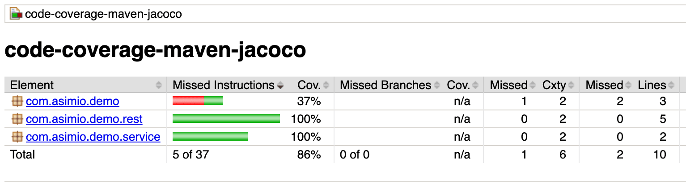

## Exercício: Code Coverage com JaCoCo

Nesse exercício vamos adicionar o JaCoCo como biblioteca de cobertura de testes em nossa aplicação, além de configurar sua integração com o Maven.

1. Primeiramente, precisamos adicionar o JaCoCo como **plugin** do Maven. Abra o arquivo **pom.xml** e adicione o plugin do JaCoCo:

  ```xml
  <plugin>
    <groupId>org.jacoco</groupId>
    <artifactId>jacoco-maven-plugin</artifactId>
    <version>0.8.5</version>
    
    <executions>
      <execution>
        <goals>
          <goal>prepare-agent</goal>
        </goals>
      </execution>

      <execution>
        <id>report</id>
        <phase>test</phase>
        <goals>
          <goal>report</goal>
        </goals>
      </execution>
    </executions>
  </plugin>
  ```

2. Agora vamos executar todos os testes da aplicação via Maven. Clique com o botão direito em cima do projeto e selecione a opção **Run As -> Maven test**.

3. Após os testes serem executados, acesse o diretório do projeto e entre na pasta **target/site/jacoco**. Abra no browser o arquivo **index.html** para ver e navegar pelo relatório.

4. Discuta com os(as) alunos(as) e com o(a) instrutor(a) da turma sobre os percentuais da nossa aplicação.

  <!--@note
    Aqui a ideia é discutir sobre a má pratica de querer 100% de cobertura, pois com isso o foco passa a ser "bater o percentual", nem para isso seja necessario criar testes inuteis e desnecessarios.
  -->

5. É possível também definir um percentual mínimo de cobertura de testes que será aceito, forçando o Maven a interromper o build quando esse percentual não for atingido:

  ```xml
  <execution>
    <id>jacoco-check</id>
    <goals>
      <goal>check</goal>
    </goals>
    <configuration>
      <rules>
        <rule>
          <element>PACKAGE</element>
            <limits>
              <limit>
                <counter>LINE</counter>
                <value>COVEREDRATIO</value>
                <minimum>0.50</minimum>
              </limit>
            </limits>
          </rule>
        </rules>
    </configuration>
  </execution>
  ```

## Métrica: Change Failure Rate

No livro **Accelerate: The Science of Lean Software and DevOps** os autores discutem sobre quatro métricas que são extremamente importantes para times DevOps:

* Lead Time for Changes
* Deployment Frequency
* MTTR (Mean Time To Recover)
* Change Failure Rate

Essas métricas servem para que o time consiga medir o quão eficiente ele está, em relação à adoção do modelo DevOps e das melhorias que ele deveria trazer para a organização como um todo.

Uma dessas métricas é chamada de **Change Failure Rate**, sendo que seu objetivo é medir a taxa de falhas que acontece a cada mudança no software, ou seja, a cada deploy que é realizado medimos se houve ou não algum tipo de problema relacionado com as mudanças que foram feitas na aplicação.

Se essa taxa estiver muito alta, por exemplo 80%, significa que a cada 10 deploys, 8 deles apresentam algum tipo de problema e o time DevOps terá que *correr* para o solucionar o mais rápido possível ou então fazer um **rollback**, retornando para a última versão estável da aplicação.

Ou seja, um time DevOps deveria sempre medir qual é o seu Change Failure Rate atual e buscar maneiras de diminuir essa taxa, para assim evitar que problemas surjam a cada deploy da aplicação.

Isso evita ambientes em que o termo **deploy** seja algo traumático e que ninguém quer fazer a toda hora, pois sempre vai gerar problemas e dores de cabeça. Nesse tipo de ambiente os deploys costumam ser realizados apenas nas sextas-feiras à noite, pois o time terá o final de semana para resolver os problemas que certamente vão surgir.

### Reduzindo a Change Failure Rate

Uma das maneiras de diminuir a Change Failure Rate é utilizando a prática de escrever testes automatizados, conforme foi visto nesse capítulo, pois os testes nos dão um feedback rápido se tudo continua funcionando normalmente, após mudanças serem realizadas no código da aplicação.

Perceba então a importância dos testes automatizados em uma aplicação, pois além de garantir que as regras de negócio estão sendo implementadas corretamente e promover uma maior segurança ao mexer no código fonte dela, eles nos ajudam a diminuir a chances de falhas ocorrem ao realizar deploy das novas mudanças.

Isso certamente vai diminuir o trauma do time em realizar deploys, além de até poder aumentar a frequência dos deploys sendo realizados, que inclusive é o foco de outra métrica, a **Deployment Frequency**.

Uma outra maneira de diminuir a Change Failure Rate é reduzindo-se o **escopo** das mudanças sendo realizadas na aplicação.

Antigamente era comum ter ciclos de entrega mais longos, que duravam meses ou até anos, e com isso o número de mudanças sendo realizadas na aplicação era muito grande, aumentando assim proporcionalmente as chances de falhas acontecerem.

Times que trabalham com metodologias ágeis tem preferência por ciclos de entrega mais curtos, com duração de dias ou poucas semanas, e com isso o escopo acaba sendo bem pequeno, contemplando poucas mudanças e reduzindo assim as chances de muitos problemas acontecerem.

Essa pode ser uma outra prática a ser seguida que com certeza diminuirá bastante o número de falhas ao realizar mudanças na aplicação.
