# Integração Contínua

Neste capítulo vamos aprender sobre Integração Contínua e entender o porquê dessa prática ser indispensável para um time DevOps, além de também aprender a utilizar o Jenkins como uma das principais ferramentas para tal prática.

## Trabalhando em time

Já discutimos que desenvolver um software é uma tarefa bastante complexa e desafiadora, não sendo comum que apenas uma pessoa, de maneira isolada, seja responsável por todo o desenvolvimento dele. É mais provável que seja formado um time, com diversas pessoas colaborando entre si, para realizar tal tarefa.

E com isso algumas dificuldades podem surgir:

* Como fazer para que essas pessoas trabalhem todas ao mesmo tempo mexendo na mesma **base de código**?
* Como fazer para que essas pessoas **sincronizem** sua parte do trabalho com as partes das outras?
* Como identificar possíveis **conflitos** no código ao realizar a sincronização do trabalho?

Já discutimos também, em capítulos anteriores, sobre essas dificuldades e que utilizar uma ferramenta de **controle de versão** é a principal solução para elas. Inclusive, para isso, aprendemos e começamos a utilizar o Git em nossa aplicação.

Entretanto, apenas utilizar uma ferramenta de controle de versão não vai resolver todos os problemas, pois algumas dificuldades ainda podem permanecer e outras poderão surgir.

Para entender melhor que tipos de problemas podem surgir, vamos imaginar a seguinte situação: nossa aplicação possui diversas funcionalidades que precisam ser desenvolvidas e outras que precisam ser ajustadas, e o time de desenvolvimento é formado por 8 pessoas.

Suponha que você ficou responsável por desenvolver alguma dessas funcionalidades, por exemplo, uma tela que mostre um relatório mensal de tópicos criados no fórum da Alura. Você analisou o esforço para realizar essa tarefa e estimou um prazo de 4 dias para realizá-la.

Após os 5 dias, você finalizou o trabalho e agora precisa sincronizar seus commits com o repositório central que está no GitLab. Vimos que isso é algo bem simples de se fazer com o Git, bastando apenas utilizar o comando `git push`.

Porém, durante esses 5 dias em que você ficou trabalhando nessa funcionalidade, as outras 7 pessoas do time também estavam trabalhando em suas funcionalidades, realizando alterações no código fonte da aplicação e commits para registrá-las.

Embora 5 dias possa parecer pouco tempo, quando temos muitas pessoas mexendo ao mesmo tempo no código fonte de uma aplicação, o trabalho acumulado por elas será muito grande, sendo que o efeito disso será percebido apenas quando elas forem sincronizar seus trabalhos.

Antes de efetuar o `push`, você vai precisar executar o comando `pull`, para baixar os commits enviados ao repositório central pelas outras 7 pessoas do time.

Como são muitas pessoas trabalhando na aplicação ao longo de 5 dias, serão muitos commits a serem baixados, sendo muito provável que alguns conflitos ocorram durante a sincronização.

> **Conflitos?**
>
> Em sistemas de controle de versão conflitos ocorrem quando duas ou mais pessoas alteram um mesmo arquivo no repositório.
>
> Se as alterações forem em linhas distintas do arquivo, o Git é capaz de realizar o **merge(mesclagem)** de maneira automática, sem a necessidade de intervenção humana.
>
> Somente nos casos das alterações terem ocorrido na mesma linha de um determinado arquivo é que precisaremos resolver manualmente o conflito, editando o arquivo e indicando ao Git que o conflito foi resolvido.

Perceba então que quanto mais tempo sem sincronizar o código fonte da aplicação, com as alterações feitas pelas outras pessoas do time, mais commits com alterações estarão sendo acumulados, aumentando proporcionalmente com isso as chances de conflitos ocorrerem durante a próxima sincronização.

Agora imagine que o time é formado por 16 pessoas e você ficou 25 dias trabalhando de maneira isolada no desenvolvimento de uma determinada funcionalidade. É bem provável que a sincronização, também chamada de **integração**, será bastante *dolorosa*.

## Integration hell

Trabalhar durante muito tempo de maneira isolada, sem integrar seu código com o repositório central, pode levar a problemas de conflitos ao realizar a integração, que podem demandar muito tempo para serem resolvidos, afinal, estamos falando de centenas, ou até milhares de alterações realizadas no repositório durante todo esse tempo.

Infelizmente essa prática ainda é comum em muitos projetos de software, podendo levar as equipes de desenvolvimento a terem uma certa **aversão** à integração de código, pois as pessoas sabem que isso se trata de um evento traumático e que certamente vai gerar muita dor de cabeça.

Inclusive, as pessoas criaram um termo que define bem essa situação: **Integration Hell**, também conhecido como **Merge Hell**. Isso se deve justamente ao fato de ser um verdadeiro *inferno* o fato de ter que integrar o código e gastar um bom tempo resolvendo problemas de conflitos que são bastante chatos de lidar.

É bem comum encontrar alguns times de desenvolvimento que costumam levar horas, ou até mesmo dias, para fazer a integração do código fonte da aplicação. Geralmente essa atividade é realizada apenas quando é necessário subir uma nova versão da aplicação em ambiente de produção. Também é comum que essa atividade seja realizada apenas nas sextas-feiras, pois o time de desenvolvimento terá o final de semana para resolver os problemas de conflitos, caso seja necessário.

Além dos conflitos, outro problema muito comum ao realizar a integração acontece quando, mesmo depois da resolução dos conflitos, a aplicação não funciona como deveria. Às vezes uma alteração em uma parte do código produz efeitos colaterais em outras partes, sem que a pessoa que realizou tal alteração perceba.

Os testes automatizados, conforme foi visto no capítulo anterior, costumam ajudar bastante a evitar esse problema, mas nem sempre as pessoas se lembram de executar todos os testes após alterar o código fonte da aplicação, podendo com isso deixar de ter rapidamente o feedback de que um ou mais bugs foram gerados.

## Integração Contínua

Existe uma frase bem famosa do Martin Fowler, citada em seu livro *Continuous Integration*, que diz: "If it hurts, do it more often", que em português seria algo como: "Se dói, faça mais vezes".

Embora essa frase seja meio *estranha*, soando até como *masoquismo*, ela reflete exatamente a solução para os problemas citados acima, pois integrar código é uma tarefa dolorosa apenas quando não a fazemos com bastante frequência.

Ao realizar a integração apenas ao finalizar uma tarefa, como por exemplo o desenvolvimento de uma funcionalidade, ocorre um acumulo de alterações no código fonte da aplicação, que certamente vai ser bastante trabalhoso de integrar.

Mas ao diminuir esse tempo, por exemplo integrando semanalmente, diariamente ou até mesmo diversas vezes ao longo do dia, diminuímos com isso o acúmulo de alterações, reduzindo assim também a dificuldade e problemas de se integrar código.

Esse é justamente o ponto principal da frase anterior, pois o foco não é aumentar a frequência de integração para que as pessoas se *acostumem* com a dor, mas sim para **reduzir**, ou quem sabe até eliminar, a dor.

Ou seja, quanto menos tempo levamos para integrar nosso código com o repositório central, menores são as chances de conflitos e outros problemas acontecerem, pois o trabalho acumulado será bem pequeno.

Esse é justamente o *coração* da prática que ficou conhecida como **Continuous Integration(Integração Contínua)**, que é uma das principais práticas utilizadas por times DevOps.

O termo *integração contínua* foi descrito inicialmente por **Grady Booch**, um dos criadores da *UML(Unified Modeling Language)*, em 1991 em seu livro *Object Oriented Design: With Applications*, mas se popularizou apenas após **Kent Beck** ter o incluído com uma das práticas do *XP(Extreme Programming)*, que é uma das principais metodologias ágeis utilizadas por times de desenvolvimento de software.

Integração contínua não é uma ferramenta, como algumas pessoas costumam interpretar de maneira errônea, mas sim uma **prática**. Tal prática consiste no **hábito** que as pessoas que fazem parte do time de desenvolvimento devem ter de continuamente integrarem o código de seu repositório local com o repositório remoto.

Ao invés de realizar tais integrações em períodos longos, como semanas ou meses, o ideal é sempre preferir períodos mais curtos, como dias ou horas.

Dessa forma não ficamos com o nosso repositório local desatualizado por um período muito longo, algo que poderia aumentar drasticamente as chances de conflitos e bugs.

Embora não seja obrigatório, é altamente recomendado que as práticas de build e testes automatizados também façam parte do processo de integração contínua, para assim potencializar seu resultado e benefícios.

## Princípios da integração contínua

Para que o processo de integração contínua se torne um hábito entre todas as pessoas do time de desenvolvimento, não se tornando algo complexo e trabalhoso, alguns princípios devem ser seguidos.

Ao seguir tais princípios, aumentamos as chances de aplicar corretamente a prática de integração contínua e com isso colher todos os seus benefícios.

### Utilize um repositório de código

Já discutimos anteriormente que utilizar uma ferramenta de controle de versão é algo essencial para qualquer projeto de desenvolvimento de software. Com integração contínua isso se torna mais importante ainda.

As pessoas do time precisam ter acesso ao código fonte da aplicação, para poder obter uma cópia dele e então começar a trabalhar nela, criando, editando e removendo seus arquivos.

Gerenciar manualmente os milhares de arquivos que fazem parte do código fonte da aplicação e todas as modificações efetuadas neles se torna uma tarefa praticamente impossível de ser realizada.

Portanto, utilizar uma ferramenta de controle de versão e manter o código fonte da aplicação em um repositório é um dos principais princípios que devem ser seguidos para se realizar a prática da integração contínua.

Não somente o código fonte da aplicação deve ser mantido no repositório, mas também todo e qualquer recurso que seja essencial para ela ser executada normalmente. Isso inclui, por exemplo, os seguintes tipos de recursos:

* Scripts de testes
* Scripts de banco de dados
* Arquivos de configurações
* Bibliotecas externas

Para avaliar se a regra anterior está sendo seguida, responda ao seguinte questionamento: Se eu baixar uma cópia do repositório para um computador recém formatado, serei capaz de executar o build da aplicação sem a necessidade de baixar quaisquer outros arquivos externos?

Caso a resposta do questionamento anterior seja negativa, isso significa que o repositório da aplicação está incompleto, ou seja, existem arquivos essenciais que deveriam estar presentes no repositório, mas que não estão.

### Automatize o processo de build

Integração contínua não se resume a apenas sincronizar o repositório local com o remoto e resolver os conflitos de códigos que eventualmente ocorrerem.

Não adianta nada apenas resolver os conflitos de código, se não pudermos mais realizar o build da aplicação por conta de algum problema ter ocorrido com as alterações realizadas.

Ou seja, é importante também, após realizar a sincronização e resolução dos conflitos, realizar o build da aplicação, para verificar se as últimas alterações realizadas no código fonte dela não causaram algum efeito colateral.

Também é importante que esse processo de build seja automatizado, para que ele seja executado de maneira mais ágil e com menos riscos de falhas.

Perceba então que automatizar o processo de build, para que ele possa ser executado de maneira ágil e confiável a cada integração realizada, se torna também um princípio importante no processo de integração contínua.

Automatização de build é outro assunto que também já foi discutido anteriormente aqui no curso, sendo que já sabemos muito bem como o realizar e sua grande importância para um time DevOps.

### Utilize testes automatizados

No capítulo anterior discutimos sobre testes automatizados e os grandes benefícios que tal prática proporciona para um projeto de software.

Justamente por conta disso é que a prática de escrever testes automatizados em uma aplicação se torna, também, um dos princípios da integração contínua.

Isso porque de nada adianta gerar o build da aplicação com sucesso, gerando com isso o artefato que pode ser realizado o deploy em produção, se nela existem diversos bugs que foram gerados por conta das últimas alterações que foram realizadas nela.

É extremamente importante também garantir que tudo o que estava funcionando, antes de realizar a integração, continue funcionando normalmente após a integração ser realizada.

E sabemos que a única maneira de garantir isso é testando a aplicação, para verificar se nenhuma das modificações gerou um efeito colateral resultando em bugs.

Testar todas as funcionalidades da aplicação de maneira manual, a cada nova integração, se torna algo muito trabalhoso e lento com o passar do tempo, chegando a se tornar algo inviável.

Sendo assim, nada melhor do que automatizar todos esses testes, para agilizar esse processo de detectar bugs e garantir que nada foi impactado com as novas alterações realizadas no código fonte da aplicação.

### Integre os testes automatizados ao processo de build

De nada adianta ter testes automatizados na aplicação, se eles não forem executados continuamente para a detecção de possíveis bugs.

Eventualmente algumas alterações no código fonte da aplicação podem gerar efeitos colaterais, fazendo com que alguns testes automatizados falhem por conta de bugs terem surgido.

Devemos então ter o hábito de sempre executar os testes automatizados da aplicação, principalmente após realizar alterações no código fonte dela, para detectar o quanto antes os problemas.

Porém, pode acontecer das pessoas se esquecerem de executar os testes automatizados, deixando passar batido alguns bugs que deveriam ter sido detectados.

Até aí não seria um grande problema, pois o código foi integrado apenas localmente, sendo que tais alterações, a princípio, não foram enviadas para o ambiente de produção.

Problema mesmo seria se realizarmos o build da aplicação para realizar um deploy em ambiente de produção, sem antes executar os testes automatizados, pois corremos o risco de gerar um artefato contendo bugs.

Ou seja, o mínimo que devemos fazer é integrar a execução dos testes automatizados ao processo de build da aplicação, para que eles sejam executados automaticamente a cada novo build realizado, inclusive forçando uma interrupção do processo de build caso algum dos testes falhe, pois isso indica a presença de um bug.

A regra é bem simples e clara: não podemos gerar os artefatos do build da aplicação no caso de existirem bugs nela!

Isso é extremamente importante para se evitar que bugs sejam colocados em ambiente de produção, prejudicando os usuários da aplicação e até mesmo a organização como um todo.

Esse é mais um dos princípios do processo de integração contínua, que inclusive já estamos seguindo, pois o build de nossa aplicação está configurado para ser automaticamente interrompido no caso de algum teste automatizado falhar.

### Sincronize diariamente com o repositório remoto

Esse talvez possa ser considerado como o principal princípio da integração contínua, pois de nada adianta seguir todos os princípios anteriores, se a integração em si é realizada com pouca frequência.

Devemos encurtar ao máximo o intervalo em que as integrações ocorrem, para minimizar o **volume** de código a ser integrado, pois já discutimos bastante sobre os problemas e dificuldades que podemos enfrentar ao não seguir esse hábito.

A periodicidade recomendada para a sincronização com o repositório remoto é diária, ou seja, pelo menos uma vez ao dia devemos sincronizar nosso repositório local com o remoto, para assim disparar todo o processo de integração contínua e então detectar e corrigir o quanto antes os problemas que surgirem.

Se possível, o ideal seria tentar encurtar mais ainda esse período, realizando então diversas integrações ao longo de todos os dias de trabalho.

### Mantenha ágil o processo de build

Um dos principais fatores que contribuem para a redução da frequência, ou até mesmo o abandono, da prática de integração contínua é o seu tempo de execução ser muito longo.

No início do projeto o tempo para a execução do processo de integração contínua como um todo costuma ser bem pequeno, com uma duração de poucos minutos ou até mesmo segundos.

Porém, conforme a aplicação vai crescendo, com a adição de novas funcionalidades, testes automatizados e complexidade, é natural que o esse tempo também aumente proporcionalmente, podendo levar vários minutos ou até mesmo horas, em casos extremos.

Imagine uma aplicação cujo processo de integração contínua demore 20 minutos para ser concluído. Certamente as pessoas do time não vão gostar do fato de terem de esperar 20 minutos a cada integração que fizerem, pois isso vai impactar absurdamente sua produtividade.

Nesse caso é bem provável que as pessoas parem de realizar o processo de integração contínua, ou, no mínimo, diminuam drasticamente sua frequência, para que assim consigam trabalhar de maneira produtiva, sem muitos momentos de espera e ociosidade.

Ou seja, precisamos ficar sempre atentos a quanto tempo leva para que o ciclo de integração contínua seja concluído, realizando ajustes quando ele estiver muito elevado.

Agora você deve estar se perguntando: mas qual é o tempo ideal de duração do processo de integração contínua da aplicação que estou desenvolvendo?

Infelizmente não existe uma resposta padrão para essa pergunta. Cada aplicação tem suas necessidades e particularidades distintas, fazendo com que esse tempo varie de projeto para projeto.

É possível utilizar como base uma prática do XP chamada **10-minute build**, que recomenda que o build seja executado em no máximo 10 minutos, pois um tempo maior do que esse vai causar uma redução na frequência de sua realização, fazendo com que o time perca feedbacks importantes e rápidos sobre a situação atual da aplicação.

### Dispare o processo de integração contínua a cada novo commit

Ao invés de criar uma especie de *calendário* para a execução do processo de integração contínua, ou seja, definir horários ou uma periodicidade específica, é mais simples e fácil o disparar a cada novo commit efetuado no repositório.

Isso evitar termos de ficar lembrando quando precisamos disparar o processo, além de fazer mais sentido, pois cada commit representa um conjunto de modificações que foi realizado no código fonte da aplicação.

### Utilize um servidor para executar a integração contínua

Até o momento falamos bastante sobre automatização, mas o foco dela era em algumas das etapas do processo de integração contínua e não no processo em si.

Para agilizar o processo e diminuir o risco de esquecimento ou de erros em sua execução, o ideal é sempre utilizar alguma ferramenta que dispare o processo de integração contínua de maneira automatizada para o time.

Inclusive podemos instalar e configurar essa ferramenta em algum servidor externo, evitando que tenhamos que executar o processo em nosso próprio computador.

Dessa forma podemos focar em desenvolver o software em si, de tal forma que o processo de integração contínua funcionará de maneira transparente para o time de desenvolvimento. A única coisa que o time precisará fazer é ter o hábito de sincronizar seu repositório continuamente.

Como não estaremos mais disparando e acompanhando manualmente a execução do processo, precisamos também configurar para que a ferramenta nos alerte de maneira automática, no caso de erros terem sido encontrados.

Seguindo esse princípio o time poderá ficar mais focado em desenvolver o software em si, sendo alertado eventualmente em casos de problemas, e com isso sua produtividade não será muito afetada.

Existem diversas ferramentas que nos auxiliam com esse processo de integração contínua, tais como:

* Jenkins
* Travis CI
* Circle CI
* Bamboo
* Team City
* Code Ship

Mais adiante nesse capítulo aprenderemos a utilizar o Jenkins como nossa principal ferramenta para integração contínua.

### Imediatamente corrija os problemas que forem detectados

Sempre que um problema for detectado, independente se foi por uma pessoa do time, ao realizar o processo de integração contínua manualmente, ou por uma ferramenta, que disparou o processo de maneira automatizada, o time deve parar o que estiver fazendo e imediatamente focar na resolução dele.

Isso é muito importante para evitar que os problemas se acumulem, além de que quanto mais tempo demoramos para resolver um problema, mais difícil será de lembrar o porquê das alterações que o causaram terem sido realizadas.

Ou seja, será muito mais fácil de encontrar e resolver o problema na hora que ele surgir, pois ainda não teremos uma quantidade muito grande de trabalho acumulado e também porque o conhecimento ainda estará *fresco* na cabeça das pessoas do time.

### Torne visível a todos o processo de integração contínua

No início do curso discutimos que transparência é um dos principais pilares culturais para a adoção do modelo DevOps em uma organização, pois sem transparência não haverá confiança.

Esse pilar também é válido para o processo de integração contínua, pois todas as pessoas do time deveriam saber como funciona esse processo em sua aplicação, além de também conseguir visualizar os problemas e possíveis melhorias nele.

Deixar o processo de integração contínua disponível e visível a todos é mais uma maneira de praticar o princípio da transparência, além de também ser considerado como uma forma de comunicação.

É comum que alguns times de desenvolvimento utilizem um monitor ou TV de tela grande, geralmente ficando na mesma sala em que o time trabalha, como forma de seguir esse princípio, pois assim qualquer pessoa, tanto do time quanto externa, ficará sabendo de maneira bem clara e direta como está a situação da aplicação.


As ferramentas de integração contínua, como o Jenkins, possuem recursos para exibir de maneira visual o status de cada aplicação, nos auxiliando com isso a seguir esse princípio.

### Deixe acessível os artefatos gerados pelos builds

Lembre-se que o resultado do build da aplicação é um artefato que pode ser colocado em produção. Para simplificar esse processo, é importante facilitar o acesso a tais artefatos.

Geralmente na própria ferramenta de integração contínua conseguimos ter acesso aos artefatos produzidos por cada um dos builds que foram executados, facilitando com isso o acesso a eles.

Isso é importante também para que o time de Ops não precise ficar interrompendo alguém do time de Dev toda vez que precisar ter acesso aos artefatos da aplicação para realizar um novo deploy.

Aqui também, novamente, podemos ver o pilar da transparência sendo aplicado.

### Automatize o processo de deploy

Pelo mesmo fato de ser extremamente importante automatizar o processo de build da aplicação, o processo de deploy também deveria ser automatizado.

Além de agilizar o deploy de uma nova versão da aplicação, a automatização vai reduzir o risco de erros que podem ser causados quando esse processo é executado de maneira manual.

Mais adiante no curso veremos com mais detalhes e aplicaremos esse princípio em nossa aplicação.

## Jenkins

**Jenkins**(https://jenkins.io) é um servidor de integração contínua capaz de orquestrar de maneira automatizada o fluxo utilizado em processos de integração contínua. Por ser gratuito e extensível, por meio de plugins, se tornou bastante popular e utilizado ao redor do mundo.

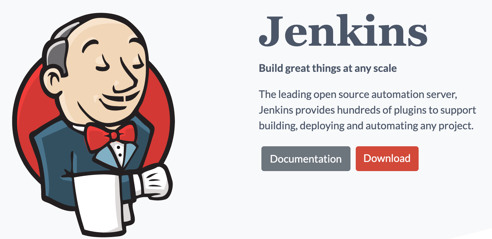

Ele foi desenvolvido em Java, o que o torna portável, mas também suporta aplicações em diversas outras linguagens de programação. Utilizaremos o Jenkins ao longo do curso, sendo que nos próximos exercícios aprenderemos como o instalar, configurar e utilizar.

## Exercício: Instalação do Jenkins

Nesse exercício vamos fazer a instalação e configuração inicial do Jenkins.

1. Acesse o diretório do curso e copie o arquivo `jenkins.war` para o **Desktop**.

2. Abra o terminal, acesse o diretório Desktop e rode o seguinte comando para inicializar o Jenkins:

  ```
  java -jar jenkins.war --httpPort=8082
  ```

3. A partir da versão 2 o jenkins possui um mecanismo de autenticação que já vem habilitado por padrão. Na primeira vez que você executar o jenkins pelo terminal uma senha será gerada para acessá-lo:

  

4. Abra o navegador e acesse o Jenkins em http://localhost:8082

  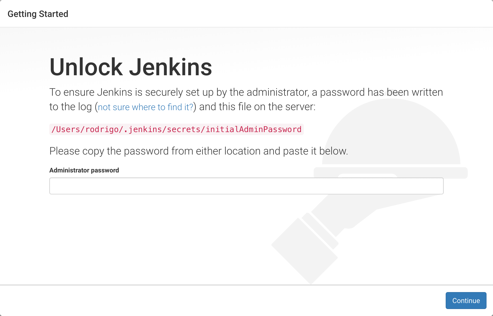

5. Na próxima tela temos a possibilidade de instalar os plugins que queremos utilizar no Jenkins:

  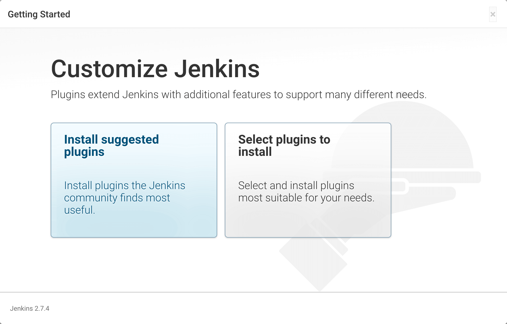

6. Selecione a segunda opção(**Select plugins to install**) e na próxima tela clique no link **None**, para desmarcar os plugins que já vem selecionados por padrão:

  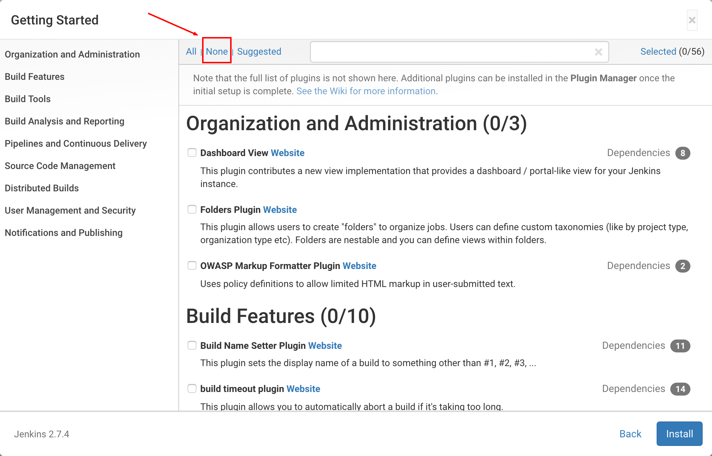

7. Inicialmente precisaremos apenas dos plugins do **Git** e do **Maven Integration**. Selecione-os e clique no botão **Install**.

  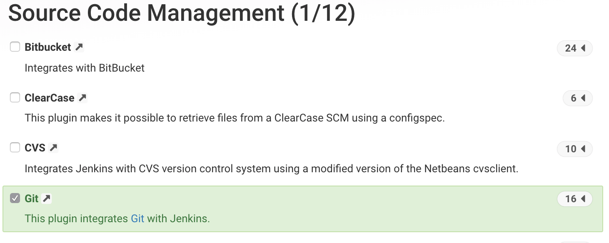

8. O próximo passo será a criação de um usuário `admin` no jenkins. Crie um usuário com o username **admin** e com password **caelum**. Preencha também os campos `Full name` e `E-mail address` com o seu nome e email, e então clique no botão **Save and finish**:

  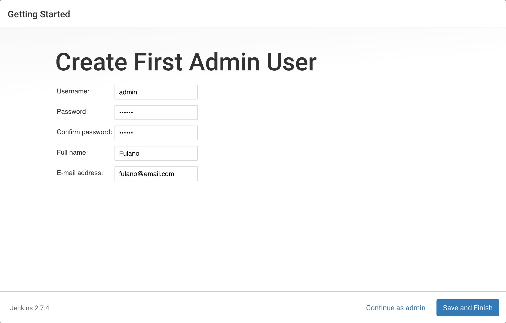

9. Na próxima tela, de configuração da instância do Jenkins, deixe a configuração padrão e clique no botão **Save and finish**.

  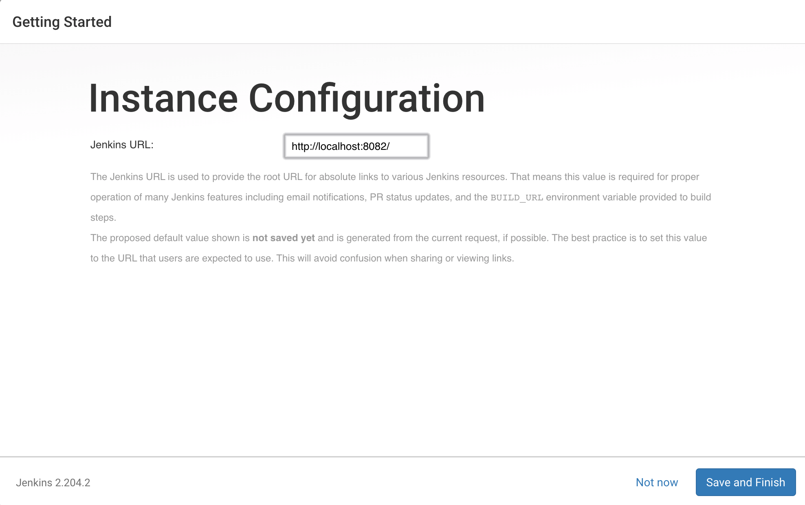

10. Por fim, clique no botão **Start using Jenkins** para acessar a tela principal do Jenkins:

  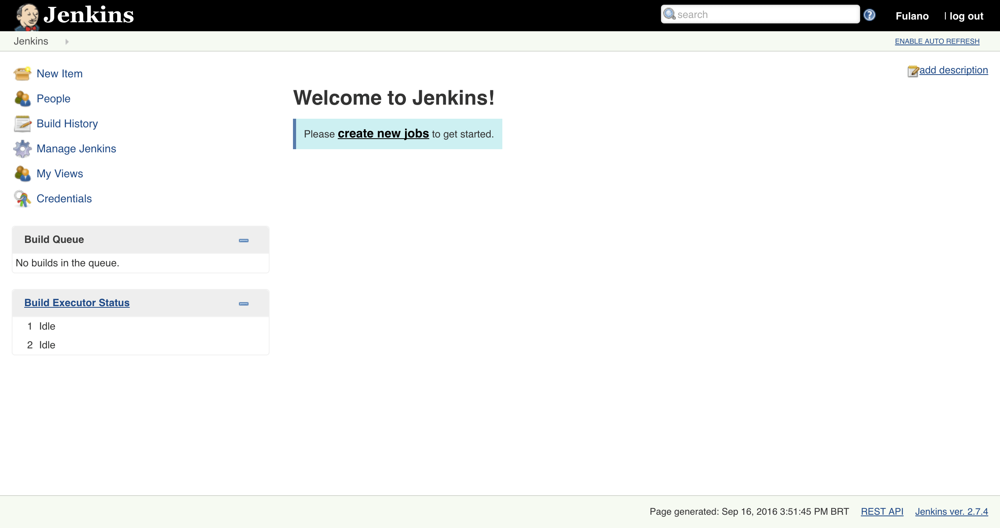

## Integração contínua com Jenkins

Agora que o Jenkins já está pronto para uso, podemos o utilizar para melhorar nosso processo de integração contínua. A ideia agora é seguir os **princípios** mencionados anteriormente.

Inclusive, boa parte desses princípios nós já estamos seguindo, como por exemplo, estamos utilizando o Git para controle de versão, automatizamos o build da aplicação, estamos escrevendo testes automatizados e eles estão integrados ao build, e o build está sendo executado de maneira ágil.

O próximo passo será utilizar o Jenkins como servidor, para automatizar o processo de executar o build da aplicação a cada novo commit efetuado no repositório, além de nos alertar no caso de ocorrer algum erro no processo ou no caso de algum teste automatizado falhar.

## Exercício: Utilizando o Jenkins como servidor de integração contínua

Nesse exercício vamos utilizar o Jenkins como servidor de integração contínua, configurando-o para executar os testes automatizados a cada novo commit realizado no repositório da aplicação.

1. Acesse o Jenkins no browser em http://localhost:8082 e, no menu lateral esquerdo, clique na opção **New Item**.

2. Preencha o campo *item name* com **alura-forum-testes**, selecione a opção **Maven project** e clique no botão **Ok**.

  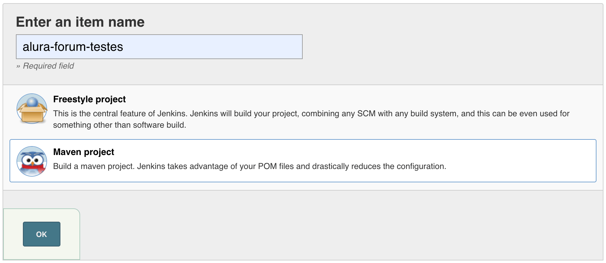

3. No formulário de configuração do novo Item, procure a seção chamada **Source Code Management**, marque a opção **Git** e no campo **Repository URL** preencha com **file:///home/LOGIN_DA_TURMA/Desktop/alura-forum**. Obs: Deve ser o caminho do repositório Git da aplicação alura-forum em seu computador. Em caso de dificuldades, peça ajuda ao instrutor(a).

  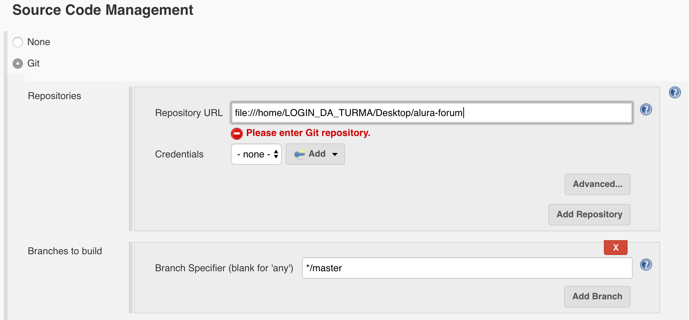

4. Na seção **Build Triggers**, marque a opção **Poll SCM** e no campo **Schedule** preencha com: `* * * * *`.

  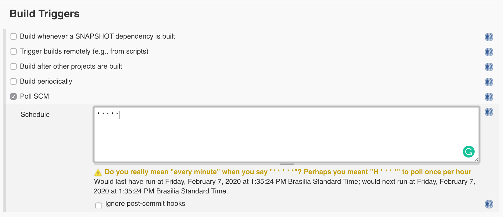

5. Na seção **Build**, preencha o campo **Goals and options** com o valor: `clean test` e clique no botão **Save** para finalizar a configuração.

  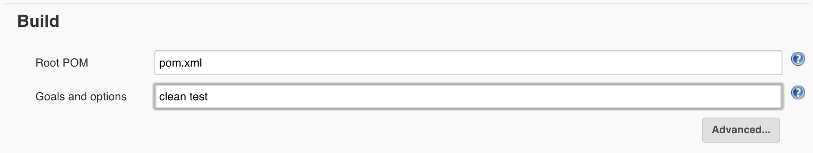

6. Para forçar um novo build, clique no botão **Build Now**, localizado no menu lateral esquerdo da tela:

  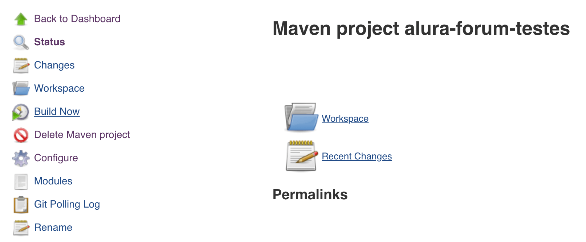

7. O build deve passar, e clicando nele somos redirecionados para a tela de detalhes, na qual podemos ver quais testes foram executados, dentre outras informações:

  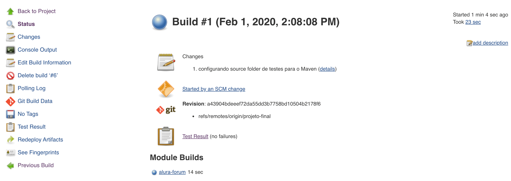

8. Repare que no canto superior direito da tela é informado quanto tempo o build levou para ser executado. No exemplo anterior, levou apenas 23 segundos, que é um tempo muito bom. Claro, esse tempo só foi bem pequeno pelo fato da nossa aplicação possuir poucos testes, sendo natural ele aumentar com o andamento do projeto.

## Plugins do Jenkins

Uma das grandes vantagens do Jenkins é sua extensibilidade, obtida por meio de **plugins** que podem ser criados para adicionar novas funcionalidades a ele.

Um plugin pode ser desenvolvido por qualquer pessoa no mundo, podendo também ser compartilhado livremente para a comunidade tirar benefício dele. Atualmente o Jenkins possui mais de 1500 plugins, utilizados para melhorar algumas tarefas, tais como: relatórios de testes, análise estática de código, build e deploy da aplicação, etc.


## Exercício: Utilizando plugins do Jenkins

Nesse exercício vamos adicionar alguns plugins ao Jenkins, para tirar proveito de sua extensibilidade e incrementar nosso processo de integração contínua.

1. Acesse o Jenkins no browser em https://localhost:8082

2. No menu lateral esquerdo clique na opção **Manage Jenkins**.

3. Na tela que foi aberta, selecione a opção **Manage Plugins**.

  

4. Na tela que foi aberta, clique na aba superior **Available** e espere o Jenkins carregar a lista de plugins disponíveis.

  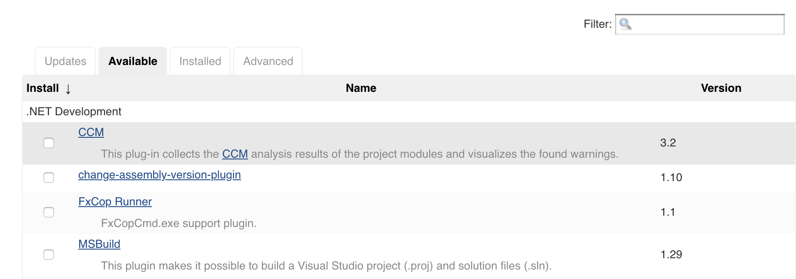

5. Marque os seguintes plugins: **Green ball**, **Radiator View** e **Test Results Analyzer**, e então clique no botão **Download now and install after restart**.

6. Na tela de instalação que foi aberta, marque a checkbox **Restart Jenkins when installation is complete and no jobs are running** e aguarde a finalização da instalação.

  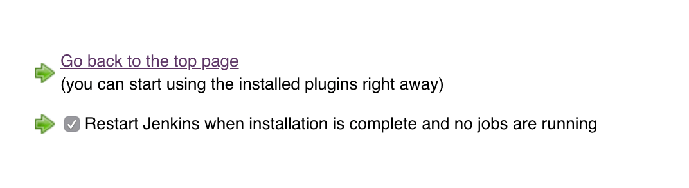

7. O plugin *Green balls* é ativado automaticamente e sua função é trocar a cor de azul para verde, nos builds executados com sucesso:

  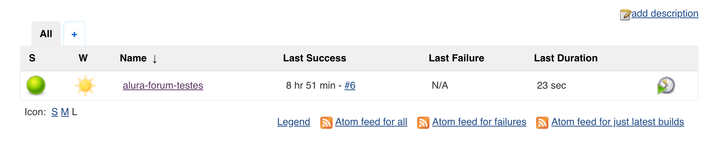

8. O plugin *Test Results Analyzer* adiciona uma nova tela com mais informações sobre os testes automatizados da aplicação. Para acessá-lo, basta entrar na tela de detalhes do *Item* **alura-forum-testes** e clicar na nova opção **Test Results Analyzer** no menu lateral esquerdo:

  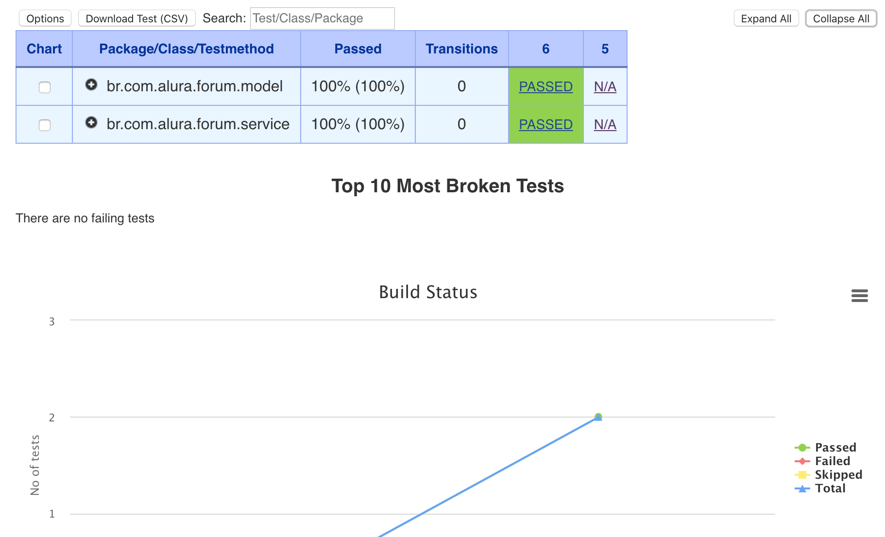

9. O plugin *Radiator View* precisa ser configurado, para adicionar uma nova forma de visualizar o status de cada projeto sendo monitorado pelo Jenkins. Acesse a tela principal do Jenkins e clique no botão com o símbolo **+**, localizado ao lado da aba superior **All**:

  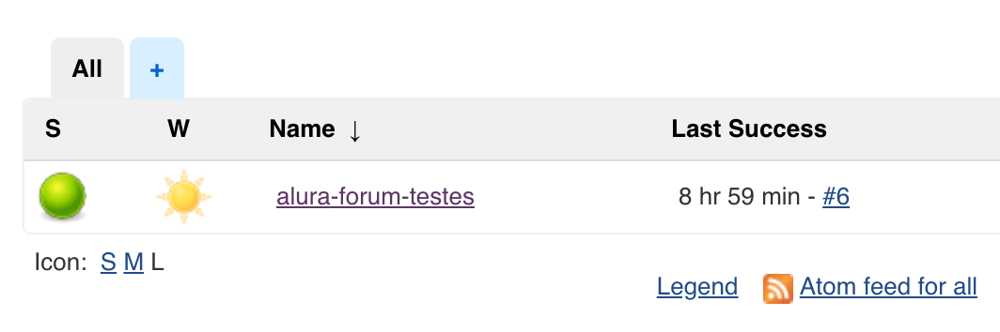

10. No formulário que foi aberto, preencha o campo **View name** com o valor **Radiator**, marque a opção **Raditor** e clique no botão **Ok**:

  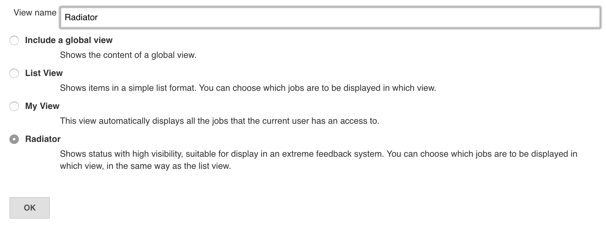

11. No novo formulário que foi aberto, marque o projeto *alura-forum-testes* na opção **Jobs** e marque também as opções **Show stable builds** e **Show build details**, e então finalize clicando no botão **Ok**.

  

12. O Radiator divide a tela de acordo com o número de projetos selecionados, exibindo como fundo de cada um a cor verde, no caso do último build ter passado com sucesso, ou vermelho no caso de ter falhado. Essa tela do Radiator poderia ser exibida em um monitor ou TV de tela grande na sala do time DevOps, para que todos tenham visibilidade do status de cada projeto, além de tornar ágil a identificação das aplicações cujo build falhou.

Para conhecer melhor esses e outros plugins do Jenkins, acesse o site: https://plugins.jenkins.io

## Branches

Uma outra abordagem muito utilizada para se trabalhar em time, com várias pessoas utilizando o mesmo repositório de código, é utilizar o conceito chamado de **branch**, sendo esse um recurso disponibilizado pelos sistemas de controle de versão.

Todo commit é realizado em alguma branch, sendo que no caso do Git ele cria automaticamente uma branch chamada **master**, que geralmente é utilizada como branch principal do projeto.

Mas é possível também criar outras branches no repositório, além da branch *master*, para assim ser possível **separar** logicamente os commits do repositório. Essa separação permite, por exemplo, que uma pessoa trabalhe e realize seus commits em outra branch, de maneira isolada, sem atrapalhar com isso as outras pessoas, que podem continuar a trabalhar na branch master.

### Utilizando branches no Git

No Git, branches são bem simples e performáticas de se trabalhar, algo bem diferente das branches no SVN, que eram lentas e causavam muita dor de cabeça para os times de desenvolvimento.

Para listar as branches de um repositório devemos utilizar o comando `git branch`:

```
git branch

* master
```

Repare que foi listada apenas a branch `master`, que é a única existente em nosso repositório. O asterisco(`*`) antes do nome `master` é para indicar em qual branch estamos no momento.

Para criar uma nova branch devemos utilizar o comando `git branch nome_da_branch`:

```
git branch login
```

Agora ao executar novamente o comando `git branch` veremos que temos duas branches no repositório:

```
git branch

login
* master
```

Podemos trocar de branch com o comando `git checkout nome_da_branch`:

```
git checkout login

Switched to branch 'login'
```

E agora ao realizar novos commits eles serão registrados na branch `login`, que é a branch selecionada no momento.

### Merge de commits

Após finalizar o trabalho em uma branch separada, vamos precisar juntar os commits realizados nela aos novos commits da branch `master`. Isso é feito com a utilização do comando `git merge nome_da_branch`:

```
git checkout master
git merge login
```

Caso ocorra algum conflito, o Git nos avisará e precisaremos resolvê-los para continuar com o processo de `merge` dos commits.

Caso a branch não seja mais utilizada, é possível excluí-la com o comando `git branch -d nome_da_branch`:

```
git branch -d login

Deleted branch login (was a43904b).
```

### Feature-Branch

Existe uma prática utilizada por diversos times de desenvolvimento ao redor do mundo, que consiste em sempre desenvolver as funcionalidades da aplicação em branches separadas, evitando com isso realizar commits diretamente na branch `master`. Essa prática é chamada de **Feature-Branch**.

A ideia consiste em criar uma branch para cada nova funcionalidade a ser desenvolvida e cada pessoa do time deve trabalhar na branch específica de sua funcionalidade, sendo que após a funcionalidade ser concluída um merge dos commits deve ser realizado na branch `master`.

Isso serve para manter a branch `master` estável, ou seja, ela nunca deverá ter funcionalidades incompletas, representando com isso um *estado seguro* que pode ir para produção a qualquer momento. Outra vantagem é permitir que as pessoas trabalhem em suas respectivas funcionalidades sem atrapalhar o trabalho das outras pessoas com seus commits.

### Trunk-Based

Uma outra prática, diferente da feature-branch, consiste em não utilizar branches para cada nova funcionalidade a ser desenvolvida, mas sim sempre utilizar a branch principal, ou seja, a branch `master`.

Essa prática ficou conhecida como **Trunk-Based**, sendo que `trunk` é o nome da branch principal no SVN, que é equivalente à branch `master` no Git.

Nessa prática o foco é evitar a criação de branches, para que assim todos possam trabalhar juntos e serem forçados com isso a integrarem seus códigos a todo momento, para detectar e corrigir o quanto antes os possíveis problemas de integração que surgirem.

Ao utilizar essa prática, todas as pessoas do time devem desenvolver suas funcionalidades na branch `master`, ou `trunk`, no caso do SVN, sempre realizando o processo de integração contínua, para antecipar problemas.

O problema é que na branch master teremos código de funcionalidades incompletas misturado com o código das que já foram finalizadas, podendo com isso dificultar o trabalho de gerar um build para fazer deploy em produção, pois será necessário fazer algum tipo de tratamento para o trabalho ainda não concluído. Uma técnica utilizada para resolver esse problema é chamada de **Feature Toggle**.

> **Feature Toggle?**
>
> Com certeza você já utilizou um interruptor para ligar uma lâmpada em algum cômodo de sua residência. Um interruptor de energia é algo bem simples de utilizar, pois possui apenas duas posições possíveis: ligado e desligado.
>
> Feature Toggle nada mais é do que uma técnica utilizada para se criar uma espécie de *interruptor*, mas ao invés de ligar/desligar uma lâmpada, ele serve para ativar/desativar uma funcionalidade em uma aplicação.
>
> Essa técnica pode ser utilizada para diversos objetivos, sendo um deles o de *esconder* as funcionalidades incompletas de uma aplicação, no caso do time estar trabalhando no modelo *trunk-based*.

## Feature-Branch vs. Trunk-Based

Agora você deve estar se perguntando: Devo utilizar qual das duas práticas, feature-branch ou trunk-based? Qual delas é melhor?

Na verdade não existe a melhor prática, pois ambas possuem vantagens e desvantagens, devendo você e seu time avaliar qual delas se encaixa melhor em seu contexto.

Alguns especialistas renomados em desenvolvimento de software, como Martin Fowler, por exemplo, criticam a utilização de feature-branch, pais quando uma pessoa do time cria uma branch para desenvolver sua funcionalidade, ela está se **separando** da branch principal e do resto do time, podendo ficar bastante tempo sem integrar seu código. E já discutimos anteriormente que separar as pessoas em **silos** é algo ruim.

Isso aumenta as chances de conflitos e dores de cabeça quando ela terminar sua funcionalidade e for integrar seu código com o código das outras pessoas, que também ficaram todo esse tempo trabalhando separadas.

Mas essa crítica é bem antiga, da época em que ainda não existia o Git e o SVN era a principal ferramenta de controle de versão utilizada pelos times de desenvolvimento de software.

Trabalhar com branches no SVN era bem difícil, pois uma branch era uma cópia completa do repositório, algo pouco performático. Além disso, naquela época não existia o termo DevOps e as pessoas não seguiam a prática de integração contínua.

Ou seja, quando um time criava uma branch, ela costumava existir por muito tempo, geralmente meses, e ao realizar o merge com a branch principal, diversos conflitos e problemas aconteciam, forçando o time a parar seus trabalhos e focar na resolução desses problemas, algo que tomava muito tempo das pessoas. Com isso, criou-se uma cultura de medo e resistência à utilização de branches, pois elas eram traumáticas para as pessoas.

Mas no Git isso é totalmente diferente, pois branches são simples e performáticas de se trabalhar, bem diferente das branches do SVN.

Sendo assim, é totalmente possível de se trabalhar com branches no Git, no modelo de feature-branch, realizando o processo de integração contínua, para se evitar os pesadelos das traumáticas branches do SVN.

A única recomendação é tentar manter o tempo de vida das branches curtas, dias ou poucas semanas, e orientar as pessoas do time a sempre sincronizarem seus repositório locais com o remoto, para não acumular commits quando o merge for realizado. Ou seja, evitar sincronizar apenas quando a funcionalidade for concluída.
