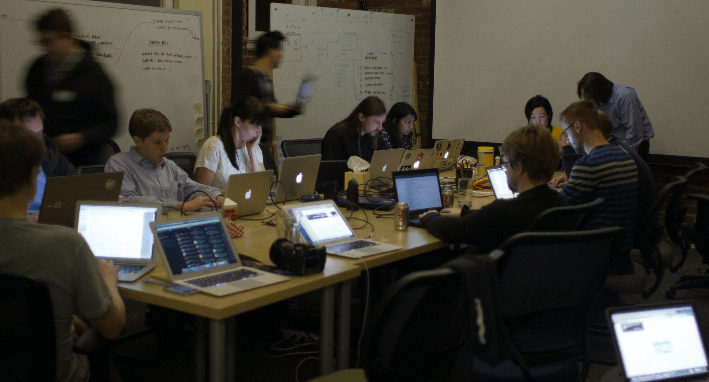
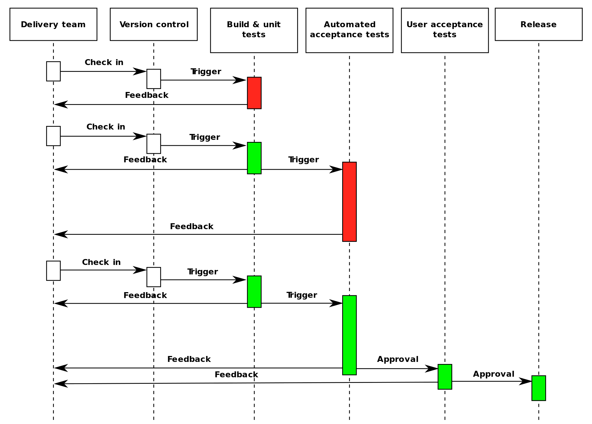

# Entrega Contínua

Neste capítulo vamos aprender sobre Continuous Delivery(Entrega Contínua) e entender como podemos utilizar essa prática para entregar software com mais frequência e agilidade, e menos riscos e problemas.

## O trauma do deploy

Em muitas empresas é comum que o termo *deploy* seja tratado pelo time de desenvolvimento, e principalmente pelo time de operações, como sinônimo de *problema*.

Isso se deve ao fato de que, geralmente, o processo de deploy de uma aplicação é algo burocrático, manual, lento, sujeito a falhas e que raramente é executado com total sucesso, ou seja, sem nenhum tipo de problema acontecer ao longo de sua execução.

Mesmo hoje em dia ainda é comum encontrar tal situação em diversas empresas, principalmente as que possuem aplicações que são grandes e complexas, tornando com isso que um simples processo de deploy de uma aplicação seja uma tarefa muito complexa e arriscada, pois pode deixar a aplicação, ou até mesmo a organização como um todo, fora do ar, podendo isso levar a enormes prejuízos.

Essa é razão pela qual muitos times de desenvolvimento e operações evitam ao máximo realizar deploys, acumulando o máximo de trabalho possível para ser entregue de uma só vez, pois eles sabem que o processo de deploy é algo muito complexo e que vai gerar diversos problemas, que certamente demandarão muitas horas, ou até mesmo dias, para serem resolvidos.

Talvez você já tenha passado por essa situação, na qual o processo de deploy de uma aplicação gerou diversos problemas, forçando todo o time de desenvolvimento a parar suas atividades até descobrir o que os causou e como os resolver o mais rápido possível. Geralmente nesses casos mais caóticos é comum o time se reunir no modelo de **War Room**.

> **War Room?**
>
> War Room(Sala de Guerra) é um termo utilizado para se referenciar à uma reunião especial de urgência, na qual um time fica confinado em uma sala de reunião até que se chegue à solução de um determinado problema.
>
> A ideia é que todas as pessoas envolvidas nessa reunião estejam totalmente focadas em entender o problema e definir uma estratégia para resolvê-lo o mais rápido possível.
>
> Esse termo se originou na 2ª guerra mundial, quando Winston Churchill necessitou de uma reunião focada em um objetivo muito importante e urgente: Derrotar as tropas de Hitler.

Em alguns casos é comum que o time de operações precise realizar o *rollback* da aplicação para uma versão anterior, para não deixá-la fora do ar por muito tempo, até que o time de desenvolvimento descubra e corrija os problemas que aconteceram, para que uma nova tentativa de deploy possa ser realizada futuramente.

Por conta disso ser algo recorrente, ou seja, algo que acontece em diversas aplicações e em diferentes empresas, é comum que as pessoas que trabalham em times de desenvolvimento e operações tenham um certo *trauma* de realizar deploy de aplicações, pois elas sabem muito bem o quão *dolorido* é realizar essa tarefa, por conta de suas experiências anteriores.

Como consequência disso, muitas empresas costumam limitar o número de vezes em que os deploys de aplicações podem ser realizados, para assim tentar diminuir os riscos e o estresse causados por tal tarefa.

## Janela de deploy

Uma prática comum em muitas empresas é criar a famosa **janela de deploy**, que nada mais é do que um agendamento do deploy das aplicações. Isso significa que o deploy de uma aplicação não pode ser realizada a qualquer momento, mesmo que o time de desenvolvimento já tenha finalizado as alterações nela e ela já esteja pronta para ir à produção, pois o deploy será realizado apenas na próxima janela de deploy disponível.

Por exemplo, imagine que a janela de deploy de uma empresa seja às quintas-feiras e sextas-feiras das 18:00 às 20:00. Isso significa que os deploys somente poderão ser realizados nesses dias e horários específicos.

Sendo assim, quando uma aplicação já está pronta para ir à produção, o time de desenvolvimento deve solicitar ao time de operações que realize o deploy dela na próxima janela disponível.

A janela de deploy mais comum é nas sextas-feiras à noite, ou na madrugada dos sábados, pois nesse horário é pouco comum que tenham usuários utilizando a aplicação, e caso aconteça algum problema, o time terá todo o final de semana para resolvê-lo.

## Continuous Delivery

Todos esses problemas e dificuldades citados anteriormente contribuem para que os times de desenvolvimento entreguem software com uma frequência muito baixa, sendo isso algo que pode prejudicar a organização como um todo.

De nada adianta ter agilidade no desenvolvimento das funcionalidades de uma aplicação, se não formos capazes de entrega-las para os usuários finais. Ao não realizar deploys, ou seja, ao não entregar software, estamos perdendo oportunidades de feedbacks dos usuários finais da aplicação, que são os principais interessados.

A prática utilizada para resolver esses problemas é chamada de **Continuous Delivery (Entrega Contínua)**, sendo que seu objetivo é criar um processo no qual o software possa ser entregue em produção a qualquer momento, de maneira simples e, principalmente, automatizada.

Ao utilizar a prática de Continuous Delivery o time DevOps passa a ter os seguintes benefícios:

* **Deploy mais ágil**: Como o processo de deploy será todo automatizado, é natural que ele leve bem menos tempo para ser executado.
* **Riscos menores ao realizar Deploy**: Ao automatizar o processo diminuímos os riscos de problemas, geralmente associados a erros humanos.
* **Deploys mais frequentes**: Com o processo de deploy automatizado e menos riscos envolvidos nele, é natural que isso faça parte da rotina do time e seja executado mais vezes.
* **Feedback mais rápido e frequente**: Ao entregar software com mais frequência, o time tem a oportunidade de receber cedo os feedbacks sobre as mudanças realizadas no software.
* **Redução do Lead Time**: Ao utilizar a prática de entrega contínua é natural que o tempo para entregar uma ideia em produção seja reduzido.

Isso tudo faz com que o processo de realizar deploy deixe de ser encarado como uma tarefa complexa, arriscada e estressante, passando a ser algo simples e rotineiro, que faz parte do dia a dia do time.

Sendo assim, mais deploys passarão a ser realizados e com isso o time poderá realizar entregas menores e receberá feedbacks mais rapidamente e de maneira frequente, algo que facilitará e agilizará nos ajustes que forem necessários de serem realizados.

## Os pilares da Continuous Delivery

Para utilizar a prática de entrega contínua devemos, primeiramente, atender a três requisitos essenciais, que podem ser considerados como **pilares** fundamentais para uma adoção efetiva dessa prática:

* Colaboração;
* Integração contínua; e
* Automatização.

### Colaboração

Como o processo de entrega de software pode envolver diversas pessoas, inclusive de áreas distintas, é extremamente importante que haja uma boa colaboração entre elas, para que assim o processo possa ser executado sem muitos atritos e dificuldades.

Tal colaboração deve envolver principalmente os times de Dev e de Ops, pois geralmente eles serão os principais responsáveis pelo processo de entrega de software, sendo comum que um time realize parte do processo e depois "passe o bastão" para o outro time continuar com o restante.

Perceba então como **colaboração** se torna um pilar fundamental para utilizar a prática de entrega contínua, de maneira mais assertiva.

Esse pilar pode ser alcançado ao se trabalhar seguindo o modelo DevOps, conforme discutimos bastante ao longo do curso, adotando as práticas culturais que promovam uma boa colaboração entre as pessoas e áreas distintas da organização.

### Integração Contínua

Entrega contínua pode ser considerada como o **próximo passo** após a integração contínua, pois após o código estar integrado, com qualidade aceitável e funcionando corretamente, ele pode ser considerado como apto a ser entregue.

E como a integração contínua foca apenas na parte de **integração**, estando relacionada com *commits*, *build*, *testes* e *empacotamento* da aplicação, é necessário alguma prática complementar, focada em **deploy** e **entrega** de software.

Ou seja, integração contínua acaba se tornando outro requisito e pilar importante para a utilização da prática de entrega contínua.

No capítulo anterior foi discutido sobre a prática de integração contínua, no qual aprendemos sobre seus princípios e como um time DevOps pode fazer para utilizar e tirar benefícios dessa prática.

### Automatização

De nada adianta ter uma boa colaboração entre as pessoas do time e utilizar a prática de integração contínua, se todo o processo de entrega de software for executado de maneira manual.

Já discutimos algumas vezes ao longo do curso sobre os problemas e riscos causados por tarefas complicadas e repetitivas serem executadas de maneira manual.

Não somente a fase inicial de integração, mas **todo** o processo de entrega de software deveria ser **automatizado**, para que a fase posterior, ou seja, a fase de deploy, não cause gargalos e atrase a entrega de software, por conta de dependências de pessoas e de manuais complexos para a sua execução, e também por conta de problemas e atritos que isso pode causar.

Automatização se torna então outro pilar fundamental para que a prática de entrega contínua seja aplicada de maneira mais eficiente, sendo de fato executada de maneira **contínua** pelo time DevOps.

## Deployment Pipeline

O processo de entrega de software, como um todo, pode variar de organização para organização, ou até mesmo de aplicação para aplicação, em uma mesma organização.

É comum que esse processo seja extenso, envolvendo diversas atividades que devem ser realizadas para que o software possa sair do repositório do projeto até as mãos dos usuários.

Para simplificar esse processo extenso, é comum que times DevOps o quebre em diversas etapas que são executadas de maneira sequencial, algumas podendo necessitar de intervenção humana, formando com isso uma espécie de **fluxo de deploy**, que é conhecida como **Deployment Pipeline**.

Deployment pipeline nada mais é do que a sequência de passos que precisam ser realizados para que o software possa ser entregue em produção. Isso inclui tanto os passos necessários para a integração do software, quanto para o deploy dele.

A imagem anterior mostra um diagrama de sequência exemplificando um deployment pipeline. Perceba que todo o processo de entrega foi quebrado em diferentes etapas, na qual existe uma transição entre elas, sendo que cada etapa representa um passo no processo, gerando com isso vários pontos de feedbacks no processo como um todo.

O ideal é que todas as etapas sejam disparadas e executadas de maneira automatizadas, mas eventualmente algumas delas podem ser manuais, inclusive seu *disparo* também pode ser manual.

O deployment pipeline pode ser um bom ponto de partida para a adoção da prática de entrega contínua, pois o time tem a possibilidade de mapear todo o seu processo de integração e entrega de software.

Isso é algo muito bom, pois promove uma melhor **transparência** do processo para todas as pessoas do time, e de fora dele também, além de também possibilitar ao time uma **colaboração** para entender melhor seu fluxo de trabalho e pensar em estratégias para otimizá-lo.

Além disso, ficará mais fácil de identificar etapas que são executadas de maneira manual e que poderiam ser automatizadas, bem como ficará visível a todos quais são os pontos de gargalo do processo que precisam ser otimizados, para que a entrega de software seja mais ágil e não gere problemas, se tornando com isso parte da rotina do time.

## Os problemas do deploy manual

Dos três pilares da entrega contínua, listados anteriormente, ainda não estamos seguindo da melhor maneira o último deles, que é o pilar da automatização.

Já temos parte do processo de entrega automatizado, mas apenas a parte focada na integração da aplicação, faltando ainda a parte da entrega em si, ou seja, relacionada com o deploy da aplicação.

Para fazer o deploy de nossa aplicação foi necessário seguir o *manual do deploy*, que é uma documentação explicando todo o passo a passo a ser realizado, de maneira manual, para conseguir realizar o deploy de maneira correta.

Esse é justamente o problema, pois todo o processo de deploy é realizado de maneira manual, sem nenhum tipo de ferramenta de automatização, o que torna o processo burocrático, lento e sujeito a erros humanos.

Lembre-se que isso é justamente o que estamos tentando evitar, com a utilização da prática de entrega contínua, para que todo o processo de entrega de software seja o mais automatizado possível, evitando com isso dificuldades e dores de cabeça.

É comum encontrar times que mesmo utilizando um processo automatizado para a integração contínua, por parte do time de desenvolvimento, ainda possui um processo de deploy manual, por parte do time de operações.

Isso acaba sendo ruim, pois causa uma dependência forte entre os times, além de atrapalhar na agilidade do processo de entrega de software, pois de nada adianta uma parte do processo estar totalmente automatizada e otimizada, se a outra parte não estiver. O foco deve ser em otimizar o processo como um todo e não somente uma parte dele.

## Automatizando o deploy

A ideia agora então é tentar automatizar o processo de deploy da aplicação, sendo que para isso precisaremos de alguma ferramenta que consiga deixar o processo o mais simples possível.

Existem diversas ferramentas no mercado que podemos utilizar para automatizar o deploy de uma aplicação, sendo que a escolha dela(s) pode variar de acordo com as tecnologias utilizadas na aplicação.

No nosso caso utilizaremos o **Jenkins**, pois já estamos o utilizando no processo de integração contínua, o que facilitará nosso trabalho, e também utilizaremos o **Vagrant**, já que estamos utilizando máquinas virtuais com o VirtualBox.

## One-Click deploy

## Blue-Green Deployment

## Reduzindo o Lead Time
