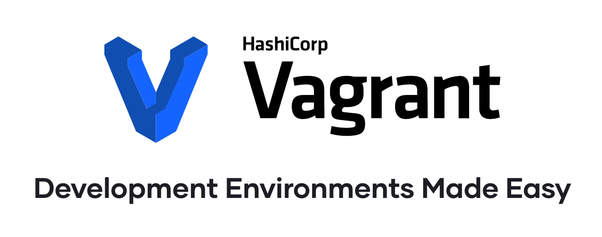
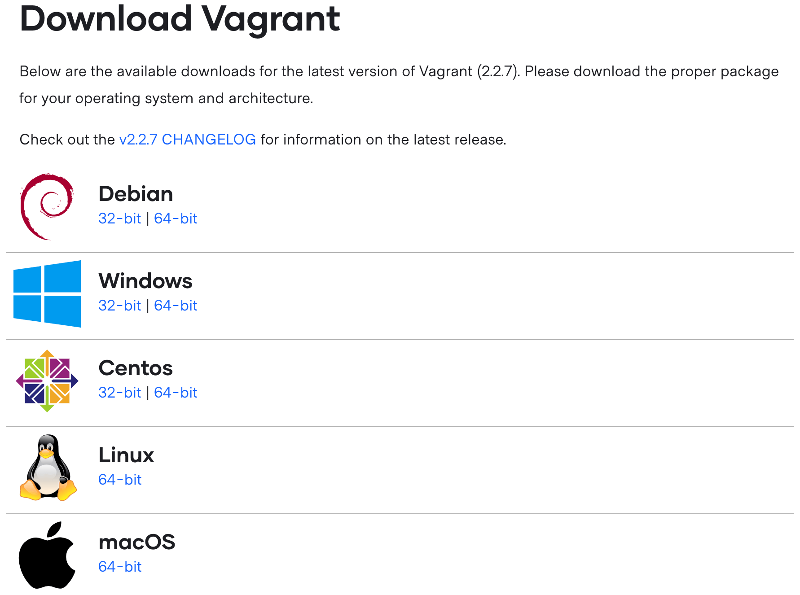
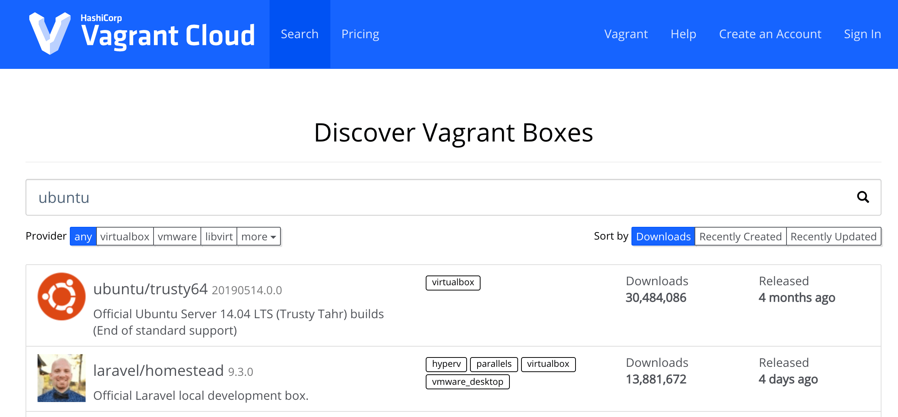
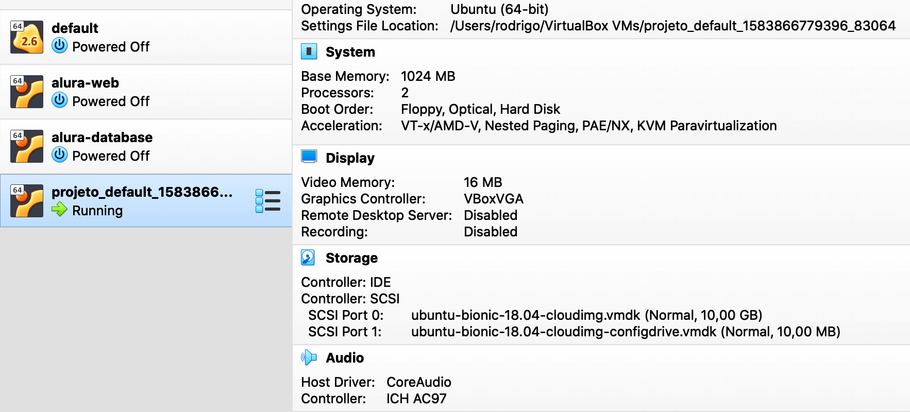
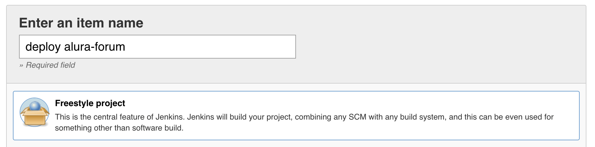
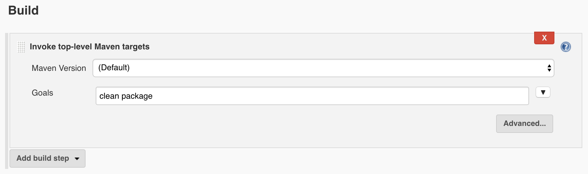
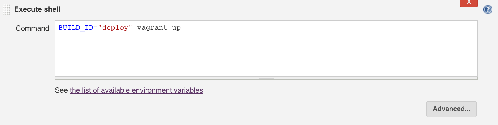
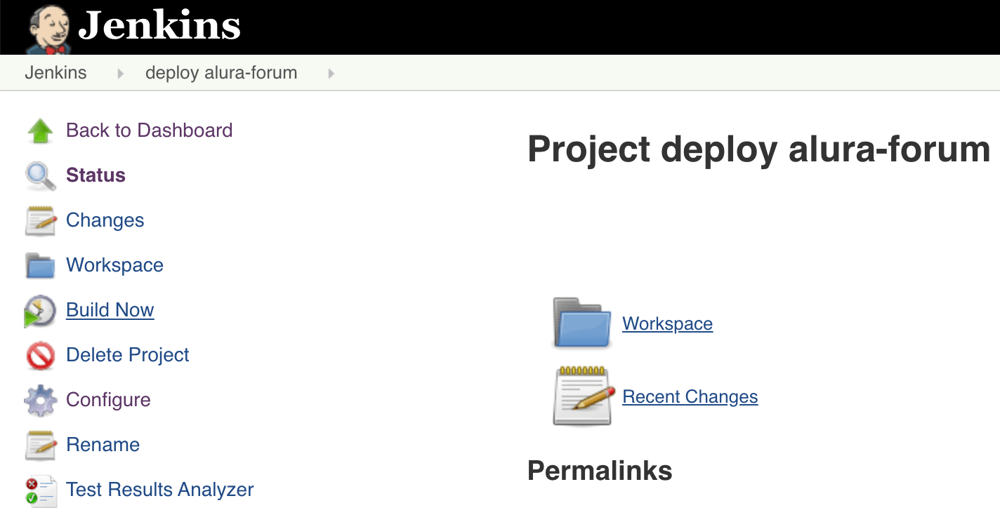

# Entrega Contínua

Neste capítulo vamos aprender sobre Continuous Delivery(Entrega Contínua) e entender como podemos utilizar essa prática para entregar software com mais frequência e agilidade, e menos riscos e problemas.

## O trauma do deploy

Em muitas empresas é comum que o termo *deploy* seja tratado pelo time de desenvolvimento, e principalmente pelo time de operações, como sinônimo de *problema*.

Isso se deve ao fato de que, geralmente, o processo de deploy de uma aplicação é algo burocrático, manual, lento, sujeito a falhas e que raramente é executado com total sucesso, ou seja, sem nenhum tipo de problema acontecer ao longo de sua execução.

Mesmo hoje em dia ainda é comum encontrar tal situação em diversas empresas, principalmente as que possuem aplicações que são grandes e complexas, tornando com isso que um simples processo de deploy de uma aplicação seja uma tarefa muito complexa e arriscada, pois pode deixar a aplicação, ou até mesmo a organização como um todo, fora do ar, podendo isso levar a enormes prejuízos.

Essa é razão pela qual muitos times de desenvolvimento e operações evitam ao máximo realizar deploys, acumulando o máximo de trabalho possível para ser entregue de uma só vez, pois eles sabem que o processo de deploy é algo muito complexo e que vai gerar diversos problemas, que certamente demandarão muitas horas, ou até mesmo dias, para serem resolvidos.

Talvez você já tenha passado por essa situação, na qual o processo de deploy de uma aplicação gerou diversos problemas, forçando todo o time de desenvolvimento a parar suas atividades até descobrir o que os causou e como os resolver o mais rápido possível. Geralmente nesses casos mais caóticos é comum o time se reunir no modelo de **War Room**.

> **War Room?**
>
> War Room(Sala de Guerra) é um termo utilizado para se referenciar à uma reunião especial de urgência, na qual um time fica confinado em uma sala de reunião até que se chegue à solução de um determinado problema.
>
> A ideia é que todas as pessoas envolvidas nessa reunião estejam totalmente focadas em entender o problema e definir uma estratégia para resolvê-lo o mais rápido possível.
>
> Esse termo se originou na 2ª guerra mundial, quando Winston Churchill necessitou de uma reunião focada em um objetivo muito importante e urgente: Derrotar as tropas de Hitler.


Em alguns casos é comum que o time de operações precise realizar o *rollback* da aplicação para uma versão anterior, para não deixá-la fora do ar por muito tempo, até que o time de desenvolvimento descubra e corrija os problemas que aconteceram, para que uma nova tentativa de deploy possa ser realizada futuramente.

Por conta disso ser algo recorrente, ou seja, algo que acontece em diversas aplicações e em diferentes empresas, é comum que as pessoas que trabalham em times de desenvolvimento e operações tenham um certo *trauma* de realizar deploy de aplicações, pois elas sabem muito bem o quão *dolorido* é realizar essa tarefa, por conta de suas experiências anteriores.

Como consequência disso, muitas empresas costumam limitar o número de vezes em que os deploys de aplicações podem ser realizados, para assim tentar diminuir os riscos e o estresse causados por tal tarefa.

## Janela de deploy

Uma prática comum em muitas empresas é criar a famosa **janela de deploy**, que nada mais é do que um agendamento do deploy das aplicações. Isso significa que o deploy de uma aplicação não pode ser realizada a qualquer momento, mesmo que o time de desenvolvimento já tenha finalizado as alterações nela e ela já esteja pronta para ir à produção, pois o deploy será realizado apenas na próxima janela de deploy disponível.

Por exemplo, imagine que a janela de deploy de uma empresa seja às quintas-feiras e sextas-feiras das 18:00 às 20:00. Isso significa que os deploys somente poderão ser realizados nesses dias e horários específicos.

Sendo assim, quando uma aplicação já está pronta para ir à produção, o time de desenvolvimento deve solicitar ao time de operações que realize o deploy dela na próxima janela disponível.

A janela de deploy mais comum é nas sextas-feiras à noite, ou na madrugada dos sábados, pois nesse horário é pouco comum que tenham usuários utilizando a aplicação, e caso aconteça algum problema, o time terá todo o final de semana para resolvê-lo.

## Continuous Delivery

Todos esses problemas e dificuldades citados anteriormente contribuem para que os times de desenvolvimento entreguem software com uma frequência muito baixa, sendo isso algo que pode prejudicar a organização como um todo.

De nada adianta ter agilidade no desenvolvimento das funcionalidades de uma aplicação, se não formos capazes de entrega-las para os usuários finais. Ao não realizar deploys, ou seja, ao não entregar software, estamos perdendo oportunidades de feedbacks dos usuários finais da aplicação, que são os principais interessados.

A prática utilizada para resolver esses problemas é chamada de **Continuous Delivery (Entrega Contínua)**, sendo que seu objetivo é criar um processo no qual o software possa ser entregue em produção a qualquer momento, de maneira simples e, principalmente, automatizada.

Ao utilizar a prática de Continuous Delivery o time DevOps passa a ter os seguintes benefícios:

* **Deploy mais ágil**: Como o processo de deploy será todo automatizado, é natural que ele leve bem menos tempo para ser executado.
* **Riscos menores ao realizar Deploy**: Ao automatizar o processo diminuímos os riscos de problemas, geralmente associados a erros humanos.
* **Deploys mais frequentes**: Com o processo de deploy automatizado e menos riscos envolvidos nele, é natural que isso faça parte da rotina do time e seja executado mais vezes.
* **Feedback mais rápido e frequente**: Ao entregar software com mais frequência, o time tem a oportunidade de receber cedo os feedbacks sobre as mudanças realizadas no software.
* **Redução do Lead Time**: Ao utilizar a prática de entrega contínua é natural que o tempo para entregar uma ideia em produção seja reduzido.

Isso tudo faz com que o processo de realizar deploy deixe de ser encarado como uma tarefa complexa, arriscada e estressante, passando a ser algo simples e rotineiro, que faz parte do dia a dia do time.

Sendo assim, mais deploys passarão a ser realizados e com isso o time poderá realizar entregas menores e receberá feedbacks mais rapidamente e de maneira frequente, algo que facilitará e agilizará nos ajustes que forem necessários de serem realizados.

## Os pilares da Continuous Delivery

Para utilizar a prática de entrega contínua devemos, primeiramente, atender a três requisitos essenciais, que podem ser considerados como **pilares** fundamentais para uma adoção efetiva dessa prática:

* Colaboração;
* Integração contínua; e
* Automatização.

### Colaboração

Como o processo de entrega de software pode envolver diversas pessoas, inclusive de áreas distintas, é extremamente importante que haja uma boa colaboração entre elas, para que assim o processo possa ser executado sem muitos atritos e dificuldades.

Tal colaboração deve envolver principalmente os times de Dev e de Ops, pois geralmente eles serão os principais responsáveis pelo processo de entrega de software, sendo comum que um time realize parte do processo e depois "passe o bastão" para o outro time continuar com o restante.

Perceba então como **colaboração** se torna um pilar fundamental para utilizar a prática de entrega contínua, de maneira mais assertiva.

Esse pilar pode ser alcançado ao se trabalhar seguindo o modelo DevOps, conforme discutimos bastante ao longo do curso, adotando as práticas culturais que promovam uma boa colaboração entre as pessoas e áreas distintas da organização.

### Integração Contínua

Entrega contínua pode ser considerada como o **próximo passo** após a integração contínua, pois após o código estar integrado, com qualidade aceitável e funcionando corretamente, ele pode ser considerado como apto a ser entregue.

E como a integração contínua foca apenas na parte de **integração**, estando relacionada com *commits*, *build*, *testes* e *empacotamento* da aplicação, é necessário alguma prática complementar, focada em **deploy** e **entrega** de software.

Ou seja, integração contínua acaba se tornando outro requisito e pilar importante para a utilização da prática de entrega contínua.

No capítulo anterior foi discutido sobre a prática de integração contínua, no qual aprendemos sobre seus princípios e como um time DevOps pode fazer para utilizar e tirar benefícios dessa prática.

### Automatização

De nada adianta ter uma boa colaboração entre as pessoas do time e utilizar a prática de integração contínua, se todo o processo de entrega de software for executado de maneira manual.

Já discutimos algumas vezes ao longo do curso sobre os problemas e riscos causados por tarefas complicadas e repetitivas serem executadas de maneira manual.

Não somente a fase inicial de integração, mas **todo** o processo de entrega de software deveria ser **automatizado**, para que a fase posterior, ou seja, a fase de deploy, não cause gargalos e atrase a entrega de software, por conta de dependências de pessoas e de manuais complexos para a sua execução, e também por conta de problemas e atritos que isso pode causar.

Automatização se torna então outro pilar fundamental para que a prática de entrega contínua seja aplicada de maneira mais eficiente, sendo de fato executada de maneira **contínua** pelo time DevOps.

## Deployment Pipeline

O processo de entrega de software, como um todo, pode variar de organização para organização, ou até mesmo de aplicação para aplicação, em uma mesma organização.

É comum que esse processo seja extenso, envolvendo diversas atividades que devem ser realizadas para que o software possa sair do repositório do projeto até as mãos dos usuários.

Para simplificar esse processo extenso, é comum que times DevOps o quebre em diversas etapas que são executadas de maneira sequencial, algumas podendo necessitar de intervenção humana, formando com isso uma espécie de **fluxo de deploy**, que é conhecida como **Deployment Pipeline**.

Deployment pipeline nada mais é do que a sequência de passos que precisam ser realizados para que o software possa ser entregue em produção. Isso inclui tanto os passos necessários para a integração do software, quanto para o deploy dele.


A imagem anterior mostra um diagrama de sequência exemplificando um deployment pipeline. Perceba que todo o processo de entrega foi quebrado em diferentes etapas, na qual existe uma transição entre elas, sendo que cada etapa representa um passo no processo, gerando com isso vários pontos de feedbacks no processo como um todo.

O ideal é que todas as etapas sejam disparadas e executadas de maneira automatizadas, mas eventualmente algumas delas podem ser manuais, inclusive seu *disparo* também pode ser manual.

O deployment pipeline pode ser um bom ponto de partida para a adoção da prática de entrega contínua, pois o time tem a possibilidade de mapear todo o seu processo de integração e entrega de software.

Isso é algo muito bom, pois promove uma melhor **transparência** do processo para todas as pessoas do time, e de fora dele também, além de também possibilitar ao time uma **colaboração** para entender melhor seu fluxo de trabalho e pensar em estratégias para otimizá-lo.

Além disso, ficará mais fácil de identificar etapas que são executadas de maneira manual e que poderiam ser automatizadas, bem como ficará visível a todos quais são os pontos de gargalo do processo que precisam ser otimizados, para que a entrega de software seja mais ágil e não gere problemas, se tornando com isso parte da rotina do time.

## Os problemas do deploy manual

Dos três pilares da entrega contínua, listados anteriormente, ainda não estamos seguindo da melhor maneira o último deles, que é o pilar da automatização.

Já temos parte do processo de entrega automatizado, mas apenas a parte focada na integração da aplicação, faltando ainda a parte da entrega em si, ou seja, relacionada com o deploy da aplicação.

Para fazer o deploy de nossa aplicação foi necessário seguir o *manual do deploy*, que é uma documentação explicando todo o passo a passo a ser realizado, de maneira manual, para conseguir realizar o deploy de maneira correta.

Esse é justamente o problema, pois todo o processo de deploy é realizado de maneira manual, sem nenhum tipo de ferramenta de automatização, o que torna o processo burocrático, lento e sujeito a erros humanos.

Lembre-se que isso é justamente o que estamos tentando evitar, com a utilização da prática de entrega contínua, para que todo o processo de entrega de software seja o mais automatizado possível, evitando com isso dificuldades e dores de cabeça.

É comum encontrar times que mesmo utilizando um processo automatizado para a integração contínua, por parte do time de desenvolvimento, ainda possui um processo de deploy manual, por parte do time de operações.

Isso acaba sendo ruim, pois causa uma dependência forte entre os times, além de atrapalhar na agilidade do processo de entrega de software, pois de nada adianta uma parte do processo estar totalmente automatizada e otimizada, se a outra parte não estiver. O foco deve ser em otimizar o processo como um todo e não somente uma parte dele.

## Automatizando o deploy

A ideia agora então é tentar automatizar o processo de deploy da aplicação, sendo que para isso precisaremos de alguma ferramenta que consiga deixar o processo o mais simples possível.

Existem diversas ferramentas no mercado que podemos utilizar para automatizar o deploy de uma aplicação, sendo que a escolha dela(s) pode variar de acordo com as tecnologias utilizadas na aplicação.

No nosso caso utilizaremos o **Jenkins**, pois já estamos o utilizando no processo de integração contínua, o que facilitará nosso trabalho, e também utilizaremos o **Vagrant**, já que estamos utilizando máquinas virtuais com o VirtualBox.

## Vagrant



Vagrant é uma ferramenta utilizada para criar e gerenciar máquinas virtuais de maneira simples, orquestrada e, principalmente, automatizada.

Ela suporta diversas ferramentas de máquinas virtuais, que são chamadas de `Providers`, tais como: VirtualBox, VMware, Hyper-V e Docker.

E para fazer toda a configuração das máquinas virtuais, conforme as necessidades de nossas aplicações, podemos utilizar em conjunto com o Vagrant alguma ferramenta de **provisionamento**, como por exemplo Chef e Puppet.

### Instalação do Vagrant

Para instalar o Vagrant devemos entrar em sua página de download (https://www.vagrantup.com/downloads.html) e escolher a versão apropriada, de acordo com o sistema operacional desejado. O Vagrant é uma ferramenta gratuita e multi-plataforma.



Seu processo de instalação é bem simples, o qual devemos apenas executar o arquivo binário baixado, que pode variar de acordo com o sistema operacional. No curso utilizaremos a versão **2.2.7**.

Após instalar o Vagrant, sua utilização é feita via comandos executados no `Terminal` ou `Prompt`, sendo que existem diversos possíveis comandos e conceitos que veremos ao longo desse capítulo.

### Criando um projeto com Vagrant

O primeiro passo é inicializar um novo projeto Vagrant, sendo que isso é feito com o comando `init`:

```
vagrant init

A `Vagrantfile` has been placed in this directory. You are now
ready to `vagrant up` your first virtual environment! Please read
the comments in the Vagrantfile as well as documentation on
`vagrantup.com` for more information on using Vagrant.
```

Repare na mensagem anterior que o Vagrant diz ter criado um arquivo chamado **Vagrantfile**. Esse é o arquivo de configurações do projeto, sendo que nele ensinaremos ao Vagrant o que ele deve fazer, ou seja, como ele deve criar e gerenciar nossas máquinas virtuais.

Se abrirmos esse arquivo em algum editor de texto, veremos que ele foi criado com o seguinte conteúdo:

```
# -*- mode: ruby -*-
# vi: set ft=ruby :

# All Vagrant configuration is done below. The "2" in Vagrant.configure
# configures the configuration version (we support older styles for
# backwards compatibility). Please don't change it unless you know what
# you're doing.
Vagrant.configure("2") do |config|
  # The most common configuration options are documented and commented below.
  # For a complete reference, please see the online documentation at
  # https://docs.vagrantup.com.

  # Every Vagrant development environment requires a box. You can search for
  # boxes at https://vagrantcloud.com/search.
  config.vm.box = "base"

  # Disable automatic box update checking. If you disable this, then
  # boxes will only be checked for updates when the user runs
  # `vagrant box outdated`. This is not recommended.
  # config.vm.box_check_update = false

  # Create a forwarded port mapping which allows access to a specific port
  # within the machine from a port on the host machine. In the example below,
  # accessing "localhost:8080" will access port 80 on the guest machine.
  # NOTE: This will enable public access to the opened port
  # config.vm.network "forwarded_port", guest: 80, host: 8080

  # Create a forwarded port mapping which allows access to a specific port
  # within the machine from a port on the host machine and only allow access
  # via 127.0.0.1 to disable public access
  # config.vm.network "forwarded_port", guest: 80, host: 8080, host_ip: "127.0.0.1"

  # Create a private network, which allows host-only access to the machine
  # using a specific IP.
  # config.vm.network "private_network", ip: "192.168.33.10"

  # Create a public network, which generally matched to bridged network.
  # Bridged networks make the machine appear as another physical device on
  # your network.
  # config.vm.network "public_network"

  # Share an additional folder to the guest VM. The first argument is
  # the path on the host to the actual folder. The second argument is
  # the path on the guest to mount the folder. And the optional third
  # argument is a set of non-required options.
  # config.vm.synced_folder "../data", "/vagrant_data"

  # Provider-specific configuration so you can fine-tune various
  # backing providers for Vagrant. These expose provider-specific options.
  # Example for VirtualBox:
  #
  # config.vm.provider "virtualbox" do |vb|
  #   # Display the VirtualBox GUI when booting the machine
  #   vb.gui = true
  #
  #   # Customize the amount of memory on the VM:
  #   vb.memory = "1024"
  # end
  #
  # View the documentation for the provider you are using for more
  # information on available options.

  # Enable provisioning with a shell script. Additional provisioners such as
  # Ansible, Chef, Docker, Puppet and Salt are also available. Please see the
  # documentation for more information about their specific syntax and use.
  # config.vm.provision "shell", inline: <<-SHELL
  #   apt-get update
  #   apt-get install -y apache2
  # SHELL
end
```

Repare que o arquivo já vem com bastante comandos pré-definidos, sendo que a maioria deles está comentado. A ideia é que esse arquivo sirva como um exemplo para o nosso projeto, o qual podemos descomentar e editar apenas o que for de nosso interesse.

De maneira resumida podemos dizer que o arquivo `Vagrantfile` possui cinco principais *blocos* de configuração:

* **Boxes**: Box é o termo utilizado pelo Vagrant para se referir ao nosso ambiente em si, ou seja, à nossa máquina virtual. É nesse bloco que indicamos qual será o sistema operacional da nossa VM;
* **Networking**: Utilizamos esse bloco para realizar configurações referentes à rede interna da VM e sua integração com o Host;
* **Synced Folder**: Nesse bloco indicamos se queremos compartilhar diretório(s) do Host com a VM, além de configurar como será a sincronização entre eles;
* **Provider**: Configurações específicas do provider, como o VirtualBox, por exemplo; e
* **Provisioning**: Após instalar e subir a VM, podemos configurar o Vagrant para instalar softwares, criar e alterar configurações dentro da VM, etc. É aí que entram as ferramentas de provisionamento, a qual devem ser configurados nesse bloco do Vagrantfile.

### Boxes

Box é a base de uma VM para o Vagrant. Ao utilizar diretamente uma ferramenta de máquinas virtuais, como o VirtualBox, devemos baixar a imagem `.iso` do sistema operacional e fazer sua instalação manualmente no VirtualBox.

No Vagrant todo esse trabalho já está abstraído em um Box, que funciona como um pacote contendo o sistema operacional e, opcionalmente, arquivos e softwares pré-instalados e configurados.

Ou seja, se precisamos de uma máquina virtual Ubuntu para o VirtualBox, devemos apenas pedir para o Vagrant baixar esse box.

O Vagrant mantem um repositório de boxes online, chamado de **Vagrant Cloud**, na qual qualquer pessoa pode hospedar e compartilhar seus boxes com outras pessoas ao redor do mundo. Você pode acessar o Vagrant Cloud para explorar e pesquisar por boxes em: https://vagrantcloud.com/boxes/search



Para adicionar um box devemos utilizar o comando `vagrant box add`:

```
vagrant box add ubuntu/bionic64
```

Ao executar o comando anterior, o Vagrant vai pesquisar na Vagrant Cloud um box chamado `ubuntu/bionic64` e caso o encontre vai realizar o seu download.

Também é possível adicionar um box a partir de um arquivo existente no computador, evitando o download na internet:

```
vagrant box add diretorio/ubuntu.box --name ubuntu/bionic64
```

Após ter adicionado um box ao Vagrant, podemos o utilizar em nosso projeto, adicionando a seguinte configuração no arquivo `Vagrantfile`:

```
config.vm.box = "ubuntu/bionic64"
```

### Criando uma VM com Vagrant

Adicionando apenas a configuração do box no `Vagrantfile`, deixando todas as outras comentadas, já é possível pedir ao Vagrant que crie e execute a VM no VirtualBox. Isso pode ser feito com o comando `vagrant up`, que deve ser executado dentro do diretório do projeto, o qual deve conter o arquivo `Vagrantfile`:

```
vagrant up
```

Ao executar o comando anterior o Vagrant criará uma VM no VirtualBox, caso ela ainda não tenha sido criada anteriormente, a inicializando na sequência. Se abrirmos o VirtualBox será possível ver que uma nova VM foi criada e está sendo executada:



### Interagindo com a VM

É possível acessar e interagir com a VM via SSH, utilizando o comando `vagrant ssh`:

```
vagrant ssh

Welcome to Ubuntu 18.04.4 LTS (GNU/Linux 4.15.0-88-generic x86_64)

 * Documentation:  https://help.ubuntu.com
 * Management:     https://landscape.canonical.com
 * Support:        https://ubuntu.com/advantage

  System information as of Tue Mar 10 19:59:07 UTC 2020

  System load:  0.0               Processes:             94
  Usage of /:   10.1% of 9.63GB   Users logged in:       0
  Memory usage: 12%               IP address for enp0s3: 10.0.2.15
  Swap usage:   0%


0 packages can be updated.
0 updates are security updates.


Last login: Tue Mar 10 19:45:07 2020 from 10.0.2.2
vagrant@ubuntu-bionic:~$
```

### Outros comandos do Vagrant

A seguir veja uma relação dos principais comandos do Vagrant que podemos utilizar, e quais os seus objetivos:

* **vagrant up**: Cria e/ou inicializa a VM;
* **vagrant suspend**: Suspende temporariamente a VM, sem desligá-la;
* **vagrant resume**: Resume a VM que estava suspensa temporariamente;
* **vagrant halt**: Desliga a VM;
* **vagrant destroy**: Desliga e apaga permanentemente a VM;
* **vagrant upload**: Copia arquivos do host para a VM;
* **vagrant reload**: Reinicia a VM, recarregando as configurações do Vagrantfile;
* **vagrant status**: Exibe o status atual da VM; e
* **vagrant package**: Cria um novo box com o estado atual da VM.

### Configurando a rede da VM

O Vagrant por padrão configura a rede da VM como sendo privada, impedindo com isso que outras VMs tenham acesso a ela. Para alterar esse comportamento e torná-la pública, a seguinte configuração deve ser feita no arquivo `Vagrantfile`:

```
config.vm.network "public_network"
```

Dessa maneira a VM poderá ser acessada publicamente. O endereço `IP` da VM será obtido via `DHCP` do host, mas também é possível definir um IP estático alterando a configuração para:

```
config.vm.network "public_network", ip: "192.168.0.30"
```

### Provisionamento da VM

Até então a VM está apenas com o sistema operacional instalado, ou seja, não possui nenhum software instalado ou configuração executada internamente.

Mas geralmente é necessário realizar diversas configurações no sistema operacional, além de instalar os softwares necessários na VM, como por exemplo: Java, MySQL, Apache Tomcat, etc.

Essa parte deve ser configurada no bloco `provisioning` do `Vagrantfile`, sendo que é necessário utilizar alguma ferramenta de provisionamento, como por exemplo: Ansible, Chef, Puppet, CFEngine, Salt, dentre outras, ou até mesmo pode ser feita via Shell Scripting.

Por exemplo, a instalação do MySQL via Shell Scripting poderia ser feita com as seguintes configurações no `Vagrantfile`:

```
config.vm.provision "shell", inline: <<-SHELL
  apt-get update
  apt-get install -y mysql-server
SHELL
```

Também é possível deixar os comandos em um arquivo separado, indicando para o Vagrant o caminho do arquivo a ser executado com a seguinte configuração:

```
config.vm.provision "shell", path: "vagrant/script.sh"
```

No exemplo anterior o Vagrant vai procurar e executar os comandos do arquivo `script.sh`, que está localizado dentro do diretório `vagrant`, devendo esse diretório estar na raiz do projeto, ou seja, no mesmo diretório onde estiver o arquivo `Vagrantfile`, pois é a partir desse diretório que o Vagrant busca pelos arquivos referenciados nas configurações.

## Exercício: Automatizando a infra da aplicação com Vagrant

Nesse exercício vamos adicionar o Vagrant em nossa aplicação, além de o configurar conforme as necessidades de infra estrutura dela.

1. Acesse o diretório do curso e copie o arquivo `vagrant-ubuntu.box` para o **Desktop**.

2. Abra o terminal, acesse nele o `Desktop` e importe o `box` do Ubuntu com o seguinte comando:

  ```
  vagrant box add vagrant-ubuntu.box --name ubuntu/bionic64
  ```

3. Ainda no terminal, agora acesse o diretório da aplicação e execute o seguinte comando:

  ```
  vagrant init
  ```

4. O próximo passo será configurar o Vagrant para a nossa aplicação. Abra o arquivo `Vagrantfile` da aplicação em algum editor de texto, apague todo o seu conteúdo e digite nele as seguintes configurações:

  ```
  Vagrant.configure("2") do |config|

    config.vm.define "alura-database" do |db|
      db.vm.box = "ubuntu/bionic64"

      db.vm.network "private_network", ip: "192.168.56.110"
      db.vm.network "forwarded_port", guest: 3306, host: 3307

      db.vm.provision "shell", path: "vagrant/database/install.sh"
      db.vm.provision "file", source: "vagrant/database/mysqld.cnf", destination: "/tmp/mysqld.cnf"
      db.vm.provision "file", source: "vagrant/database/script-inicial.sql", destination: "/tmp/script-inicial.sql"
      db.vm.provision "shell", path: "vagrant/database/post-install.sh"
    end

    config.vm.define "alura-web" do |web|
      web.vm.box = "ubuntu/bionic64"

      web.vm.network "private_network", ip: "192.168.56.105"
      web.vm.network "forwarded_port", guest: 8080, host: 8080

      web.vm.provision "shell", path: "vagrant/web/install.sh"
      web.vm.provision "file", source: "vagrant/web/apache-tomcat-8.5.47.tar.gz", destination: "/tmp/apache-tomcat-8.5.47.tar.gz"
      web.vm.provision "file", source: "vagrant/web/tomcat.service", destination: "/tmp/tomcat.service"
      web.vm.provision "file", source: "target/alura-forum-0.0.1-SNAPSHOT.war", destination: "/tmp/alura-forum.war"
      web.vm.provision "shell", path: "vagrant/web/post-install.sh"
    end

  end
  ```

5. Agora precisamos dos `arquivos` e `scripts` que serão provisionados em cada uma das VMs. Acesse o diretório do curso e copie a pasta chamada **vagrant** para o diretório raiz da aplicação. Nessa pasta estão todos os arquivos referenciados no `Vagrantfile`.

6. Pronto! Já estamos com todas as configurações do Vagrant para a nossa aplicação realizadas, já sendo possível o executar.

7. Abra o VirtualBox e apague as VMs criadas anteriormente. Verifique também se a aplicação **não** está sendo executada localmente, no Eclipse.

8. No terminal, dentro do diretório raiz da aplicação, faça o build da aplicação via Maven, executando o seguinte comando:

  ```
  mvn clean package
  ```

9. Agora execute o Vagrant para criar e subir as VMs no VirtualBox:

  ```
  vagrant up
  ```

10. Após a execução do Vagrant finalizar, algo que pode levar alguns poucos minutos, verifique se as VMs foram criadas e estão sendo executadas normalmente no VirtualBox, e também tente acessar a aplicação abrindo o browser e entrando em: http://localhost:8080/alura-forum

## One-Click deploy

No exercício anterior conseguimos automatizar toda a parte de infra estrutura da nossa aplicação, permitindo com isso que tanto a criação das VMs, quanto o deploy da aplicação fossem executados de maneira automatizada. Sem dúvidas será muito mais simples e, principalmente, mais ágil realizar os deploys da aplicação a partir de agora.

Podemos inclusive *aposentar* o *manual do deploy*, uma vez que não é mais necessário realizar todo aquele passo a passo de maneira manual, algo que era bem chato, trabalhoso e sujeito a erros.

Entretanto, podemos melhorar ainda mais esse processo, pois tivemos que o executar via terminal, primeiramente executando o build da aplicação via Maven e depois realizando o deploy com o Vagrant.

O ideal é que o processo de entrega da aplicação possa ser realizado por qualquer pessoa do time, sem a necessidade de ter programas instalados em seu computador, e de preferência utilizando alguma aplicação gráfica, na qual a pessoa precise apenas apertar um botão.

Essa é justamente a ideia de uma prática que ficou conhecida como **One-click deployment**, cujo objetivo é automatizar todo o processo de deploy de uma aplicação, a ponto dele poder ser disparado com um único clique.

Certamente essa é uma excelente ideia, pois visa em simplificar ao máximo a burocracia do deploy de uma aplicação, além de o tornar muito mais ágil de ser executado, o que permite ao time realizar deploy com mais frequência e assim de fato aplicar a prática de entrega contínua.

Utilizaremos o Jenkins para realizar o processo de one-click deployment, visto que ele é uma das ferramentas que podem ser utilizadas para tal objetivo, além de que já estamos o utilizando no processo de integração contínua.

## Exercício: One-click deployment com Jenkins

Nesse exercício vamos utilizar o Jenkins para permitir que o deploy da aplicação possa ser realizado com um único clique de um botão.

**Atenção!** Para não ter problemas de conflitos é necessário finalizar as VMs que estiverem rodando no VirtualBox, bem como no ambiente local. Certifique-se disso antes de prosseguir no exercício.

1. Acesse o Jenkins em: http://localhost:8082

2. Clique na opção **New Item**, localizado no menu lateral esquerdo, preencha o campo  *item name* com **Deploy alura-forum**, escolha a opção **Freestyle project** e clique no botão **Ok**.

  

3. Na seção **Source Code Management**, marque a opção **Git** e no campo **Repository URL** preencha com **file:///home/LOGIN_DA_TURMA/Desktop/alura-forum**. Obs: Deve ser o caminho do repositório Git da aplicação alura-forum em seu computador. Em caso de dificuldades, peça ajuda ao instrutor(a).

  

4. Na seção **Build**, escolha a opção **Invoke top-level Maven targets** e preencha o campo *Goals* com: **clean package**.

  

5. Ainda na seção **Build**, agora escolha a opção **Execute Shell** e preencha o campo *Command* com: **BUILD_ID="deploy" vagrant up**.

  

6. Clique no botão **Save**.

7. Diferente do *Item* que criamos no capítulo de integração contínua, o qual verifica a cada 1 minuto por novos commits para ser executado, esse *Item* que acabamos de criar deve ser disparado manualmente.

8. Na tela principal do Jenkins, acesse o Item **Deploy alura-forum** e clique no botão **Build Now**, localizado no menu lateral esquerdo.

  

9. Espere o build finalizar, algo que pode levar alguns poucos minutos, e tente acessar a aplicação pelo browser: http://localhost:8080/alura-forum

## Blue-Green Deployment

## Reduzindo o Lead Time
