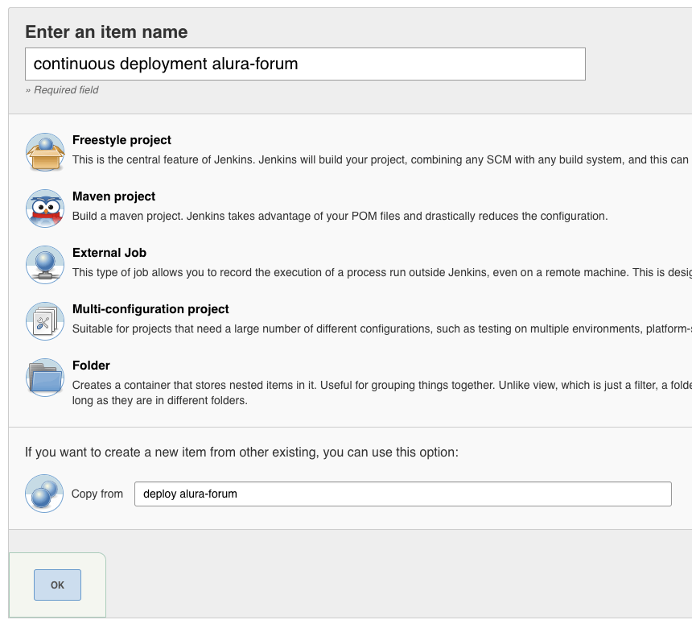

# Deploy Contínuo

Neste capítulo vamos aprender sobre Continuous Deployment(Deploy Contínuo) e entender sua diferença em relação ao Continuous Delivery, além de aprender a utilizar essa prática para levar o processo de automatização e entrega de software ao extremo, fazendo deploys a cada novo commit realizado.

## Continuous Deployment

No capítulo anterior estudamos sobre continuous delivery e agora estudaremos sobre continuous deployment, que é mais uma prática relacionada com entrega de software.

Mas se essa prática também está relacionada com entrega de software, qual é sua diferença em relação ao continuous delivery?

A diferença está na **maneira** que a entrega do software é realizada.

Enquanto no continuous delivery temos uma ferramenta com um *botão* para disparar o processo de entrega de software, ou seja, realizar o deploy de uma nova versão dele, no continuous deployment essa entrega é efetuada de maneira totalmente automatizada, sem a necessidade de intervenção de alguma pessoa para ser realizada.

Ou seja, cada nova mudança realizada no software, ao ser registrada no controle de versão, vai disparar automaticamente o processo de deploy e realizar a entrega dele de maneira imediata, não havendo mais a necessidade de alguém ter de acessar uma ferramenta e apertar o *botão* que dispara o processo de deploy.

Resumindo em termos técnicos, isso significa que cada novo commit realizado por alguma pessoa do time de desenvolvimento vai disparar automaticamente o processo de deploy, sendo que as alterações desse commit estarão disponíveis no ambiente de produção em questão de minutos.

## Vantagens e desvantagens do continuous deployment

A grande vantagem de utilizar a prática de continuous deployment é o fato de que cada mudança registrada no controle de versão é imediatamente entregue e disponibilizada em ambiente de produção.

Do ponto de vista das pessoas que vão utilizar o software isso é extremamente útil e vantajoso, pois elas terão acesso às novidades do software de maneira muito mais frequente e ágil, sem ter que esperar muito tempo por futuras releases.

Principalmente para as pessoas que estão acostumadas a solicitar pequenos ajustes e melhorias e acabam tendo que esperar por ciclos muito longos, de semanas a meses, para receber tais mudanças entregues em produção, a prática de continuous deployment é vista com *bons olhos*, pois o time agora será capaz de entregar pequenas alterações para elas em questão de minutos ou horas.

Uma desvantagem é que o time de desenvolvimento vai precisar se adaptar para utilizar essa prática, pois é comum que eles utilizem ciclos de desenvolvimento com frequência predefinida, sendo que a release, na teoria, costuma ser liberada apenas ao final de cada ciclo.

Por exemplo, times que utilizam o Scrum como metodologia costumam ter ciclos, conhecidos como Sprints, que variam de uma a quatro semanas, sendo comum que eles estejam acostumados a realizarem a entrega do incremento do software apenas no final de cada Sprint.

Outro problema é que o time de desenvolvimento precisa ter mais atenção ao realizar commits, pois cada commit vai disparar o processo de deploy, sendo que nem sempre um commit pode representar uma tarefa finalizada e com isso pode acontecer de existirem funcionalidades incompletas, ou até mesmo com bugs, em ambiente de produção.

Nesse caso o time vai precisar separar de alguma maneira o trabalho finalizado do trabalho que está ainda em andamento, para evitar problemas em ambiente de produção. Existe uma prática utilizada para esse cenário, que ficou conhecida como **Feature Toggle**.

## Feature Toggle

**Feature Toggle**, também conhecida como **Feature Flag**, é uma prática utilizada para controlar dinamicamente a liberação de funcionalidades em um software. A ideia consiste em ativar/desativar funcionalidades do software, podendo ser utilizada também para realizar testes de novas implementações de determinadas funcionalidades.

Essa prática também pode ser utilizada com outros objetivos, além de controlar a release apenas das funcionalidades que estão concluídas, tais como:

* Realização de testes A/B;
* Validação de funcionalidades do ponto de vista de negócios;
* Coletar métricas de impactos de performance de novas funcionalidades;
* Desativar funcionalidades problemáticas; e
* Release de funcionalidades seguindo o modelo de Canary Release.

A implementação de feature toggles é feita diretamente no código do software, por exemplo de maneira simples utilizando `if/else`:

```java
if (FeatureToggles.NOVA_VALIDACAO_TOPICO.isAtiva()) {
	return new ValidadorTopicoOtimizado();
} else {
	return new ValidadorTopico();
}
```

Repare que o código anterior faz uma verificação para saber qual validador de tópicos utilizar, sendo que no exemplo anterior existem duas diferentes versões dele. Com isso é possível controlar qual versão da funcionalidade será disponibilizada em produção para os usuários, ou até mesmo controlar qual versão determinado usuário vai ter acesso.

Também é possível delegar essa liberação para alguma pessoa que seja administradora do sistema, criando para isso uma tela na qual ela poderá ativar/desativar determinadas funcionalidades, evitando assim que o código precise ser alterado pelo time de desenvolvimento.

São inúmeras possibilidades de se utilizar feature toggles, além de inúmeras maneiras de se implementar tal prática no software, devendo o time de desenvolvimento fazer um alinhamento com a área de negócios sobre qual a melhor estratégia a ser utilizada.

Entretanto, existe uma desvantagem de se utilizar feature toggles, que é o fato dessa prática aumentar a complexidade do software, visto que o time de desenvolvimento terá que implementar e dar manutenção também no código dos feature toggles em si, que, dependendo do tipo de implementação utilizada, pode ser bastante trabalhoso e complexo.

## Exercício: Continuous Deployment com Jenkins

Nesse exercício vamos utilizar o Jenkins para realizar o processo de continuous deployment, disparando o processo de deploy de maneira automatizada a cada novo commit registrado no Git.

1. Acesse o Jenkins em: http://localhost:8082

2. Clique na opção **New Item**, localizado no menu lateral esquerdo, preencha o campo  *item name* com **continuous deployment alura-forum**, na opção **Copy from** preencha com **deploy alura-forum** e clique no botão **Ok**.

  

3. Na seção **Build Triggers**, marque a opção **Poll SCM** e no campo **Schedule** preencha com: `* * * * *`.

  

4. Deixe as outras configurações conforme já estão preenchidas e clique no botão **Save**.

5. Efetue alguma alteração na aplicação, faça um commit para registrá-la e verifique no Jenkins se o processo de deploy foi disparado automaticamente.

6. Verifique também se o deploy foi realizado com sucesso, acessando a aplicação no browser em: http://localhost:8080/alura-forum
