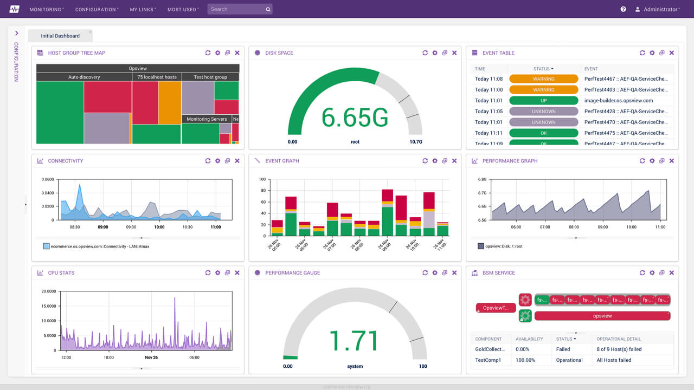

# Monitoramento Contínuo

Neste capítulo vamos aprender sobre monitoramento de aplicações e como utilizar essa prática para detectar e antecipar possíveis problemas, contribuindo para uma maior agilidade na recuperação de falhas.

## O problema: Sistema fora do ar

Nenhum sistema é à prova de falhas, sendo que problemas sempre poderão acontecer a qualquer momento. Entretanto, é comum que alguns times não tratem desse tópico com muita prioridade, o que pode ocasionar em sérios prejuízos para a organização.

Sempre que uma aplicação fica indisponível a seus usuários, isso deve ser tratado como prioridade, e até com certa urgência, pois certamente esse fato pode ter interrompido e impactado o trabalho de diversas pessoas da organização, o que pode levar a enormes prejuízos.

Já imaginou o impacto que uma indisponibilidade de várias horas de uma aplicação de internet banking pode causar à uma instituição financeira?

Justamente por conta disso, algumas empresas estabelecem que a *disponibilidade* de uma aplicação é um dos fatores mais críticos e impactantes para a organização.

Entretanto, não devemos nos preocupar com disponibilidade apenas nesses casos mais críticos, mas sim considerar que esse tópico é sempre importante, independente do tipo de aplicação, devendo o time DevOps discutir e pensar na melhor maneira possível de lidar com ele.

Mas o foco não deve ser em como evitar que as aplicações fiquem indisponíveis a qualquer custo, pois isso é algo praticamente impossível, já que sempre estaremos sujeitos a falhas humanas e técnicas. Inclusive, grandes empresas de tecnologia como Google, Microsoft e Facebook, costumam ter indisponibilidade em seus produtos, algo que é raro de acontecer, mas não impossível.

O foco deve ser em como lidar com indisponibilidade, bem como quaisquer outros problemas que possam acontecer com as aplicações e sua infraestrutura, e, principalmente, como descobrir rapidamente qual foi o problema que ocorreu, sua causa raiz, como corrigi-lo e como fazer para evitar que tal problema volte a acontecer no futuro.

Esse é a melhor abordagem para lidar com o tema, além de também ser um grande desafio para muitos times DevOps que não tem conhecimento e experiência no assunto.

## A má prática: Apagar incêndios

No mercado é bastante comum encontrar times que não sabem muito bem a melhor forma de lidar com problemas em aplicações e sua infraestrutura, sendo que eles acabam atuando como *bombeiros*, apenas *apagando os incêndios* que vão surgindo, sem de fato corrigir o problema para que um novo incêndio volte a ocorrer.

Um exemplo dessa situação acontece quando uma aplicação está fora do ar e o time de Ops, ao analisar rapidamente o que pode ter acontecido, detecta que o servidor de aplicações caiu por algum motivo, o reiniciando. A aplicação voltará a funcionar após o servidor reiniciar, resolvendo assim a indisponibilidade, porém o problema não foi de fato resolvido, sendo comum que após algum tempo o servidor volte a cair.

Existem organizações nas quais esse problema é pior ainda, pois o time de Ops não realiza nenhum tipo de monitoramento, não tendo nenhum tipo de controle sobre quais aplicações estão online e quais não, sendo comum que os próprios usuários precisem o avisar quando problemas acontecem e aplicações estão fora do ar.

Esses são alguns exemplos de más práticas para lidar com problemas e indisponibilidade de aplicações, as quais os times DevOps devem evitar ao máximo, pois isso é considerado um dos principais motivos pela má fama da área de tecnologia, que, aos olhos das outras áreas da organização, está sempre causando problemas e nunca consegue os resolver de maneira definitiva.

Inclusive esse é um dos principais motivos que levou a famosa rixa entre os times de Dev e Ops nas organizações, pois quando um problema ocorria um time empurrava a responsabilidade ao outro e vice-versa.

## A solução: Monitoramento Contínuo

Os problemas citados anteriormente são bem comuns na grande maioria das empresas, pois muitos times não tem a preocupação do *pós-deploy*, ou seja, a partir do momento que uma aplicação é colocada em produção, considera-se como missão cumprida e o foco passa a ser em outras aplicações ou apenas em ajustes e correções de bugs.

Mas o deploy não deveria ser considerado como *linha de chegada* e encerramento do ciclo, pois muito trabalho ainda pode ser necessário após esse marco.

Uma das atividades importantes que o time de Ops, e também o time de Dev, deveria dar bastante atenção é o **monitoramento** da aplicação, para assim acompanhar como ela está se comportando no ambiente de produção, detectando previamente possíveis gargalos e problemas que precisam de atenção. Dessa maneira o time DevOps seria capaz, por exemplo, de agir antes de um problema *estourar*, evitando que o problema piore e a aplicação fique indisponível aos seus usuários.

Monitoramento é mais uma das atividades que são consideradas extremamente importantes, principalmente em ambientes DevOps, pois além de buscar por mais agilidade e eficiência no processo de desenvolvimento da aplicação, também é importante ter agilidade e eficiência na detecção, correção e recuperação de falhas, que sempre podem acontecer a qualquer momento.

A grande questão é que a atividade de monitoramento não deve ser realizada apenas uma única vez, por exemplo após o deploy ser realizado, e nem tampouco apenas quando problemas acontecerem. Monitoramento deve ser realizado de maneira **contínua**, da mesma forma que devemos integrar o código continuamente.

Isso foi justamente o que motivou o surgimento de um termo conhecido como **Monitoramento Contínuo**, para demonstrar a necessidade dessa prática ser realizada de maneira constante pelo time DevOps, em especial o time de Ops, que geralmente é o time que acaba assumindo essa responsabilidade.

A prática de monitoramento contínuo consiste em fazer um acompanhamento, contínuo e em tempo real, de como a aplicação está se comportando no ambiente de produção, em especial referente ao consumo dos recursos de hardware, como CPU, memória e disco.

Isso permite ao time identificar se os recursos de hardware estão de acordo com o exigido pela aplicação, além de também permitir encontrar padrões de utilização de tais recursos e detectar quando há um uso fora desses padrões, que podem levar a possíveis problemas.

Claro, isso deve ser feito com a utilização de ferramentas, que conseguem automatizar todo esse trabalho e exibir tais informações de maneira simplificada, com gráficos e dashboards bem elaborados, que agilizam na análise das informações e tomada de decisões.

## Ferramentas de monitoramento

No mercado existem diversas ferramentas de monitoramento, sendo algumas gratuitas e outras pagas. Não tem certo ou errado aqui, cada ferramenta tem suas vantagens e desvantagens, sendo que o time deve escolher as que fizerem mais sentido e atenderem às suas necessidades.

Estas são algumas das principais ferramentas para monitoramento de infraestrutura e aplicações, que atualmente são utilizadas por times DevOps ao redor do mundo:

* Nagios
* Zabbix
* Graylog
* Prometheus
* Grafana
* InfluxDB
* ELK Stack
* Sensu
* Glowroot

A lista anterior apresenta apenas algumas das ferramentas de monitoramento existentes no mercado, sendo que existem dezenas de outras ferramentas disponíveis que não foram listadas, e serve apenas como uma sugestão de ferramentas que você e seu time DevOps podem pesquisar e estudar mais a respeito, escolhendo apenas as que forem mais relevantes para o seu contexto.

Há também algumas ferramentas que funcionam como serviços Web, principalmente focadas em encontrar gargalos de performance em aplicações. Dentre elas temos: *NewRelic* e *Datadog*, que também recomendamos avaliar.

Embora a prática de monitoramento seja mais uma preocupação do time de Ops do que do time de Dev, recomendamos que esse processo de análise, testes e escolha das ferramentas seja realizado em conjunto por ambos os times, para que assim se tenha uma visão tanto a nível de aplicação, quanto a nível de infraestrutura, e o time todo possa colaborar na decisão de quais ferramentas utilizar e também em como as utilizar da melhor maneira possível.

### Alertas e integrações

Embora a recomendação seja para que a prática de monitoramento ocorra de maneira contínua, isso não significa que alguma pessoa do time precise estar 24h por dia observando os gráficos e dashboards das ferramentas. Isso seria um trabalho manual, chato e muito cansativo, além de também ser um desperdício de talento.

O recomendado é configurar **alertas** de monitoramento nas ferramentas, para que caso algo de incomum aconteça, as pessoas responsáveis sejam notificadas o quanto antes. Geralmente essas ferramentas de monitoramento possuem configurações de alertas, que podem ser utilizadas pelo time para disparar notificações de acordo com parâmetros predefinidos.

Uma outra coisa importante é que hoje em dia tais notificações podem ser feitas de diversas maneiras, com integrações a outros serviços, como Slack, WhatsApp, SMS, etc., bem melhor do que apenas por e-mail, como costumava ser antigamente.

## O que devemos monitorar?

## Métrica: Mean Time To Recover
